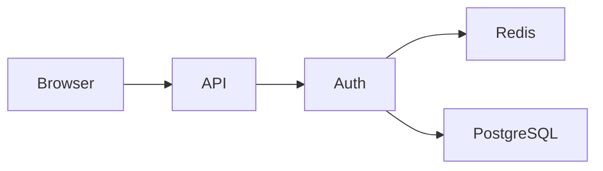

# Diagram Design：让 Claude Code / Codex 生成更有设计感的技术图

项目地址：[cathrynlavery/diagram-design](https://github.com/cathrynlavery/diagram-design)

在使用 Claude Code、Codex 等 AI 编程 Agent 时，我们经常会让它们帮忙画：

* 系统架构图
* 流程图
* 时序图
* 数据模型图
* 部署图
* 状态机
* 数据流图
* 项目路线图

最常见的方案通常是 Mermaid。

Mermaid 很方便，但生成出来的图往往更偏向“结构正确”，而不是“视觉设计得好”。

如果你希望 AI 不只是把几个方框连接起来，而是生成一张真正适合放进技术文档、博客甚至 PPT 的图，那么可以看看：

**Diagram Design**

它是一个为 Claude Code、Codex 以及其他 Agent Skills 兼容工具设计的 Diagram Skill。

它的目标可以概括为一句话：

> 让 AI 按照一套明确的视觉设计系统生成高质量 HTML/SVG 技术图，而不是生成千篇一律的 Mermaid 风格方框图。

---

## Diagram Design 是什么？

Diagram Design 并不是传统意义上的“画图软件”。

它更像是一套：

```text
Agent Skill
+
Diagram Design System
+
SVG Layout Specification
+
Diagram Template Library
+
Import / Export Tooling
```

安装之后，Claude Code 或 Codex 可以根据你的自然语言请求：

1. 理解你想表达的信息；
2. 判断应该使用哪种图；
3. 选择合适的布局规则；
4. 对内容进行删减和分层；
5. 应用颜色、字体、节点、连线等设计规范；
6. 最终生成 HTML + SVG。

也就是说，你可以直接说：

```text
画一张我们登录系统的架构图。

包含：

Browser
Cloudflare
API Gateway
Auth Service
Redis
PostgreSQL
Google OAuth

突出 Auth Service。

用于技术文档。
```

Agent 会根据 Diagram Design 的规则生成对应的架构图，而不是简单输出 Mermaid。

---

# 39 种 Diagram 类型

Diagram Design 当前提供 39 种视觉类型。

其中包括：

| 类型                 | 用途                          |
| ------------------ | --------------------------- |
| Architecture       | 系统组件与连接关系                   |
| IT Current State   | 现有 IT 架构 / Legacy Landscape |
| Flowchart          | 决策流程                        |
| Sequence           | 时序与消息交互                     |
| State Machine      | 状态与状态转换                     |
| ER / Data Model    | 数据实体与关系                     |
| Timeline           | 时间线                         |
| Swimlane           | 跨角色流程                       |
| Quadrant           | 二维矩阵                        |
| Radar              | 多维评分比较                      |
| Polar Chart        | 周期类别数据                      |
| Loop / Flywheel    | 飞轮 / 增强循环                   |
| Nested             | 包含关系                        |
| Tree               | 树形层级                        |
| Org Chart          | 组织 / Ownership              |
| Layer Stack        | 分层架构                        |
| Venn               | 集合重叠                        |
| Pyramid / Funnel   | 金字塔 / 漏斗                    |
| Bar Chart          | 分类比较                        |
| Treemap            | 面积占比                        |
| Line Chart         | 趋势变化                        |
| Gantt              | 项目时间规划                      |
| Scatter Plot       | 分布与相关性                      |
| High-Level         | 高层系统架构                      |
| Process            | 多参与者业务流程                    |
| Medallion          | 多层数据存储架构                    |
| Data Flow          | 数据流水线                       |
| DP Integration     | 数据平台集成                      |
| DP Security Matrix | 数据平台权限矩阵                    |
| Sankey             | 流量拆分与汇聚                     |
| Fishbone           | 鱼骨图 / 根因分析                  |
| Wardley Map        | Wardley 战略地图                |
| Kanban             | 看板                          |
| User Journey       | 用户旅程                        |
| Deployment         | 软件部署拓扑                      |
| Dependency Graph   | 依赖关系                        |
| UML Class          | UML 类图                      |
| Story Map          | 用户故事地图                      |
| Database Schema    | 数据库物理模型                     |

所以它覆盖的不只是软件架构图，而是一套比较完整的：

**技术 + 产品 + 数据 + 管理视觉表达工具箱。**

---

# 它和 Mermaid 最大的区别

Mermaid 的基本工作流是：

```text
文本 DSL
   ↓
自动布局
   ↓
Diagram
```

例如：



优点是非常简单。

但缺点也很明显：

* 自动布局决定视觉结构；
* 很多图长得差不多；
* 难以体现视觉层级；
* 很难突出真正重要的信息；
* 品牌风格定制能力有限。

Diagram Design 的思路则不同：

```text
业务信息
   ↓
AI 理解语义
   ↓
Semantic Pattern
   ↓
Visual Type
   ↓
Complexity Reduction
   ↓
Design System
   ↓
SVG Layout
   ↓
HTML / SVG / PNG
```

所以它并不是单纯解决：

> 怎么把节点画出来？

而是进一步解决：

> 这张图到底应该怎么设计，读者才能最快理解？

---

# 一个很重要的设计原则：少即是多

Diagram Design 的设计哲学里有一句很重要的话：

> The highest-quality move is usually deletion.

也就是：

**很多时候，提高图质量最有效的方法不是增加元素，而是删除元素。**

它要求：

* 每个节点必须代表一个独立概念；
* 如果两个节点永远一起出现，可以考虑合并；
* 如果关系从布局本身已经很明显，就不要额外画线；
* 强调色只应该用于真正重要的 1～2 个元素；
* 图不是“所有东西都放进去”才算完成。

它推荐的目标信息密度大约是：

```text
4 / 10
```

而不是：

```text
10 / 10
```

如果一张架构图已经有十几个甚至几十个节点，Diagram Design 更倾向于：

```text
Overview
+
Detail Diagram
```

而不是强行把所有东西塞进一张图。

这也是它和典型自动绘图工具非常不同的地方。

---

# Semantic Pattern 和 Visual Type

Diagram Design 还有一个比较有意思的设计：

**语义和布局是分开的。**

例如你描述的是：

```text
很多 Producer
       ↓
一个 Queue
       ↓
有限处理能力的 Consumer
```

它首先识别：

```text
Fan-in Queue / Bottleneck
```

这是 Semantic Pattern。

然后再选择：

```text
Data Flow
```

作为布局类型。

也就是说：

```text
Semantic Pattern
负责：
“这张图表达什么？”

Visual Type
负责：
“这张图怎么摆？”
```

这种分离让 AI 不需要为了每种业务情况创造一种全新的 Diagram 类型。

---

# 它特别讨厌“AI 味”的 Diagram

Diagram Design 的 Skill 里明确列出了一批 Anti-pattern。

例如：

```text
Dark Mode
+
Cyan / Purple Glow
```

这种典型“AI 科技风”是不推荐的。

其他不推荐的东西还包括：

* 所有节点都长得一样；
* 每个框都是巨大圆角；
* 到处使用阴影；
* 每个重要节点都使用强调色；
* 用等宽字体写所有文字；
* 箭头随意穿过节点；
* 连线出现大量斜线；
* 直接复刻 Mermaid 的自动布局。

它甚至明确规定：

> Shadows are out. Borders are in.

也就是：

**不要靠阴影制造层次，而是通过边框、留白、字体和信息层级来完成设计。**

---

# 可定制品牌风格

Diagram Design 还有一个非常有价值的能力：

**Brand Onboarding。**

它的颜色、字体和视觉 Token 并不是散落在每个 Diagram 里，而是集中维护在：

```text
references/style-guide.md
```

其中定义了类似：

```text
paper
ink
muted
soft
accent
accent-tint
link
rule
```

这样的 Semantic Color。

第一次在项目中使用时，如果还是默认 Style Guide，Skill 会让你选择是否进行品牌配置。

你可以让 Agent：

```text
Onboard diagram-design to https://example.com
```

它可以根据网站风格提取适合 Diagram 使用的：

```text
Background
Text
Muted
Accent
Typography
```

然后生成新的 Diagram Design Profile。

---

# Profile

如果你需要同时给不同项目或客户画图，可以保存多个 Profile。

例如：

```text
~/.diagram-design/profiles/

acme.md
company-a.md
company-b.md
personal-blog.md
```

项目根目录可以放：

```text
.diagram-design
```

内容：

```text
profile: acme
```

于是这个项目之后生成的 Diagram 都会使用对应视觉风格。

这对于：

* 公司技术文档
* 咨询项目
* 多品牌产品
* 个人博客

非常方便。

---

# 输出格式

Diagram Design 的核心输出是：

```text
HTML
+
inline SVG
+
CSS
```

也就是说生成出来的：

```text
architecture.html
```

可以直接：

```bash
open architecture.html
```

在浏览器打开。

不需要：

```text
React
Vue
Webpack
Vite
Mermaid runtime
```

之类的东西。

同时还可以进一步导出：

```text
SVG
PNG
```

因此很适合放进：

```text
README
Documentation
Blog
Slides
Notion
Confluence
PPT
```

---

# 安装

## Claude Code

通过 Plugin Marketplace 安装：

```text
/plugin marketplace add cathrynlavery/diagram-design
/plugin install diagram-design@diagram-design
```

安装完成后，可以在 Plugin 设置中开启自动更新。

---

## Codex

```bash
codex plugin marketplace add cathrynlavery/diagram-design

codex plugin add diagram-design@diagram-design
```

---

## Pi

```bash
pi install https://github.com/cathrynlavery/diagram-design
```

安装后可以显式调用：

```text
/skill:diagram-design
```

---

## Kiro

可以直接导入 Skill 子目录：

```text
https://github.com/cathrynlavery/diagram-design/tree/main/skills/diagram-design
```

---

# 仓库结构

真正的 Diagram Design Skill 位于：

```text
skills/diagram-design/
```

主要结构如下：

```text
skills/diagram-design/
├── SKILL.md
├── assets/
├── references/
└── scripts/
```

其中：

### `SKILL.md`

这是整个 Skill 的核心。

里面定义了：

* 什么情况下应该画图；
* 应该选择哪种 Diagram；
* 设计原则；
* Complexity Budget；
* Layout Rules；
* Connector Rules；
* Style System；
* 输出检查规则。

---

### `references/`

这里存放具体 Diagram 类型的详细规范。

例如：

```text
type-architecture.md
type-flowchart.md
type-sequence.md
type-deployment.md
type-db-schema.md
type-gantt.md
type-sankey.md
...
```

Agent 并不会一次读取全部规则。

而是在确定 Diagram 类型以后，再加载对应 Reference。

例如：

```text
用户请求
   ↓
Architecture Diagram
   ↓
加载 type-architecture.md
   ↓
生成 SVG
```

这样可以避免把所有设计规则全部塞进上下文。

---

### `assets/`

这里包含：

* Diagram 示例；
* HTML 模板；
* Light / Dark / Editorial 风格；
* Gallery。

可以直接打开：

```text
skills/diagram-design/assets/index.html
```

浏览所有 Diagram 类型。

---

### `scripts/`

这里提供一些辅助工具，例如：

* draw.io 提取
* Mermaid 提取
* Diagram 检查
* 导出相关工具

用于导入、验证以及处理生成结果。

---

# 怎么使用？

安装之后其实不一定需要记专门的命令。

直接用自然语言告诉 Agent：

```text
Use diagram-design.

分析这个项目的架构。

画一张 High-Level Architecture Diagram。

要求：

- 不超过 9 个主要节点
- audience: engineer
- size: doc-inline
- format: HTML
- 突出最核心的服务
- 保存到 docs/architecture.html
```

Agent 就可以先分析代码，然后生成 Diagram。

---

# 一个实际例子

假设你的系统是：

```text
Browser
   ↓
Cloudflare
   ↓
API Gateway
   ↓
Auth Service
   ├── Redis
   ├── PostgreSQL
   └── Google OAuth
```

可以直接告诉 Claude Code：

```text
Use diagram-design.

画一张登录系统架构图。

Nodes:

Browser
Cloudflare
API Gateway
Auth Service
Redis
PostgreSQL
Google OAuth

Auth Service 是 focal。

Audience: engineer
Size: doc-inline
Format: HTML

Save to:

docs/diagrams/login.html
```

Diagram Design 会选择：

```text
Visual Type:
Architecture

Focal:
Auth Service

Output:
doc-inline HTML
```

然后生成：

```text
docs/diagrams/login.html
```

直接浏览器打开即可。

---

# 同一份信息可以针对不同 Audience 重新设计

这也是 Diagram Design 很实用的地方。

例如工程师版本：

```text
Audience:
engineer

Detail:
faithful
```

可以包含：

```text
Services
Ports
Databases
Queues
Protocols
Dependencies
```

如果要放进管理层 PPT：

```text
Audience:
executive

Detail:
simplified

Size:
slide-16x9
```

则可以减少技术细节，只留下：

```text
核心平台
关键系统
主要数据流
风险
业务价值
```

所以同一份架构信息可以生成不同表达方式。

---

# 支持重新设计 Mermaid

Diagram Design 不只是生成新图。

它还可以把已有 Mermaid：

```text
.mmd
```

或者 Markdown 中的 Mermaid block 重新设计。

例如：

```text
Import every Mermaid block in README.md.

Size:
doc-wide

Detail:
balanced

Audience:
mixed
```

这里最重要的一点是：

**它不是单纯把 Mermaid 渲染成 SVG。**

而是：

```text
读取 Mermaid 语义
        ↓
理解节点和关系
        ↓
重新选择布局
        ↓
重新设计
```

所以 Mermaid 原有的：

```text
coordinates
spacing
automatic routing
```

不会被机械保留。

这也是 Diagram Design 与普通 Mermaid Renderer 最大的区别之一。

---

# 支持重新设计 draw.io

它同样支持：

```text
.drawio
.drawio.png
.drawio.svg
```

例如：

```text
Redraw architecture.drawio

Size:
slide-16x9

Detail:
simplified

Audience:
executive

Format:
PNG
```

这非常适合一个常见场景：

```text
工程师画了一张非常复杂的 draw.io
                ↓
          AI 理解结构
                ↓
       Diagram Design
                ↓
     管理层 PPT 架构图
```

换句话说，它可以把已有的图当成：

**结构信息来源**

而不是把原来的视觉设计照搬过来。

---

# 导出 PNG / SVG

如果最终要用于 Slides 或其他文档，可以进一步导出。

例如 Claude Code：

```text
/diagram-design:export-diagram path/to/diagram.html
```

只输出 PNG：

```text
/diagram-design:export-diagram \
  path/to/diagram.html \
  --png-only \
  --scale=2
```

PNG 导出使用 Playwright。

如果本机还没安装：

```bash
python -m pip install playwright

python -m playwright install chromium
```

也可以先运行 Diagram Design 的 doctor 流程检查本地环境。

---

# Gallery

仓库本身提供了大量示例。

Clone 后可以打开：

```text
skills/diagram-design/assets/index.html
```

macOS：

```bash
open skills/diagram-design/assets/index.html
```

里面可以浏览不同 Diagram 类型以及不同视觉样式。

每种 Diagram 通常提供类似：

```text
Minimal Light
Minimal Dark
Full Editorial
```

这样的视觉版本。

如果第一次接触这个项目，建议先看 Gallery。

因为 Diagram Design 的价值很大一部分来自它的视觉语言，看实际生成效果比单纯阅读 `SKILL.md` 更直观。

---

# Diagram Design 适合什么场景？

它非常适合以下几类工作。

## 技术架构文档

例如：

```text
System Architecture
Cloud Architecture
Microservices
Data Platform
Security Architecture
Deployment Architecture
```

---

## README / Documentation

例如：

```text
How it works
Request lifecycle
Deployment architecture
Data flow
System overview
```

---

## 技术博客

相比默认 Mermaid，Diagram Design 更适合对视觉品质要求比较高的文章。

尤其是需要：

* 明确视觉层级；
* 突出关键组件；
* 控制信息密度；
* 与网站品牌保持一致；

的场景。

---

## PPT / 管理层汇报

尤其适合：

```text
size: slide-16x9
audience: executive
detail: simplified
```

这样的组合。

可以把技术系统转换成更适合非工程师阅读的表达方式。

---

## 数据平台

Diagram Design 专门提供：

```text
Medallion
Data Flow
DP Integration
DP Security Matrix
Database Schema
```

等数据平台相关图形。

因此对于：

* Data Engineering
* Data Platform
* Lakehouse
* ETL / ELT
* 数据治理

等领域尤其有用。

---

## 产品设计

包括：

```text
User Journey
Story Map
Kanban
Timeline
Funnel
Quadrant
```

所以它也不仅仅是一个开发者工具。

---

# 什么情况下没必要使用？

Diagram Design 自己也强调：

**不是所有东西都值得画 Diagram。**

如果一个三列表格就能讲明白：

```text
Service | Owner | Status
```

那就直接使用表格。

如果只是：

```text
Before
vs
After
```

一个简单表格可能比 Diagram 更清楚。

如果信息只是：

```text
User
  ↓
System
```

这种只有一两个概念的关系，也没必要为了画图而画图。

它的判断标准非常简单：

> 读者能不能从图中获得比一段清晰文字更多的信息？

如果答案是否定的，就不要画。

---

# Diagram Design vs Mermaid vs draw.io

可以简单理解为：

|         | Diagram Design | Mermaid | draw.io |
| ------- | -------------- | ------- | ------- |
| 输入方式    | 自然语言 / Agent   | DSL     | 手工      |
| 自动生成    | 很强             | 很强      | 较弱      |
| 视觉设计    | 强              | 中等      | 取决于人工   |
| 品牌定制    | 强              | 一般      | 强       |
| AI 理解语义 | 强              | 弱       | 弱       |
| 自动删减内容  | 可以             | 不可以     | 不可以     |
| 架构图     | 强              | 强       | 强       |
| PPT 图   | 强              | 一般      | 强       |
| 快速简单图   | 一般             | 非常强     | 一般      |
| 精确手工控制  | 中等             | 较弱      | 非常强     |

所以它并不是 Mermaid 或 draw.io 的完全替代品。

更准确地说：

```text
Mermaid
适合快速表达结构

draw.io
适合人工精确控制

Diagram Design
适合 AI 自动完成
“信息设计 + 视觉设计”
```

---

# 总结

Diagram Design 最有意思的地方，并不是它支持 39 种 Diagram。

真正有价值的是它给 AI 增加了一套：

```text
Information Design
+
Visual Design
+
Diagram Grammar
```

让 Claude Code、Codex 这类 Agent 不只是知道：

> 哪些节点需要连接？

还需要思考：

> 什么应该删除？

> 什么最重要？

> 哪种布局最适合这个信息？

> 什么应该被突出？

> 这张图是给工程师看的，还是给管理层看的？

> 它应该用于技术文档，还是 16:9 PPT？

因此它非常适合这样的工作流：

```text
Claude Code / Codex
        ↓
     阅读代码
        ↓
     理解系统
        ↓
  Diagram Design
        ↓
 Information Design
        ↓
       SVG
        ↓
HTML / PNG / Slides
```

如果你已经在使用 Claude Code 或 Codex，并且经常让 AI：

```text
分析项目
写技术文档
画架构图
整理系统设计
制作技术方案
```

那么 Diagram Design 是一个非常值得尝试的项目。

项目地址：

https://github.com/cathrynlavery/diagram-design
