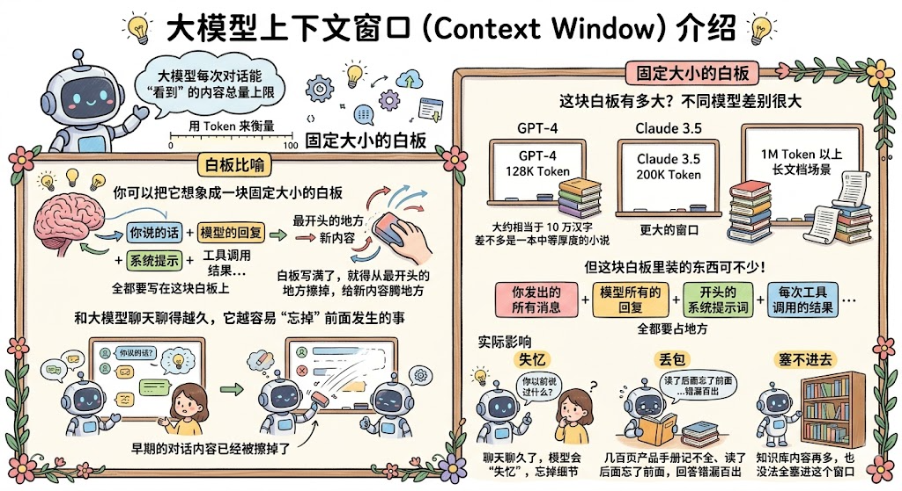
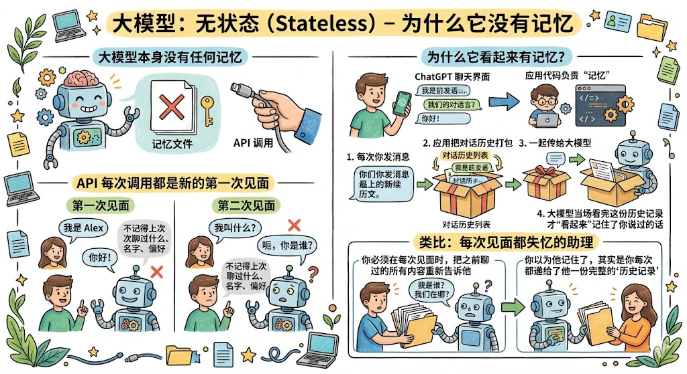
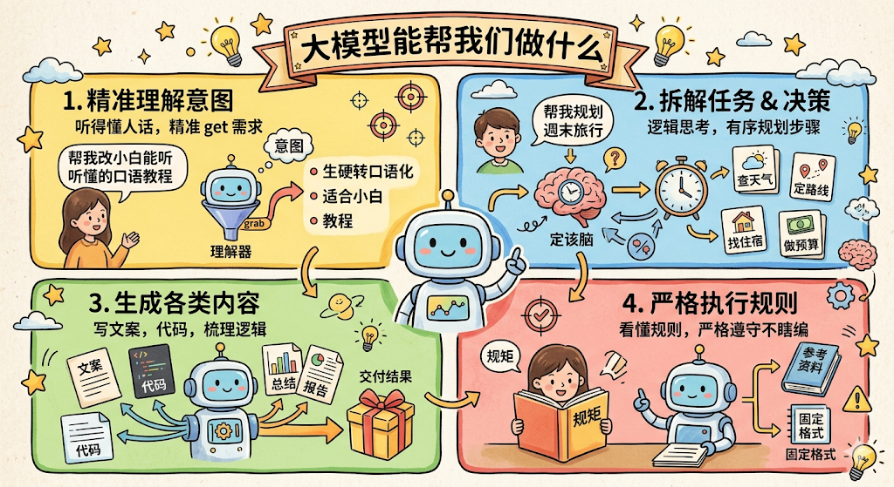
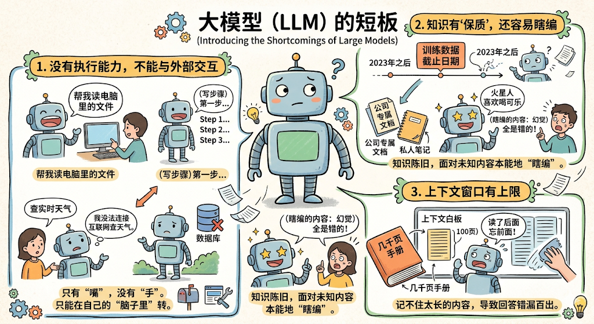

学 Agent 开发，第一件事是认识它的"大脑"： **大模型**。 

你不需要先搞懂它背后的数学原理，但你必须清楚它能做什么、不能做什么，以及它是怎么"看"你发给它的文字的。搞清楚这些，后面学 Prompt、Function Calling、RAG、Agent，你才能知道"为什么要这么做"。

## 大模型是什么

我们平时说的「AI 对话」「AI 助手」，核心都是 **大模型**，英文叫 **LLM**（Large Language Model，大语言模型）。

用大白话讲，大模型就像 **一个从小读了海量书、见识极广、逻辑又好的超级助理**。

它"大"在哪里？两点：

* **参数量大**：模型内部有数千亿个参数，可以理解为它"记住了"海量知识的精华

* **训练数据大**：研发人员提前给它喂了互联网上的书籍、文章、新闻、代码、论坛讨论等大量内容，让它学会了语言规律、通用常识和各行各业的基础知识

学会之后，它能干什么？说白了就是 **根据你给的上下文，预测接下来最合理的文字是什么**。你问它「今天天气怎么样」，它不是真的去查天气，而是根据过去学过的语言模式，生成一个"看起来最合理的回答"。

我们平时用的 ChatGPT、豆包、通义千问、文心一言，背后核心都是这样的大模型。

***

## Token：大模型读文字的方式

在讲大模型能做什么之前，有一个基础概念必须先搞清楚，因为后面所有的东西都跟它有关，那就是 **Token**。

**Token 是大模型处理文本的"基本单位"**，它既不是一个字，也不是一个词，你可以理解为把文字"切碎"后的一个个小碎片。

举个例子，「我今天心情很好」这句话，大模型不是一个字一个字地读，而是先把它切成若干个 Token，比如可能切成：「我」「今天」「心情」「很好」，每个碎片就是一个 Token。

英文的切法更直观： `"Hello world"` 通常会被切成 `["Hello", " world"]` ，大约每个单词对应 1 个 Token。中文切法不太一样，通常每个汉字对应 1～2 个 Token。

你为什么要了解 Token？有两个原因：

1. **决定模型能处理的文本长度上限**：每个大模型都有"最多能处理多少 Token"的上限，后面马上会讲到

2. **决定 API 调用费用**：调用大模型的 API 是按 Token 计费的，你发给它的文字越长、它回复的越多，花的钱越多

记住这个概念，我们继续。

***

## 上下文窗口：大模型的"短期记忆"

理解了 Token，你就能理解大模型最重要的一个限制，那就是 **上下文窗口（Context Window）**。

**上下文窗口**，指的是大模型每次对话时，能"看到"的内容总量上限，用 Token 来衡量。

你可以把它想象成 **一块固定大小的白板**。每次对话，你说的话、模型的回复、系统提示、工具调用结果……全都要写在这块白板上。白板写满了，就得从最开头的地方擦掉，给新内容腾地方。

所以，和大模型聊天聊得越久，它越容易"忘掉"前面发生的事，因为早期的对话内容已经被从白板上擦掉了。

这块白板有多大？不同模型差别很大：

* GPT-4 有 128K Token 的窗口，大约相当于 10 万汉字，差不多是一本中等厚度的小说

* Claude 3.5 的上下文窗口有 200K Token，更大一些

* 一些面向长文档场景的模型，窗口可以达到 1M Token 以上

听起来好像很大？但这块白板里装的东西可不少：你发出的所有消息 + 模型所有的回复 + 开头的系统提示词 + 每次工具调用的结果……全都要占地方。

**实际影响是什么？**

* 聊天聊久了，模型会"失忆"，忘掉对话前期的细节

* 你把一本几百页的产品手册直接丢给它，它要么记不全，要么读了后面忘了前面，回答错漏百出

* 你的知识库内容再多，也没法全塞进这个窗口

这就是为什么我们后面要学 **RAG（检索增强生成）**，它的核心思路就是：不把全部知识塞进上下文窗口，而是每次用的时候，按需检索最相关的片段放进去。上下文窗口的限制，是 RAG 存在的根本原因。

***

## 大模型是"无状态"的，没有任何记忆

理解了上下文窗口，还有一件事必须说清楚，因为很多初学者在这里会踩坑。

**大模型本身没有任何记忆。**

它是完全"无状态"的。每次你通过 API 调用它，对它来说都是第一次见面，它完全不记得你们上次聊过什么、你叫什么名字、你有什么偏好。

那为什么我们用 ChatGPT 聊天，它好像能记住之前说过的话？

因为 **是你的应用代码在负责"记忆"**。每次你发消息，应用都会把你们之前所有的对话历史，打包成一个列表，一起传给大模型。大模型是"当场"看完这份历史记录，才"看起来"记住了你说过的话。

类比一下：就像一个每次见面都失忆的助理。你必须在每次见面时，把之前聊过的所有内容重新告诉他，他才能"接着上次"继续工作。你以为他记住了，其实是你每次都递给了他一份完整的"历史记录"。

这直接解释了两件事：

* **为什么上下文窗口会写满**：历史对话越来越多，白板自然越来越满

* **为什么 Agent 需要管理记忆**：Agent 在执行长任务时，必须主动决定"把哪些历史传进去"，不然窗口很快就塞满了

***

## 对话的角色结构：system、user、assistant

既然多轮对话是靠"传历史列表"实现的，那这个列表长什么样？

调用大模型 API 时，你传入的不是一段裸文字，而是一个有结构的消息列表，每条消息都有一个 **角色（role）**：

* `system` ： **系统提示**，给模型的"身份设定和行为规则"。比如「你是一个 OnCall 助理，只能回答和系统故障相关的问题，回答必须简洁」。这部分用户看不见，但模型会严格遵守

* `user` ： **用户的输入**，就是你说的话

* `assistant` ： **模型之前的回复**，多轮对话时，把历史回复也打包进来，模型才知道"之前说了什么"

用伪代码表示，大概长这样：

模型看到这整个列表，才能知道"用户在问什么、之前说过什么、我应该怎么回答"。

这个结构非常重要，后面学 Prompt 的时候，我们会专门讲怎么用好 `system` 角色，它是控制模型行为最核心的手段。

***

## 大模型能帮我们做什么

有了上面的基础认知，现在来看大模型真正擅长什么。核心是 4 件事，也是我们后续开发全程都会用到的能力：

### 1. 听得懂人话，精准理解意图

你不用写复杂的代码指令，不用抠严谨的格式，只用日常大白话讲需求，它就能精准 get 到你想干嘛。

举个例子，你说「帮我把这段生硬的概念，改成小白能听懂的口语化教程」，它能立刻明白你的要求 ， 你不需要定义什么叫"生硬"、什么叫"小白"、什么叫"口语化"，它自己就能理解。

这是所有 AI 应用能运转的基础。

### 2. 会逻辑思考，能拆解任务、做决策

给它一个明确的目标，它能拆解出一步步的执行步骤，还能判断「下一步该做什么」。

举个例子，你说「帮我规划一场周末的短途旅行」，它能拆解出查天气、定路线、找住宿、做预算这些步骤，并按顺序推进。这种拆解任务和做决策的能力，就是我们后面 Agent 的「决策大脑」。

### 3. 能生成符合要求的各类内容

写文案、写代码、写总结、回答问题、梳理逻辑，只要你给它明确的要求和参考信息，它就能生成贴合需求的内容。

这是它最终给用户"交付结果"的核心能力。

### 4. 能看懂规则，严格按要求执行

你给它定好明确的规矩，比如「必须严格按照我给的参考资料回答，不许自己瞎编」，或者「必须按照我给的固定格式，告诉我要调用哪个工具」，它就能严格遵守，不会乱发挥。

这个能力是我们后面学 Function Calling、RAG 的核心前提 ， 如果模型不能严格按规则执行，整个系统就会乱套。

***

## 大模型做不到什么

这部分尤其重要。因为它直接对应了我们后面要学的所有技术的价值。

你搞懂了大模型的短板，就能立刻明白「我们为什么要开发 Agent」「为什么要学这么多技术」。

### 1. 没有执行能力，不能和外部世界交互

这是最核心的短板。大模型只有"嘴"，没有"手"。你让它帮你读电脑里的文件、查今天的实时天气、给客户发一封邮件、在数据库里查一条记录，它只能给你写步骤，没法自己去做这些事。它也没法主动连接数据库、调用第三方 API、浏览网页，或者和外部的任何系统交互，只能在自己的"脑子里"转。

这就是我们后面要学 **Agent + Tool 工具调用、Function Calling 和 MCP 协议**的核心原因：给大模型配上能动手的工具，打通它和真实世界之间的通道，让它从只会出主意，变成能干活。

### 2. 知识有"保质期"，还容易瞎编

大模型的知识库是在某个时间点截止的，训练截止日期之后发生的事，它不知道。而且你公司内部的产品手册、专属的制度文档、你自己写的私人笔记，它根本没见过，也不知道。

更麻烦的是，遇到它不知道的内容，它不一定会说"我不知道"，而是很可能一本正经地给你编一堆看起来很专业、实际全是错的内容。行业里管这个叫 **「幻觉」（Hallucination）**。

这就是我们后面要学 **RAG（检索增强生成）**的核心原因：把最新的、专属的知识存起来，让模型回答的时候能调取正确的参考资料，而不是靠"记忆"瞎猜。

### 3. 上下文窗口有上限，记不住太长的内容

前面已经讲过了。白板就这么大，你把一本几百上千页的电子书、产品手册扔给它，它根本记不住，会读了后面忘前面，回答错漏百出。

这也是 **RAG**要解决的问题：不把全部内容塞进窗口，而是按需检索最相关的片段。

***

## 总结

讲到这里，整个画面就清晰了：

大模型是一个 **超级能思考、能理解、能生成内容的"大脑"**。

但它没有"手"（不能执行操作，不能对接外部世界），没有"专属知识库"（不知道你的私有数据），没有持久记忆（每次调用对它都是全新的），而且单次对话能看到的内容也有上限（上下文窗口）。

单靠它自己，只能做聊天、出主意这类事，没法落地完成复杂的、具体的任务。

而我们要学的 **Agent 开发**，本质上就是：

后面要学的每一个技术，都是在补大模型的某块短板。带着这个认知往下学，你会发现每件事都有"为什么要这么做"的清晰答案。
