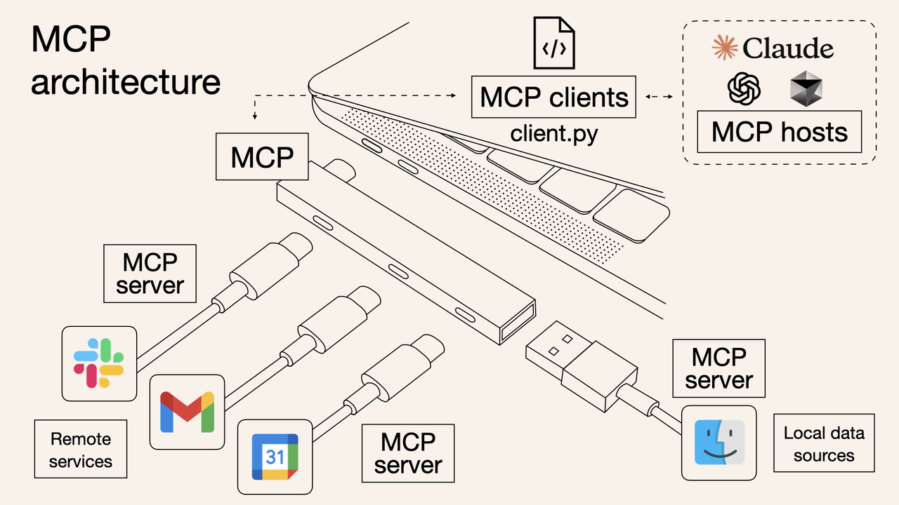
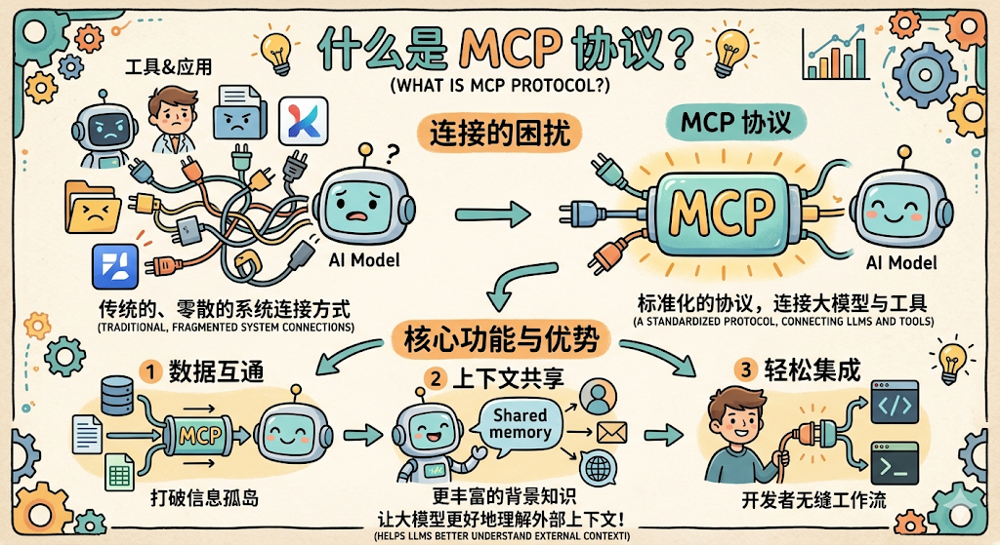
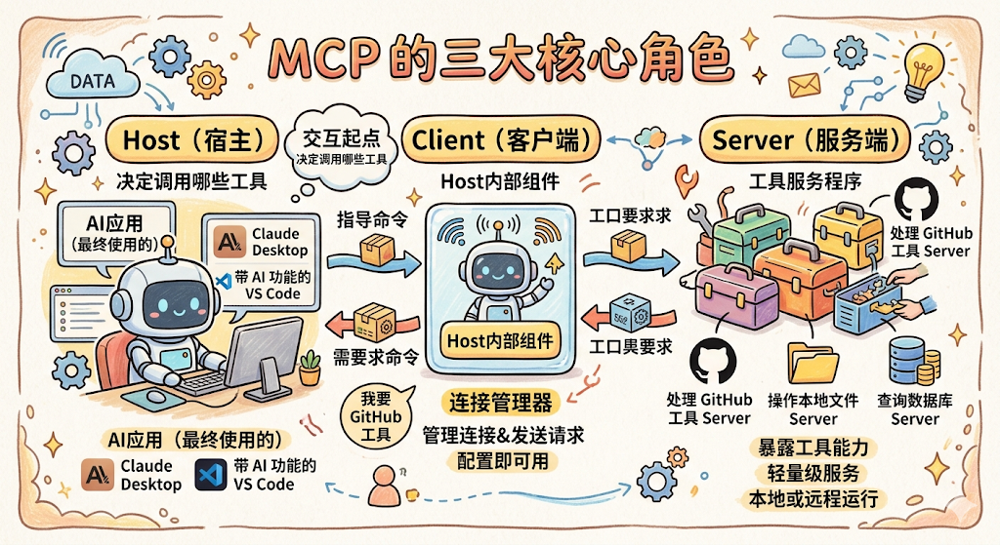
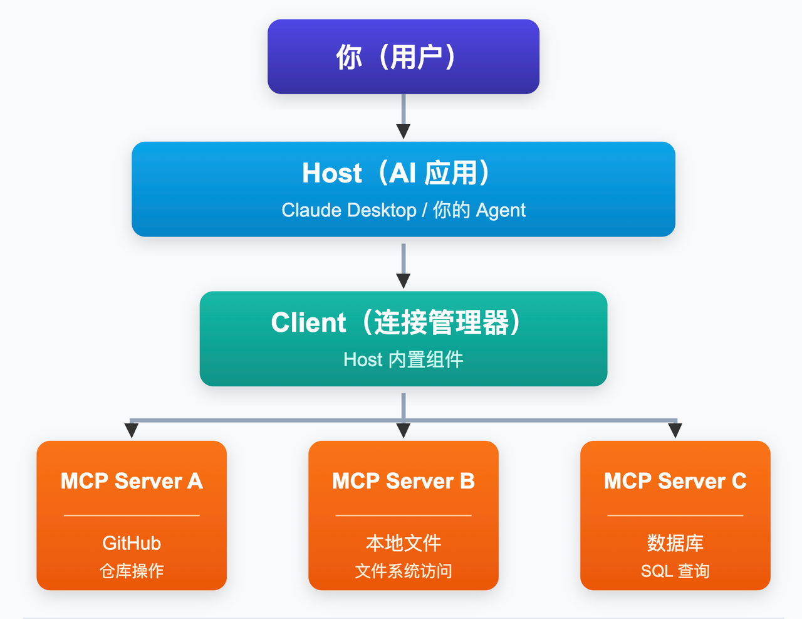
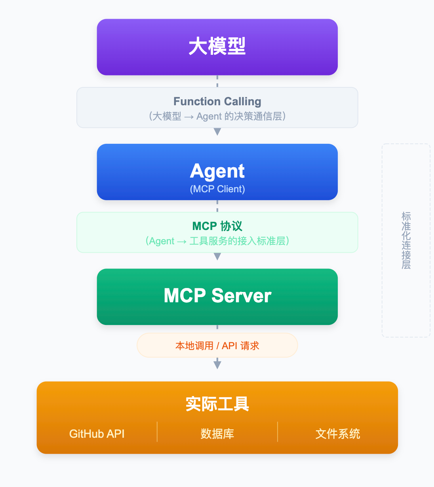
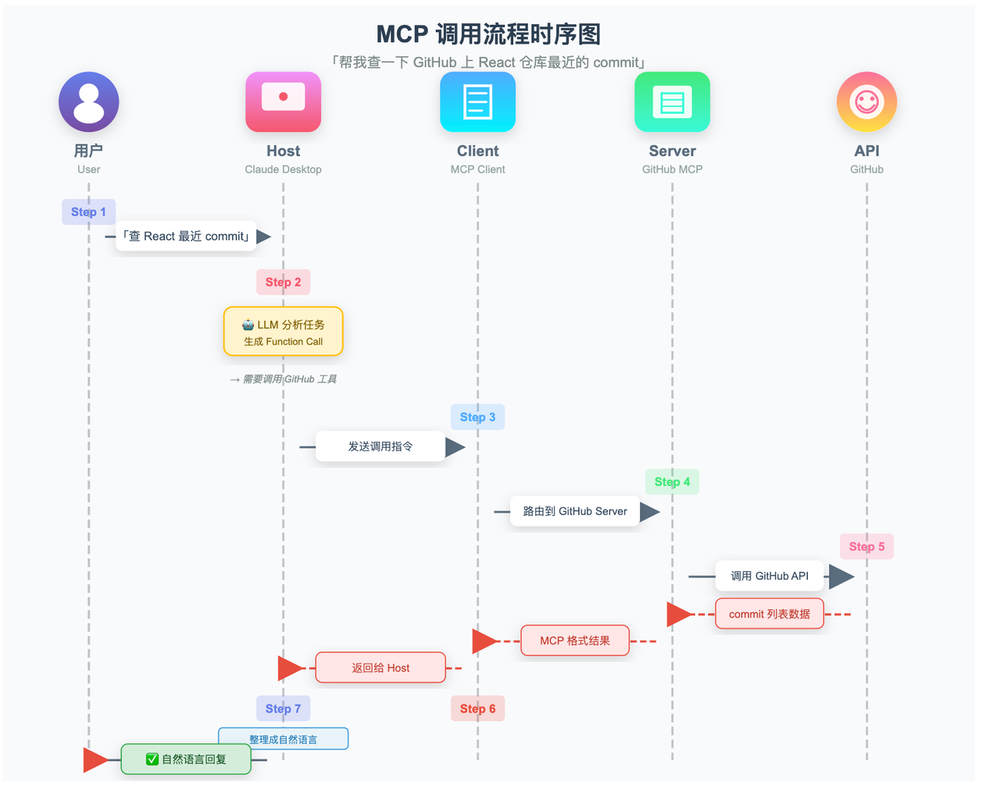

上一章讲完了 Function Calling，大模型通过标准化的 JSON 格式，告诉 Agent 要调哪个工具、传什么参数。到这里，你已经理解了工具是什么、工具怎么被调用起来。

但实际开发 Agent 的时候，你会很快遇到下一个麻烦： **工具集成本身，是个无底洞。&#x20;**

***

## 没有 MCP 之前：重复造轮子的噩梦

假设你正在开发一个 Agent，需要它能读取 GitHub 代码仓库、查询公司数据库、操作本地文件系统、还能发 Slack 消息。

每一个工具，你都得自己来：

* 自己研究这个工具的 API 文档

* 自己把 API 封装成函数

* 自己给每个函数写 Function Calling 定义（name、description、parameters）

* 自己处理认证、错误处理、数据格式转换

光这四件事，就够你忙好几天。更麻烦的是，这些集成代码只能用在你这个项目里，团队里其他同学做类似的 Agent，还得重新来一遍。

如果你的 Agent 还需要同时支持多个大模型（今天接 Claude、明天接 GPT-4、后天接 Qwen），问题就更大了：

**10 个工具 × 5 个大模型 = 50 套集成代码**

不同模型的 Function Calling 格式还可能有细微差别，你要针对每个模型写适配层。哪天 GitHub API 升级了，50 套代码你一个个去改，这还是基础设施代码，不是真正做产品该花时间的地方。

整个生态里，无数开发者都在重复做着同一件事：把 GitHub、Slack、数据库、文件系统……这些常见服务接入自己的 AI 应用。每个人写一套，互相之间完全无法复用。这就是没有统一标准时的现实，大家都在重复造同一个轮子。

***

## MCP 的出现：给 AI 工具世界定一个标准

这就是 Anthropic 在 2024 年 11 月推出 **MCP（Model Context Protocol，模型上下文协议）&#x20;**&#x7684;背景。

MCP 要解决的核心问题，可以用一句话概括： **把工具的「写好」和「用起来」彻底拆开。**

举个生活中的例子：在 USB-C 统一之前，各家手机厂商各有各的充电口，苹果用 Lightning、安卓早期用 Micro-USB，各品牌之间完全不兼容，出门得带三四根不同的充电线。USB-C 出来之后，只要设备支持 USB-C，任何 USB-C 的线都能用，充电器、数据线全部通用。

**MCP 对于 AI 工具世界的意义，就和 USB-C 对于充电口的意义一模一样。**

工具开发者只需要实现一套 MCP Server，把工具能力按 MCP 协议暴露出来，之后所有支持 MCP 的 AI 应用，都能直接接入，不需要任何额外适配。

AI 开发者只需要接入 MCP Client，就能调用整个 MCP 生态里所有已有的工具，不用自己写任何工具集成代码。

原来的 N×M 问题，变成了 N+M：N 个工具各写一次 MCP Server，M 个 AI 应用各写一次 MCP Client，然后任意组合，全部互通。

***

## MCP 的三大角色

MCP 架构里有三个核心角色，弄清楚它们是谁、各自做什么，MCP 就说明白一大半了。

### Host（宿主）

Host 就是你最终使用的那个 AI 应用，可以是 Claude Desktop、带 AI 功能的 VS Code、或者你自己开发的 Agent 程序。Host 是整个交互的起点，用户在 Host 里提问，Host 决定要调用哪些工具来完成任务。

### Client（客户端）

Client 是 Host 内部的一个组件，专门负责管理和 MCP Server 的连接。你可以把它理解为一个「连接器」，Host 说「我要调用 GitHub 工具」，Client 就负责找到对应的 MCP Server、建立连接、发送请求、拿回结果。

每个 Host 通常会内置一个 MCP Client，你不需要自己开发，直接配置就能用。

### Server（服务端）

Server 是对外暴露工具能力的轻量级服务程序。一个 MCP Server 通常负责一类工具，比如专门处理 GitHub 的 MCP Server、专门操作本地文件的 MCP Server、专门查询数据库的 MCP Server。

Server 和 Host 可以运行在同一台机器上（本地 Server），也可以部署在远程服务器上（远程 Server）。对于 Host 和 Client 来说，这些细节完全透明，调用方式完全一致。

三者的关系用一张图来看：

用户提问给 Host，Host 借助 Client 调用一个或多个 MCP Server，Server 执行完毕把结果回传，Host 拿到结果后给用户生成最终答案。

***

## MCP 和 Function Calling 是什么关系？

学到这里，很多同学脑子里会冒出一个问题：上一章学了 Function Calling，说大模型通过 Function Calling 告诉 Agent 调哪个工具；这章又学了 MCP，说 Agent 通过 MCP 来调用工具。这两个东西，到底有什么区别？MCP 是不是把 Function Calling 给替代了？

完全不是。 **Function Calling 和 MCP 解决的是不同层面的问题，它们是配合关系，不是替代关系。&#x20;**&#x6211;们来一步步理清楚。

**第一步：确认 Function Calling 工作在哪个层面**

Function Calling 解决的问题是：大模型做出「要调这个工具」的决策之后，怎么把这个决策用标准化 JSON 格式传给 Agent。这是 **大模型和 Agent 之间&#x20;**&#x7684;通信协议，负责「大模型怎么开口下指令」这一段。

**第二步：确认 MCP 工作在哪个层面**

MCP 解决的问题是：工具怎么被统一注册、统一发现、统一调用。这是 **Agent 和工具服务之间&#x20;**&#x7684;连接协议，负责「Agent 怎么找到并执行工具」这一段。

**第三步：看两者怎么配合**

把两者放进整个调用链条，位置就一目了然：

Function Calling 负责上半段：大模型用 Function Calling 格式告诉 Agent「调哪个工具、传什么参数」。

MCP 负责下半段：Agent 通过 MCP 协议，找到对应的 MCP Server，把工具真正执行起来。

**用一个具体例子把两者串联起来**

还是查天气的场景，用户问「上海明天天气怎样」：

1. 大模型通过 **Function Calling&#x20;**&#x8FD4;回调用指令，「调 check\_weather，city=上海」。这是 Function Calling 层，大模型在开口下指令。

2. Agent 里的 MCP Client 收到这条 Function Calling 指令，通过 **MCP 协议&#x20;**&#x627E;到天气 MCP Server，把请求路由过去。这是 MCP 层，Agent 在找到并执行工具。

3) 天气 MCP Server 调用真实的天气 API，拿到结果，按 MCP 格式回传。

4) 大模型收到结果，整理成自然语言告诉用户。

所以 Function Calling 是「说什么」的规范，MCP 是「怎么找到并执行」的规范。少了 Function Calling，大模型不知道怎么开口下指令；少了 MCP，Agent 不知道去哪里找工具来执行。两者分别在调用链的不同位置发挥作用，缺一不可。

***

## MCP Server 的三种能力

一个 MCP Server 可以暴露三种类型的能力，分别对应 AI 在不同场景下的不同需求。

### Tools（工具）

这是 MCP Server 最核心的能力，也是和上一章讲的工具概念最直接对应的部分。Tools 就是 AI 可以主动 **调用执行&#x20;**&#x7684;函数，发邮件、查数据库、提交代码、搜索网页，都属于 Tool。

AI 调用 Tool 的机制，底层就是 Function Calling，MCP 在这之上做了一层标准化封装，让你不需要手写每个 Tool 的 Function Calling 定义，MCP Server 会自动按标准格式对外声明工具清单。

### Resources（资源）

Resources 是 AI 可以 **读取访问&#x20;**&#x7684;数据，文件内容、数据库记录、代码仓库、网页内容等。

Tools 和 Resources 的区别在于：Tools 是「做一件事」，有副作用，会改变外部状态；Resources 是「读一份数据」，只读，不会改变任何东西。这个区分很重要，因为 AI 系统通常对「会产生副作用的操作」需要更谨慎的权限控制，读数据和写数据，应该分开授权。

### Prompts（提示模板）

Prompts 是预定义的可复用提示词模板。当你有一些常用的、固定结构的提示词（比如「代码 Review 模板」「会议纪要生成模板」），可以把它们封装成 MCP Prompts，在不同 Agent 项目里直接复用，不用每次重新写。

***

## 一次完整的 MCP 调用流程

用「帮我查一下 GitHub 上 React 仓库最近的 commit」这个任务，走一遍完整的 MCP 调用流程：

1. **用户提问&#x20;**：在 Host（比如 Claude Desktop）里输入「帮我查一下 React 仓库最近的 commit」

2. **Host 分析任务&#x20;**：大模型判断需要调用 GitHub 工具，生成 Function Call 格式的调用指令

3) **Client 接收指令&#x20;**：Host 把调用指令交给内置的 MCP Client

4) **Client 路由到对应 Server&#x20;**：Client 根据工具名，找到负责 GitHub 能力的 MCP Server，把请求发过去

5. **Server 执行&#x20;**：GitHub MCP Server 调用 GitHub API，拿到最近的 commit 列表

6. **结果回传&#x20;**：Server 把结果按 MCP 协议格式回传给 Client，Client 转交给 Host

7) **Host 生成回复&#x20;**：大模型拿到结果，整理成自然语言回复给用户

整个过程中，Host 和背后的大模型完全不需要知道 GitHub API 的任何细节，它只管说「我要调 GitHub 工具」，剩下的事情 MCP Server 全权负责。这就是「解耦」的价值：工具的实现细节，和 AI 的调用决策，完全分离。

***

## 一张表看懂：没有 MCP vs 有 MCP

| 对比维度      | 没有 MCP（自己写集成）                               | 有 MCP                           |
| --------- | ------------------------------------------- | ------------------------------- |
| 工具集成方式    | 每个工具自己写 Function Calling 定义、自己对接 API、自己处理格式 | 直接接入已有 MCP Server，工具现成可用        |
| 多模型支持     | N 个工具 × M 个模型 = N×M 套集成代码                   | N 个工具 + M 个模型，各写一遍标准接口，任意组合     |
| 跨项目复用     | 几乎不可能，每个项目重新写一遍                             | MCP Server 一次实现，所有项目直接接入        |
| 工具 API 升级 | 所有集成代码都要跟着改                                 | 只需更新对应的 MCP Server，所有 Host 自动受益 |
| 生态        | 各自为战，没有共享生态                                 | 全球开发者贡献 MCP Server，接入即可使用海量现成工具 |
| 开发成本      | 极高，大量时间花在工具集成而非业务逻辑上                        | 极低，专注业务逻辑，工具接入开箱即用              |

***

## 总结

整理一下这一章的核心认知：

* **MCP 是什么&#x20;**：Anthropic 推出的开放标准协议，定义了 AI 应用和工具服务之间如何标准化通信，是 AI 工具世界的「USB-C」。

* **为什么需要它&#x20;**：没有统一标准时，每个工具都要自己写集成，多模型场景下是 N×M 的重复工作量；MCP 把这个问题变成 N+M，工具写一次，全平台可用。

* **三大角色&#x20;**：Host（AI 应用）通过内置的 Client（连接器）调用 MCP Server（工具服务），职责清晰，完全解耦。

* **三种能力&#x20;**：Tools（可执行操作）、Resources（可读取数据）、Prompts（可复用模板），覆盖 AI 在工具调用场景下的所有需求。

后续章节呼应：

* **RAG&#x20;**：解决「大模型看不到你私有数据」的问题，把知识库检索封装成工具，让 Agent 能随时访问私有知识，是 Agent 开发中最常见的能力之一

