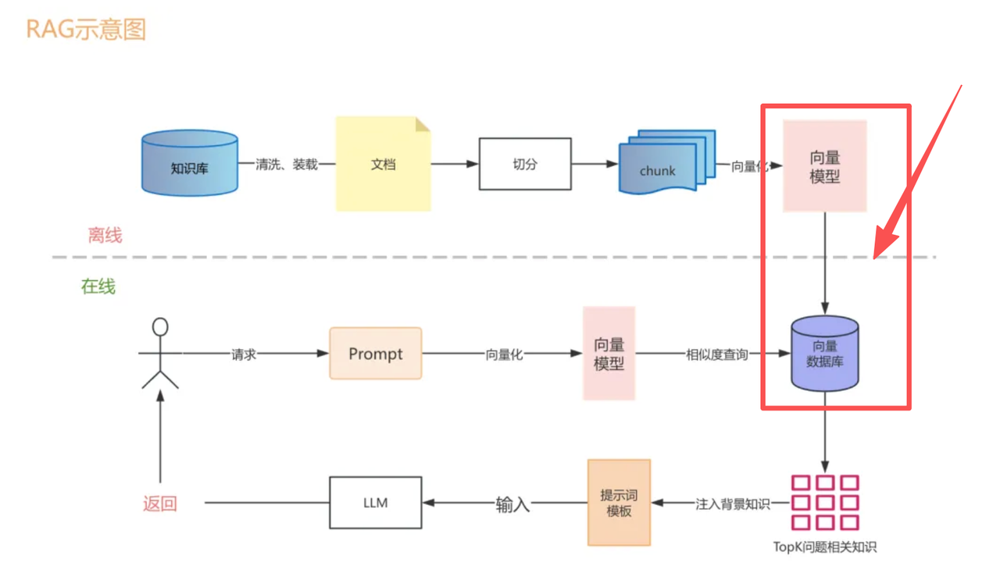
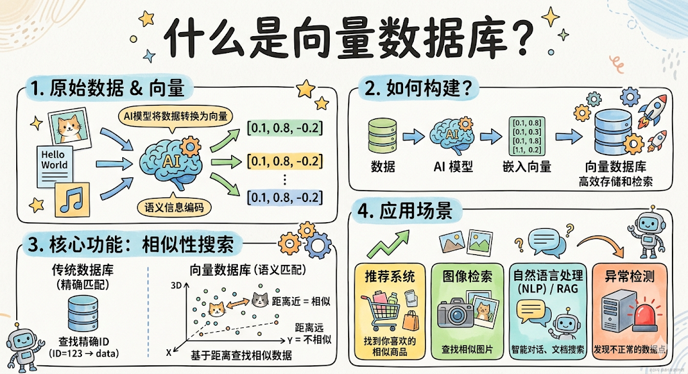
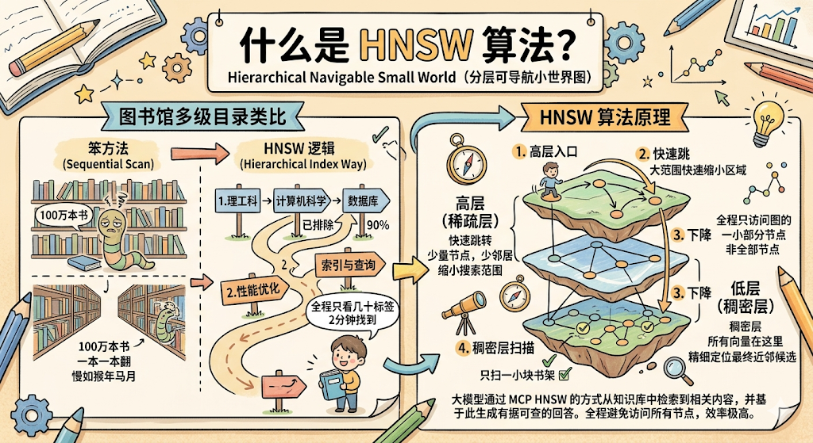

上一章 RAG 里，在介绍 RAG 工作阶段的时候，说把向量存进「向量数据库」，当时一带而过。&#x20;

你可能当时就想问： **为什么要专门用向量数据库？MySQL 不能存吗？**

这章就专门把这个问题讲清楚。

***

## 一、先别急，普通数据库能不能存向量？

能存，但有个很大的问题。

普通数据库存向量没问题，向量本质上就是一串浮点数，MySQL 建个字段存下来完全没难度。

难的是 **查&#x20;**。

***

## 二、普通数据库为什么查不了向量？

咱们先聊聊 MySQL 是怎么查数据的。

你写 `SELECT * FROM users WHERE id = 5` ，MySQL 走 B+ 树索引，几次跳转就找到了，极快。你写 `WHERE age > 18` ，同样走索引，范围扫描，也很快。

MySQL 的索引本质上是为两类操作优化的： **精确匹配&#x20;**&#x548C; **范围比较&#x20;**。

但向量搜索是完全另一回事。

向量搜索要做的事情是： **给你一个向量，找出和它最相似的 top-k 个向量&#x20;**。

「最相似」意味着要算距离，余弦相似度、欧氏距离……这类计算，需要拿着你的查询向量，和库里每一条向量都算一遍距离，然后排序，取最小的几个。

MySQL 的 B+ 树索引完全帮不上这个忙。它压根不知道怎么在多维空间里找「最近邻」。

**那就暴力遍历呗？**

来感受一下规模：

OpenAI 的 text-embedding-ada-002 模型，每个 chunk 转化出来的向量是 **1536 维&#x20;**。你的知识库有 100 万条 chunk，那么每次查询要算的浮点运算量是：

1536 维 × 100 万条 = 15.36 亿次浮点运算

这还只是算距离这一步。每次用户提问，都要触发一次这个计算量，普通数据库完全扛不住。

数据量涨到 1 亿条呢？1536 亿次浮点运算，一次查询可能要好几秒，完全不可用。

**总结：普通数据库存向量没问题，但查向量相似度完全没有优化，规模一上去就垮了。**

***

## 三、向量数据库是什么

向量数据库就是专门为解决这个问题设计的， **在海量向量中，毫秒级找到最相似的 top-k 条&#x20;**。

它存的东西和普通数据库差不多：向量 + 对应的原文（元数据）。但它有专门为向量搜索设计的索引结构，能把那个「15.36 亿次浮点运算」的暴力遍历，优化到几十毫秒甚至几毫秒完成。

关键问题就来了： **它怎么做到的？**

***

## 四、向量数据库怎么做到「又快又准」

秘诀是 **ANN（Approximate Nearest Neighbor，近似最近邻）&#x20;**&#x641C;索。

注意这个词： **近似&#x20;**。

向量数据库并不保证找到绝对最相似的那几条，而是找到「差不多最相似的」几条，精度换速度。但在实际场景里，「差不多最相似的」和「绝对最相似的」效果几乎没有区别，因为语义检索本身就不需要那么精确。

那它用的什么算法？目前最主流的是 **HNSW&#x20;**（Hierarchical Navigable Small World，分层可导航小世界图）。

名字很复杂，但原理用一个例子就能讲清楚。

### 图书馆的多级目录类比

你去一个大图书馆，想找一本叫《MySQL 索引优化》的书。

**笨方法&#x20;**：从第一排书架的第一本书开始，一本一本翻，直到找到它。100 万本书的图书馆，你翻到猴年马月。

**图书馆的实际做法&#x20;**：

* 第一步，看大类目录牌：理工科 → 计算机科学 → 数据库技术。三步跳转，你已经排除了 90% 的书架区域。

* 第二步，看中类目录：性能优化 → 索引与查询。再两步，进一步缩小范围。

* 第三步，直接在这一小块书架上找。扫几眼，拿到书。

整个过程不超过 2 分钟，而你总共只「看过」几十本书的标签，不是 100 万本。

**HNSW 就是这个逻辑。**

它把所有向量组织成一个多层的图结构：

* **高层（稀疏层）&#x20;**：只有少量「节点」，每个节点连接着几个「邻居」。高层负责大范围的快速跳转，帮你快速缩小搜索范围。

* **低层（稠密层）&#x20;**：所有向量都在这里，精细定位最终的近邻候选。

查询的时候，从高层入口进，快速跳转几步找到大致区域，然后下到低层精细扫描。全程只需要访问整个图的一小部分节点，而不是所有节点。

结果： **牺牲极少量精度（通常 95%+ 的召回率），换来 100 倍以上的速度提升&#x20;**。100 万条向量，几毫秒搞定。

***

## 五、主流向量数据库介绍

市面上向量数据库已经有不少选择了，咱们介绍五个最常见的。

### Chroma

本地轻量级向量数据库，Python 原生 API，几行代码就能跑起来，不需要任何部署配置。

适合干什么： **本地开发、功能验证、快速上手原型&#x20;**。你想跑通 RAG 的完整流程，Chroma 是最低摩擦的选择，装个 pip 包直接用。

缺点：不适合生产环境，没有高可用、分布式这些特性。

### Pinecone

全托管的云向量数据库，你不需要管任何基础设施，服务器、扩容、备份全都是 Pinecone 的事，你只需要调 API。

适合干什么： **快速上线，不想自己运维&#x20;**。创业公司、小团队，想把 RAG 功能上生产但没有专职 DBA，Pinecone 是最快的路径。

缺点：数据放在第三方，有数据合规顾虑的场景不适合；按用量收费，规模大了成本不低。

### Milvus

开源的生产级向量数据库，功能最全，支持多种索引类型、分布式部署、数据持久化。背后是 Zilliz 公司（国产）维护，社区活跃，文档完善。

适合干什么： **私有化部署的生产环境&#x20;**。数据不能出内网、需要精细控制、规模较大的场景，Milvus 是目前开源里功能最完整的选择。

缺点：部署和运维有一定复杂度，学习曲线比 Chroma 陡。

### Weaviate

开源向量数据库，特色是内置了 Embedding 集成，你可以直接把原始文本丢进去，Weaviate 自动帮你调 Embedding 模型转向量，不用自己处理这一步。同时支持图片、音频等多模态数据。

适合干什么： **需要多模态搜索、或者想简化 Embedding 步骤&#x20;**&#x7684;场景。

### Qdrant

Rust 实现的高性能向量数据库，内存占用低，查询速度快，适合资源受限或高并发场景。接口设计简洁，HTTP/gRPC 都支持。

适合干什么： **对性能和资源消耗敏感&#x20;**&#x7684;生产环境，比如在有限硬件上跑大规模向量检索。

***

## 六、怎么选？

讲了五个，选哪个？给你一个明确的决策树，不说「看情况」：

**学习 / 跑原型 → 用 Chroma**

零配置，pip 安装，几行代码跑通完整 RAG 流程。你现在就在学 RAG，直接用 Chroma，不要想太多。

**生产环境，不想管运维 → 用 Pinecone**

不想操心服务器、扩容、备份这些事，数据放云上也没问题，Pinecone 拿起来就用。

**生产环境，需要私有化部署 → 用 Milvus 或 Qdrant**

数据必须在自己服务器上，选这两个。团队有运维能力、需要最全功能选 Milvus；对性能和资源敏感、希望部署简单点选 Qdrant。

用厨房来类比这四个选择：

* **Chroma&#x20;**：家用厨房。够用，方便，不用专门装修，在家做饭首选。

* **Pinecone&#x20;**：叫外卖。你只管点菜，后厨、配送、洗碗全不用管，就是要花外卖费。

* **Milvus&#x20;**：专业餐厅厨房。功能齐全、可定制，但你得有专业厨师来管。

* **Qdrant&#x20;**：高效快餐厨房。出菜快、省资源，适合高并发大量出餐的场景。

***

## 七、普通数据库 vs 向量数据库

| 对比维度      | 普通数据库（MySQL）            | 向量数据库（Milvus/Pinecone…） |
| --------- | ----------------------- | ----------------------- |
| 核心用途      | 结构化数据存储和精确查询            | 向量存储和相似度搜索              |
| 索引结构      | B+ 树（适合精确匹配/范围查询）       | ANN 索引，如 HNSW（适合近邻搜索）   |
| 查询类型      | id = 5、age > 18、LIKE 匹配 | 找 top-k 个最相似向量          |
| 向量相似度查询   | 不支持（只能暴力全表扫描）           | 原生支持，毫秒级                |
| 百万级向量查询速度 | 数秒（暴力遍历，不可用）            | 毫秒级（ANN 索引加速）           |
| 数据形式      | 表格（行列结构）                | 向量 + 元数据                |
| 适合 RAG 吗  | 存能存，查不行                 | 专为这个场景设计                |

***

## 总结

这章的核心认知：

* **普通数据库存向量没问题，但查向量相似度完全没有优化&#x20;**。百万级向量 + 高维（1536 维）的暴力遍历，每次查询几十亿次浮点运算，压根跑不起来。

* **向量数据库专门解决「海量向量中毫秒级找最近邻」这个问题&#x20;**，靠的是 ANN 索引。

* **HNSW 是最主流的 ANN 索引&#x20;**，核心思路是多层图结构：高层大范围快速跳转，低层精细定位，就像图书馆的多级目录，不用翻所有书就能找到目标区域。代价是牺牲极少量精度，换来 100 倍以上的速度。

* **选型建议&#x20;**：学习用 Chroma，生产不想运维用 Pinecone，生产私有化部署用 Milvus 或 Qdrant。

理解了向量数据库，RAG 的离线建库这条链路就完整了：文档 → 切块 → 向量化 → **存进向量数据库&#x20;**。
