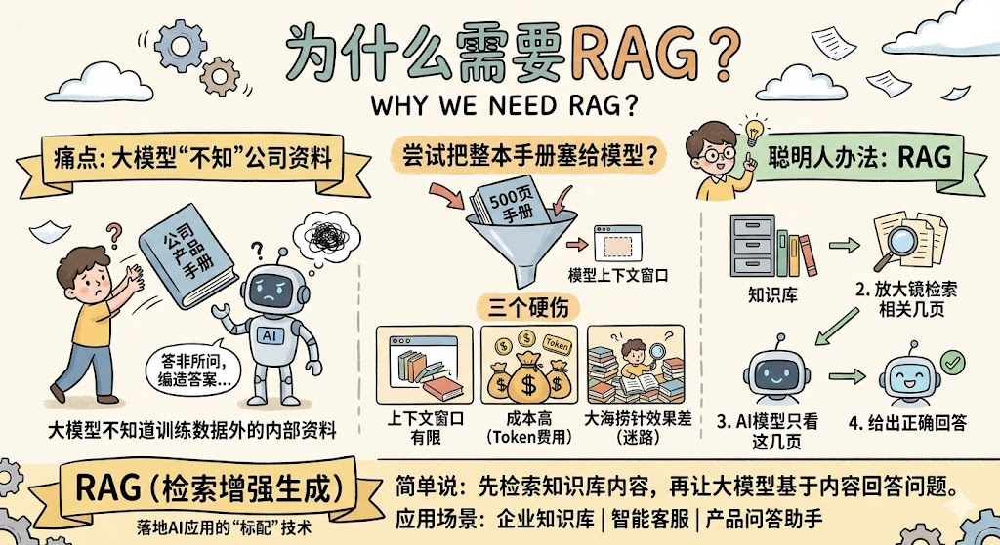
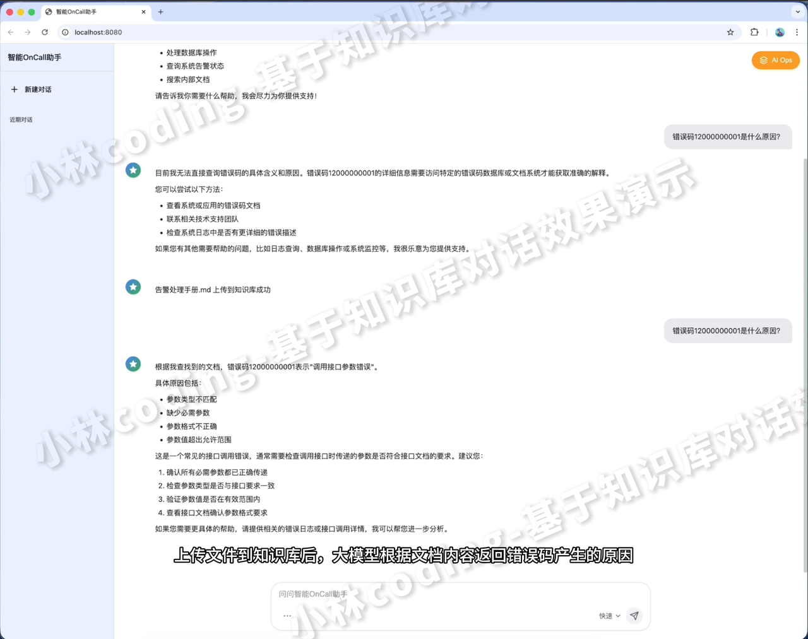
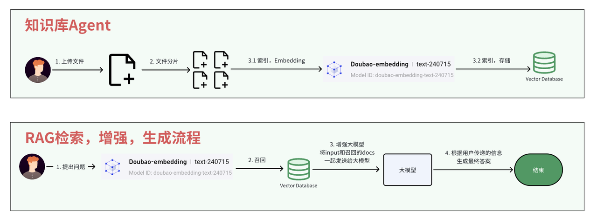
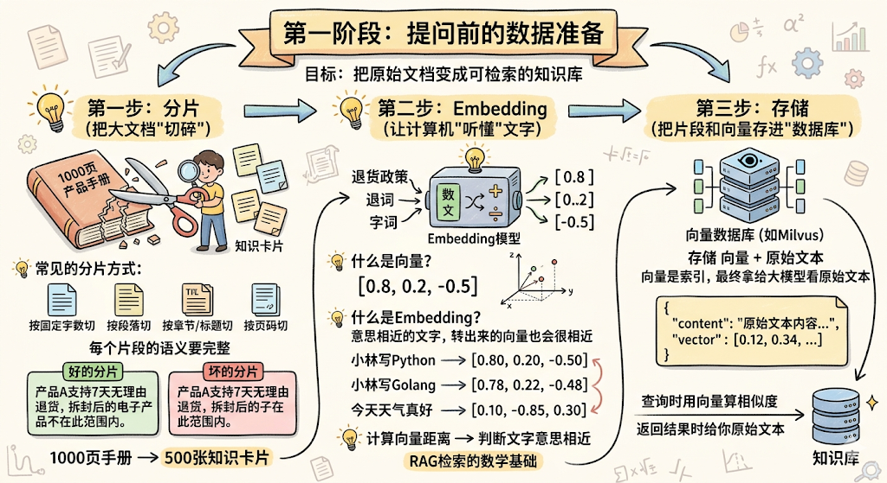
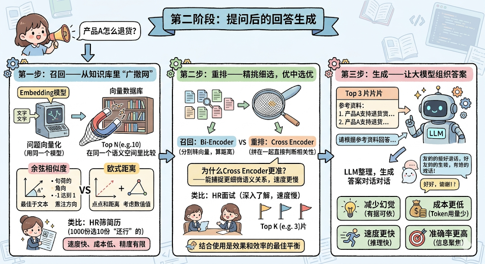
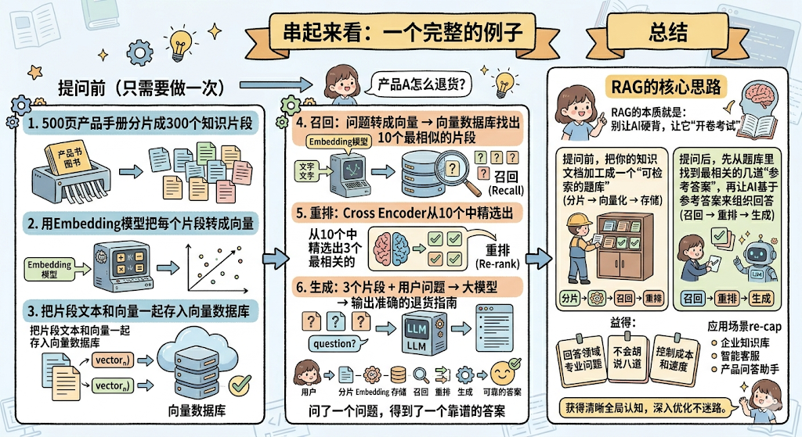

## 先聊聊，为什么需要RAG？

大家好，今天来聊一个在AI应用领域非常核心的技术——RAG。

你有没有遇到过这种情况：你兴冲冲地把公司的产品手册丢给ChatGPT，问它一个具体的业务问题，结果它要么答非所问，要么直接"编"了一个听起来很像回事但完全不对的答案？

这其实不怪大模型"笨"，而是它确实没学过你们公司的内部资料。大模型的知识来自训练数据，你公司那本500页的产品手册，它压根没见过。

那怎么办呢？最直觉的方式就是——把整本手册全部塞给模型，让它"现学现卖"。

但这样做有三个硬伤：

* **上下文窗口有限**：模型一次能处理的文本量是有上限的，500页的手册根本塞不进去。

* **成本高**：就算塞得进去，每次提问都要把整本手册发过去，token费用谁顶得住？

* **大海捞针效果差**：内容太多，模型反而容易"迷路"，找不到真正相关的信息。

所以，聪明人就想了一个办法： **我不把整本手册都给你，我先帮你把最相关的几页找出来，你只看这几页就行了。**

这个办法，就是 **RAG（Retrieval-Augmented Generation，检索增强生成）**。

简单说： **先检索，再生成**——先从知识库里捞出相关内容，再让大模型基于这些内容回答问题。

RAG现在被广泛用在企业知识库、智能客服、产品问答助手等场景里，可以说是落地AI应用的"标配"技术了。

|  |  |
| -------------------------------------------------------------- | -------------------------------------------------------------- |

## RAG的核心流程：两条链路

RAG的整体流程可以分为两个阶段，我喜欢把它们叫做 **"提问前"**和 **"提问后"**：

* **提问前（数据准备）**：分片 → Embedding → 存储

* **提问后（回答生成）**：召回 → 重排 → 生成

提问前做的事情，本质上就是 **把你的文档变成一个AI能理解的知识库**。提问后做的事情，就是 **从知识库里找答案，然后让AI组织语言回答你**。

接下来我们一步步来拆解。

## 第一阶段：提问前的数据准备

这个阶段的目标只有一个： **把你的原始文档，变成一个可以被快速检索的知识库。**

整个过程分三步：分片、向量化、存储。我们一个个来说。

### 第一步：分片——把大文档"切碎"

想象一下，你有一本1000页的产品手册。如果有人问你"产品A的退货政策是什么"，你不会把整本书递给他，而是会翻到退货政策那一页，把那一段内容指给他看。

分片做的就是这件事—— **提前把文档切成一段一段的小片段**，每个片段聚焦一个具体的知识点。

常见的分片方式有：

* **按固定字数切**：比如每1000个字切一段

* **按段落切**：以自然段落为单位

* **按章节/标题切**：按文档本身的结构来

* **按页码切**：一页一个片段

这里有一个非常重要的原则： **每个片段的语义要完整。**

什么意思呢？比如有这么一段话：

如果你恰好在"但需要注意的是"这里把它切断了，前半段说"支持退货"，后半段说"不在范围内"，两个片段各自都传达了不完整甚至矛盾的信息。用户搜到前半段就会以为随便退，搜到后半段又不知道说的是什么产品。

所以， **分片不是无脑切，而是要保证切出来的每一段都能独立表达一个完整的意思。**

一本1000页的手册，分完片可能变成500个左右的独立片段，每个片段就像一张知识卡片，聚焦一个具体问题。

### 第二步：Embedding——让计算机"听懂"文字

片段切好了，但计算机不认识中文啊。你跟它说"退货政策"，它只看到一堆字符编码，完全不理解这几个字是什么意思。

所以我们需要一种方式， **把人类的语言翻译成计算机能理解的"数学语言"**。

这就是Embedding（向量化）的作用。

#### 什么是向量？

别被"向量"这个词吓到，它其实很简单。

**向量就是一组数字**，比如 `[0.8, 0.2, -0.5]` 就是一个三维向量（三个数字，所以是三维）。你可以把它理解为一个坐标点——在三维空间里，这个点的位置就是 (0.8, 0.2, -0.5)。

低维的向量（1到3维）我们可以在坐标轴上画出来，但实际使用中，Embedding模型生成的向量维度非常高，可能有几百甚至上千维。虽然我们没法想象一个1000维的空间长什么样，但 **维度越高，能表达的信息就越丰富，对文本特征的刻画就越细腻**。

#### 什么是Embedding？

Embedding就是 **把一段文字变成一个向量的过程**。

关键来了： **意思相近的文字，转出来的向量也会很相近。**

举个例子：

* "小林写Python" → `[0.80, 0.20, -0.50]`

* "小林写Golang" → `[0.78, 0.22, -0.48]`

* "今天天气真好" → `[0.10, -0.85, 0.30]`

你看，前两句话讲的都是"小林在写代码"，虽然编程语言不同，但核心语义是相近的，所以它们的向量非常接近。而"今天天气真好"跟写代码完全不搭边，向量就差得很远。

这意味着什么？意味着 **我们可以通过计算向量之间的距离，来判断两段文字的意思是否相近**。这就是RAG能够"检索相关内容"的数学基础。

所以在这一步，我们要做的就是： **把上一步切好的每一个文档片段，都用Embedding模型转成一个向量。**

### 第三步：存储——把片段和向量存进"数据库"

向量生成好了，我们需要一个地方来存放它们。这个地方就是 **向量数据库**（比如Milvus）。

向量数据库存的不只是向量，而是 **向量 + 原始文本**，两个一起存。

为什么要存原始文本？因为向量只是用来做相似度计算的"索引"，最终我们要拿给大模型看的，还是原始的文字内容。

用一个更直观的方式来理解，向量数据库里的每条数据大概长这样：

`content` 是原始文本， `vector` 是这段文本对应的向量。查询时用向量算相似度，返回结果时给你原始文本。

到这里， **提问前的准备工作就完成了**。你的文档已经被切成片段、转成向量、存进数据库，知识库构建完毕，静静等待用户来提问。

## 第二阶段：提问后的回答生成

用户终于来提问了！比如他问："产品A怎么退货？"

接下来的流程分三步：召回、重排、生成。

### 第一步：召回——从知识库里"广撒网"

召回阶段做的事情，和提问前的索引过程是对称的：

1. **先把用户的问题也通过Embedding模型转成向量**（用的是同一个Embedding模型，这样才能保证在同一个"语义空间"里比较）。

1) **拿这个问题向量，去向量数据库里找最相似的片段**，挑出相似度最高的Top N个（比如10个）。

这个过程的核心是 **向量相似度计算**。常用的算法有两种：

**余弦相似度：**

* 计算两个向量夹角的余弦值，结果在-1到1之间

* 夹角越小，余弦值越接近1，说明两个向量方向越一致，语义越相近

* 它 **只看方向，不看长度**，所以特别适合文本语义匹配（因为我们关心的是"意思像不像"，不关心"文本长不长"）

**欧式距离：**

* 就是两个点之间的直线距离，距离越小说明越相似

* 它 **既看方向也看长度**，适合需要考虑数值大小的场景

在文本检索中，余弦相似度用得更多一些。

召回阶段的特点是： **速度快、成本低，但精度有限**。

你可以把它类比成HR筛简历——先按关键词从1000份简历中快速捞出10份"看起来还行"的，至于这10份里到底谁最合适，需要下一步来细看。

### 第二步：重排——精挑细选，优中选优

召回拿到了10个片段，但这里面可能有些是"擦边球"——跟问题沾点边但不太相关。我们需要进一步精筛。

这时候登场的是 **重排模型（Cross Encoder）**。

它的工作方式和召回阶段不一样：

* 召回阶段是把问题和片段 **分别**转成向量，然后算向量之间的距离（所以叫Bi-Encoder，双编码器）

* 重排阶段是把问题和片段 **拼在一起**输入模型，让模型直接判断"这两段话到底有多相关"（所以叫Cross Encoder，交叉编码器）

为什么Cross Encoder更准？因为它能同时"看到"问题和片段的完整内容，可以捕捉到更细微的语义关系。代价是——速度更慢。

这就像HR面试：筛简历可以很快（看关键词就行），但面试必须一个个来（要深入了解每个人）。

所以我们不会用Cross Encoder去处理整个知识库的所有片段（太慢了），而是 **只对召回阶段筛出来的10个片段做重排**，从中挑出Top K个（比如3个）最相关的。

**你可能会问：为什么不直接召回3个，省掉重排这一步？**

好问题！原因在于：

* 召回用的向量相似度虽然快，但精度有限，直接取Top 3很可能漏掉真正最相关的片段

* 重排用的Cross Encoder虽然准，但太慢，不能对所有片段都做

* 两者结合， **先用快但粗的方法广撒网，再用慢但准的方法精挑细选**，这是效果和效率的最佳平衡

### 第三步：生成——让大模型组织答案

现在我们手里有了3个最相关的知识片段，最后一步就是把它们和用户的问题一起交给大模型，让它生成最终的回答。

实际发给大模型的内容大概是这样的（简化版）：

大模型拿到这些信息后，就能 **基于真实的知识内容来组织语言、生成回答**，而不是凭自己的"想象"瞎编。

这一步的好处非常明显：

* **减少幻觉**：答案有据可依，模型不容易"编故事"

* **成本更低**：只需要发送3个相关片段，而不是整本手册，token用量大幅减少

* **速度更快**：输入内容少了，模型推理速度自然更快

* **准确率更高**：信息聚焦，模型不用在海量文本里"大海捞针"

## 串起来看：一个完整的例子

假设你搭建了一个公司产品的智能客服，整个RAG流程是这样的：

**提问前（只需要做一次）：**

1. 把500页产品手册 **分片**成300个知识片段

1) 用Embedding模型把每个片段 **转成向量**

1. 把片段文本和向量一起 **存入向量数据库**

**用户提问时（每次提问都走一遍）：**

1. 用户问："产品A怎么退货？"

1) **召回**：问题转成向量 → 向量数据库找出10个最相似的片段

1. **重排**：Cross Encoder从10个中精选出3个最相关的

1) **生成**：3个片段 + 用户问题 → 大模型 → 输出准确的退货指南

整个过程对用户来说就是"问了一个问题，得到了一个靠谱的答案"，但背后其实经历了 **分片 → Embedding → 存储 → 召回 → 重排 → 生成**这六个环节。

## 总结

最后来回顾一下RAG的核心思路： **RAG的本质就是：别让AI硬背，让它"开卷考试"。**

* 提问前，把你的知识文档加工成一个"可检索的题库"（分片 → 向量化 → 存储）

* 提问后，先从题库里找到最相关的几道"参考答案"，再让AI基于参考答案来组织回答（召回 → 重排 → 生成）

这样一来，AI既能回答你领域内的专业问题，又不会胡说八道，还能控制成本和速度。无论你是要搭企业知识库、智能客服，还是产品问答助手，RAG都是你绕不开的核心技术。

希望这篇文章能让你对RAG有一个清晰的全局认知。有了这个框架，后续深入到每个环节的优化细节时，你就不会迷路了。
