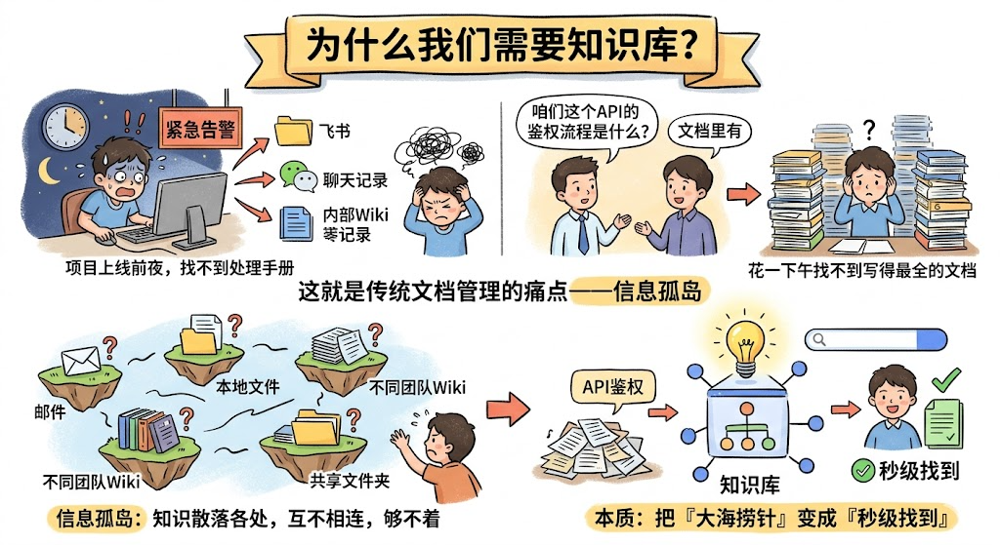
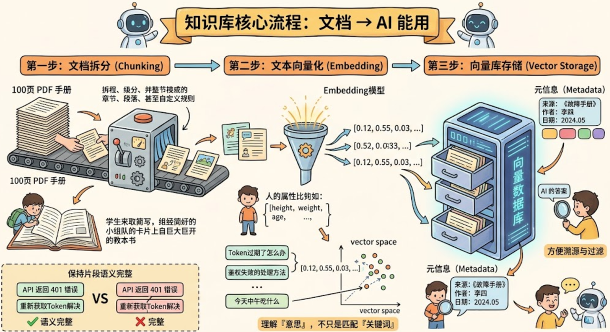
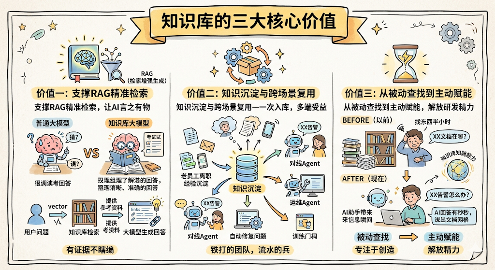
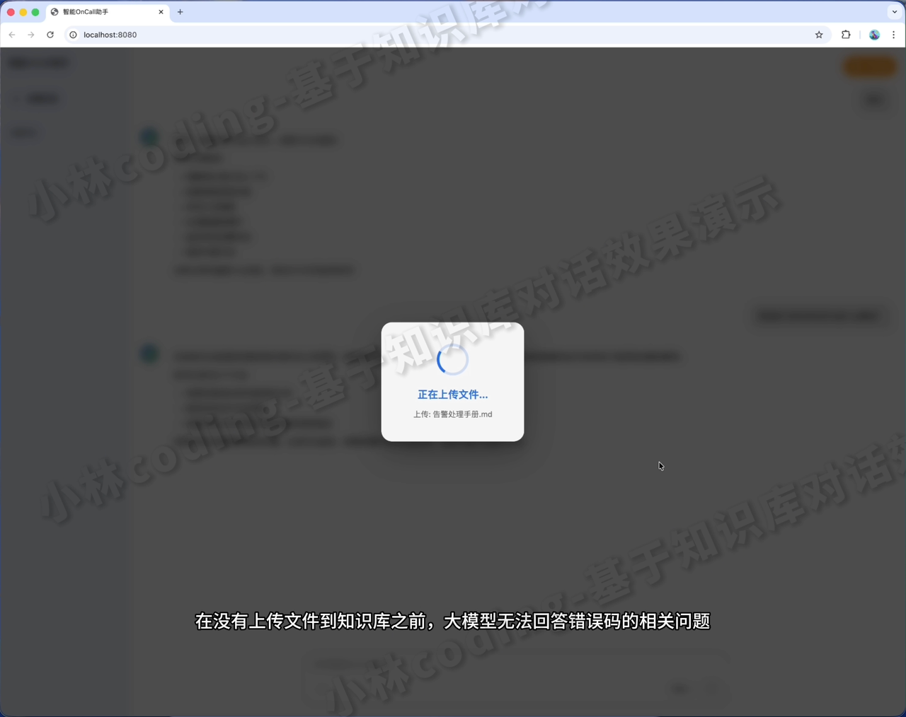
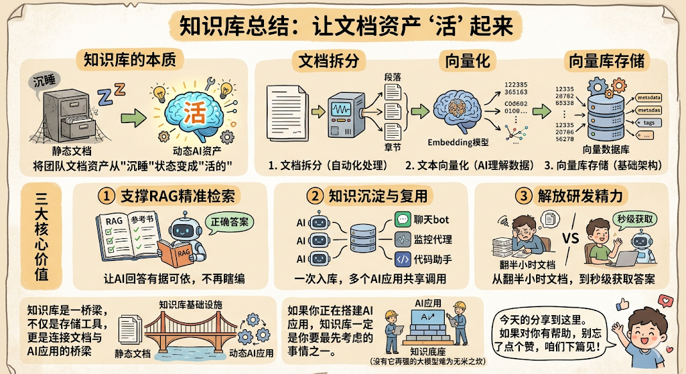

今天咱们来聊一个在AI应用中特别重要、但很多同学一开始容易忽略的东西—— **知识库 **。

先别急，咱们从一个你一定经历过的场景说起。

## 为什么我们需要知识库？

你有没有过这样的经历：项目上线前夜，突然报了一个告警，你印象中之前有人写过一份处理手册，但死活找不到在哪。翻了半小时的飞书文档、翻了聊天记录、翻了内部Wiki，最后发现那份文档藏在某个三级目录下的一个不起眼的角落里……

再比如，新同事入职了，问你"咱们这个API的鉴权流程是什么？"，你说"文档里有"，但他可能花了一下午，都没找到那份写得最全的文档。

**这就是传统文档管理的痛点——信息孤岛。**

什么意思呢？就是说，你的知识明明存在，但它们散落在各个角落，像一座座孤岛，彼此之间没有桥梁相连。你知道答案就在某个地方，但就是够不着。

所以，知识库的出现，本质上就是要解决一个问题： **把"大海捞针"变成"秒级找到"。**

## 知识库的核心目标是什么？

说白了，知识库就像你团队里最靠谱的 **智能知识管家 **。

它的核心目标，用一句话概括就是： **把团队积累的海量文档，从"沉睡的文件"变成"AI随时能调用的活资产"。**

这句话里有两个关键词，咱们拆开来说：

### 1. "沉睡的文件"

你想想，团队这些年写了多少文档？PDF、Markdown、技术手册、告警处理记录、历史工单……这些东西存在硬盘里、存在云文档里，如果没人主动去翻，它们就永远躺在那里，发挥不了任何价值。这就是"沉睡"。

### 2. "AI随时能调用的活资产"

知识库做的事情，就是把这些沉睡的文档"唤醒"。怎么唤醒？通过一套自动化的流程，把文档内容转化成AI能理解的格式，存到一个专门的数据库里。这样，当任何AI应用需要回答问题的时候，就能像查字典一样，秒级找到最相关的内容。

所以你看，知识库不是一个简单的"文档管理工具"，它更像是一座 **桥梁 **——连接着你的静态文档和动态的AI应用。

|  |  |
| ---------------------------------------------------------------------- | ---------------------------------------------------------------------- |

## 知识库的核心流程：从文档到AI能用，到底经历了什么？

好，目标讲完了，接下来咱们看看知识库到底是怎么干活的。别担心，流程并不复杂，总共就 **三步 **，我会一步步给你拆解。

### 第一步：文档拆分（Chunking）

你上传了一份100页的PDF技术手册，AI能直接读懂吗？答案是：不能，至少不能一口吞下去。

这就像你准备考试，你不会把一整本教材从头到尾读一遍就完事了吧？你会按章节、按知识点去拆分，做成一张张笔记卡片，对不对？

知识库做的也是同样的事情。它会自动把你上传的文档，按照 **章节、段落、甚至自定义的规则 **进行拆分。而且，它还会智能适配不同的文档格式——PDF有PDF的拆法，Markdown有Markdown的拆法。

这一步的关键在于： **每个拆出来的片段，都要包含完整的语义信息。**

什么意思？举个例子，假设文档里有一段话："当API返回401错误码时，通常是因为Token过期。解决方案是重新调用/auth/refresh接口获取新Token。"

如果拆分的时候，把"解决方案是重新调用/auth/refresh接口"和前面的"API返回401错误码"拆到了两个不同的片段里，那后续AI检索的时候，就可能只找到问题描述，却找不到解决方案。这就是"语义信息不完整"带来的问题。

所以， **好的拆分，是整个知识库质量的基石。**

### 第二步：文本向量化（Embedding）

拆分完成后，每个片段还是人类能读懂的文字。但问题是，AI不是用"读文字"的方式来理解内容的，它需要的是 **数学语言 **。

这一步，就是调用一个叫 **Embedding模型 **的东西，把每个文本片段转化为一组 **高维向量 **。

等等，"高维向量"是什么？别慌，咱们用一个通俗的类比来理解。

你可以把每个文本片段想象成一个人。每个人都有很多特征：身高、体重、年龄、爱好等等。如果我们用一组数字来描述一个人，比如\[175, 70, 25, ...]，那这组数字就是这个人的"向量表示"。

同样的道理，Embedding模型会根据文本的语义，给每个片段生成一组数字（通常是几百到上千维的）。 **语义越相近的文本，它们的向量在数学空间中就越"靠近"。**

举个例子：

* "Token过期了怎么办" 和 "鉴权失败的处理方法"，虽然字面上长得不一样，但语义是相近的，所以它们的向量会很接近。

* "Token过期了怎么办" 和 "今天中午吃什么"，语义完全不相关，向量就会离得很远。

这就是向量化的魔力—— **它让AI能理解"意思"，而不仅仅是匹配"关键词"。**

这也是为什么知识库比传统的关键词搜索强大得多的原因。传统搜索你搜"鉴权失败"，可能搜不到标题叫"Token过期处理"的文档。但基于向量的检索，就能把它们关联起来。

### 第三步：向量库存储

向量生成好了，总得有个地方存起来吧？这就是 **向量数据库 **的职责。

知识库会把生成的向量，连同它的 **元信息 **（比如：这段内容来自哪份文档、属于第几章、作者是谁、最后更新时间是什么），一起批量存入向量数据库中。

为什么要存元信息？两个原因：

1. **方便溯源 **：当AI给你一个回答的时候，你可以看到"这个答案来自《故障处理手册》第3章"，这样你就能判断答案靠不靠谱，而不是盲目信任AI。

1) **支持过滤 **：比如你只想搜索最近一个月更新的文档，或者只搜索某个特定作者写的内容，有了元信息就能轻松做到。

到这里，整个流程就跑通了： **文档上传 → 自动拆分 → 向量化 → 存入向量库**

整个过程是 **全自动 **的，你只需要把文档丢进去，剩下的交给Agent。

## 知识库的三大核心价值

流程搞明白了，咱们再来聊聊，知识库到底能给我们带来什么实打实的价值。

### 价值一：支撑RAG精准检索，让AI的回答"言之有物"

先解释一下 **RAG **（Retrieval-Augmented Generation，检索增强生成）。这个词听起来很唬人，但其实不难理解：

普通的大模型回答问题，是靠它训练时"记住"的知识。但问题是，它可能记错、记混，甚至"编造"一个看起来像模像样但完全错误的答案——这就是大模型的 **幻觉问题 **。

RAG的思路就是： **在AI回答之前，先去知识库里搜一搜，找到最相关的内容，然后把这些内容"喂"给大模型，让它基于真实的文档来生成回答。**

打个比方，就像你考试的时候带了一本参考书。你不是凭空编答案，而是翻书找到相关内容，再用自己的话组织出答案。这样写出来的东西，肯定比瞎编靠谱多了，对吧？

而知识库，就是RAG的 **数据底座 **。没有高质量的知识库，RAG就像考试带了一本全是乱码的参考书——根本没用。

具体来说，当你或者其他AI应用提出一个问题时：

1. 系统会把你的问题也转化为一个向量。

1) 然后拿这个向量去向量数据库里做 **相似性匹配 **，找出最接近的几个文档片段。

1. 把这些片段作为"参考资料"交给大模型，大模型基于这些资料生成最终的回答。

这样一来，AI的回答就有了"出处"，有了"证据"，而不是瞎猜的。

### 价值二：知识沉淀与跨场景复用——一次入库，多端受益

这个价值，对团队来说是最有长远意义的。

我们经常说"铁打的团队，流水的兵"。老员工离职了，他脑子里的经验怎么办？新人入职了，谁来手把手教他那些"只可意会不可言传"的坑？

知识库解决的就是这个问题。它把散落在各处的经验、文档、处理记录，都统一转化为 **向量资产 **，沉淀在知识库里。

* **老员工离职？ **没关系，他写过的文档、处理过的工单，都已经被知识库消化吸收了。新人直接问AI就行。

* **新人上手慢？ **没关系，有了知识库加持的AI，新人遇到问题直接提问，就能获得基于团队历史经验的精准回答。

更关键的是，知识库是 **通用的 **。你上传一次文档，多个AI应用都能调用。

比如， 你上传了一份《故障处理手册》：

* **对话Agent **可以用它来回答值班同事的告警咨询。

* **运维Agent **可以用它来自动排查线上问题。

一份文档，多个场景，全都受益。 **这就是"一次入库，多端受益"的威力。**

|  |  |
| -------------------------------------------------------------------- | -------------------------------------------------------------------- |

### 价值三：从被动查找到主动赋能，解放研发精力

还记得我们开头说的那个场景吗？找一份文档翻半小时。

有了知识库之后，这个问题就彻底消失了。

你上传文档，Agent自动处理一切。处理完成后，你只需要对着AI说一句"XX告警应该怎么处理？"，几秒钟就能得到答案，还附带文档出处。

这意味着什么？意味着你的研发团队 **不用再把宝贵的时间浪费在"找东西"上 **，可以把精力放在真正有创造性的工作上。

## 总结

最后咱们来做个简单的回顾。

知识库的本质，是把团队的文档资产从"沉睡"状态变成"活的"。它通过三步核心流程—— **文档拆分、向量化、入库存储 **，实现了全自动化的知识处理。

它带来的三大核心价值：

| 价值        | 一句话总结           |
| --------- | --------------- |
| 支撑RAG精准检索 | 让AI回答有据可依，不再瞎编  |
| 知识沉淀与复用   | 一次入库，多个AI应用共享调用 |
| 解放研发精力    | 从翻半小时文档，到秒级获取答案 |

记住，知识库不是一个简单的文档存储工具，它是连接 **静态文档 **和 **动态AI应用 **的桥梁，是整个AI应用体系的 **基础设施 **。

如果你正在搭建AI应用，知识库一定是你要最先考虑的事情之一。因为没有好的知识底座，再强的大模型也是巧妇难为无米之炊。

好了，今天的分享就到这里。如果对你有帮助，别忘了点个赞，咱们下篇见！

