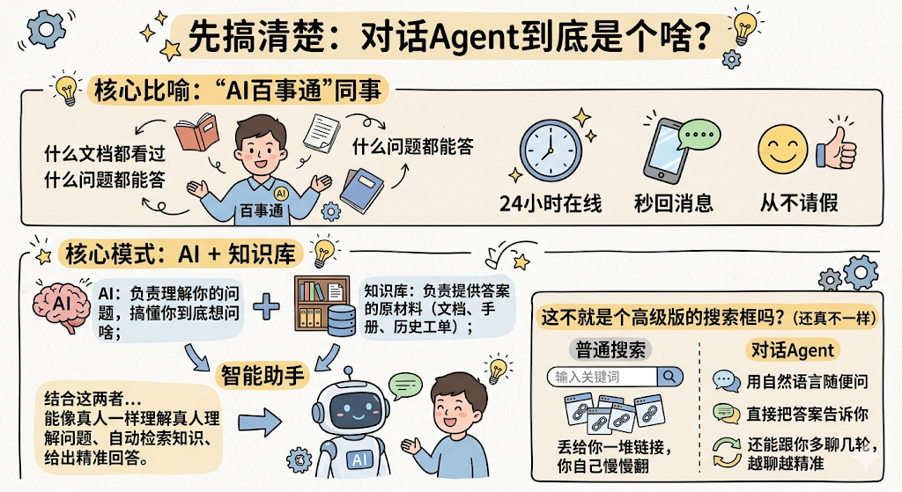
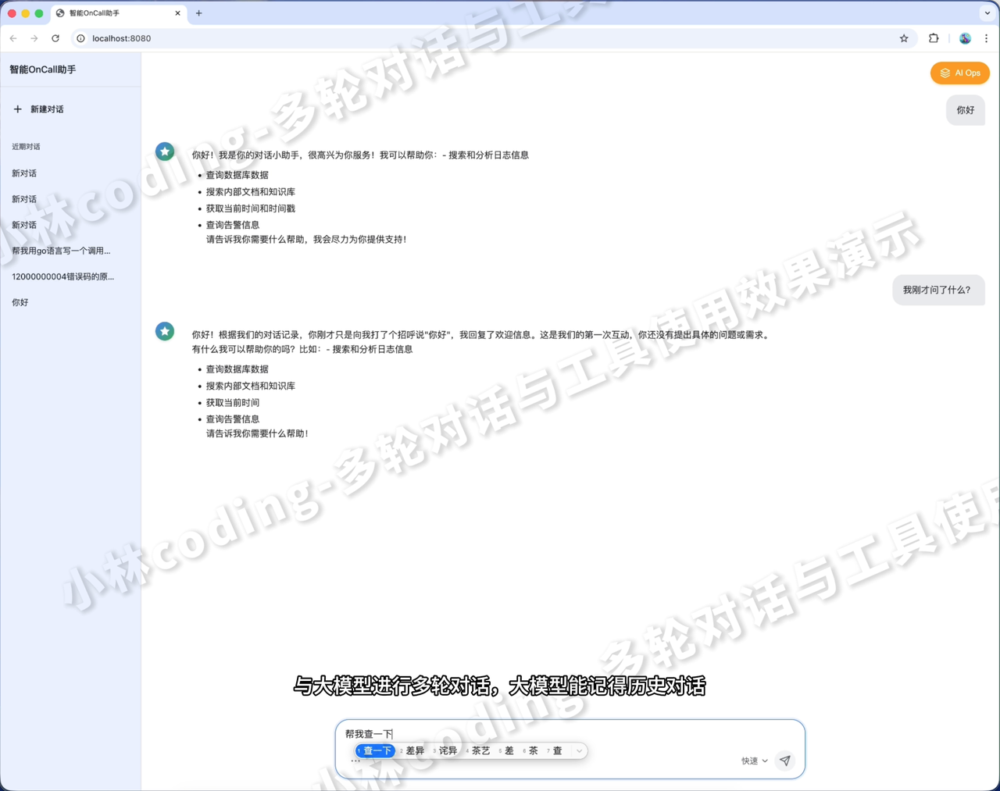
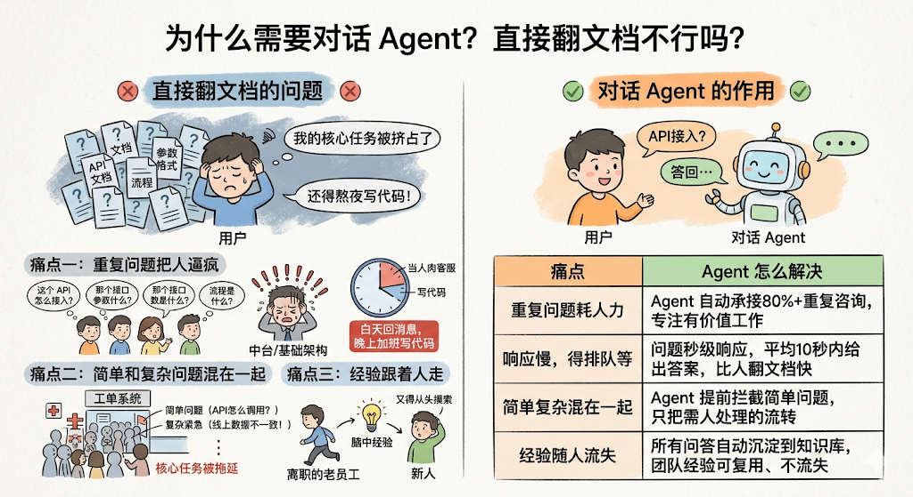
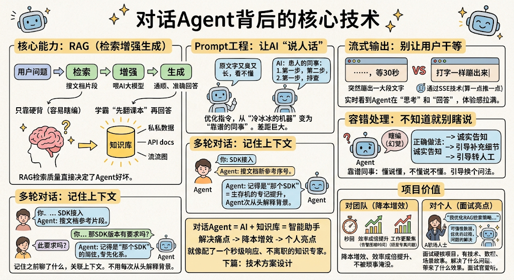

## 先搞清楚：对话Agent到底是个啥？

想象一下，你们团队里有个"百事通"同事，什么文档都看过，什么问题都能答，而且 **24小时在线，秒回消息，从不请假&#x20;**。对话Agent，本质上就是这么一个"AI百事通"。

说得稍微技术一点，它的核心模式其实就是 **AI + 知识库&#x20;**：

* **AI&#x20;**&#x8D1F;责理解你的问题，搞懂你到底想问啥；

* **知识库&#x20;**&#x8D1F;责提供答案的原材料，比如你们团队沉淀下来的文档、手册、历史工单等等。

把这两者结合起来，就是一个能像真人一样理解问题、自动检索知识、给出精准回答的 **智能助手&#x20;**。

你可能会想："这不就是个高级版的搜索框吗？"

还真不一样。普通搜索是你输入关键词，它丢给你一堆链接，你自己慢慢翻。而对话Agent是你用 **自然语言&#x20;**&#x968F;便问，它直接把 **答案&#x20;**&#x544A;诉你，而且还能跟你多聊几轮，越聊越精准。

|  |  |
| ------------------------------------------------------------------- | ------------------------------------------------------------------- |

## 为什么需要对话Agent？直接翻文档不行吗？

这个问题问得好。我猜很多同学的第一反应也是："团队有文档啊，有手册啊，自己翻翻不就行了？"

道理是没错，但现实往往是这样的

### 痛点一：重复问题把人逼疯

你有没有这种体验？作为中台或者基础架构的同学，每天被业务方追着问：

* "这个API怎么接入？"

* "那个接口的参数格式是什么？"

* "流程是什么？要找谁审批？"

这些问题， **每一个单独看都不难&#x20;**，但架不住每天都有人问，而且问的基本是 **同样的问题&#x20;**。

结果就是，你可能 **50%的工作时间&#x20;**&#x90FD;在当"人肉客服"，真正写代码、解决核心问题的时间反而被挤占了。白天回消息，晚上加班写代码——这谁顶得住？

### 痛点二：简单问题和复杂问题混在一起

工单系统里，"API怎么调用"和"线上数据不一致"这两类问题可能排在一起等你处理。简单的问题占了大头，但你得一个个看，核心的、紧急的任务反而被拖延了。

这就像你去医院急诊，前面排了一堆感冒发烧的，真正需要急救的反而排不上号。

### 痛点三：经验跟着人走

团队里那个"什么都懂"的老员工离职了，带走的不只是人，还有一脑子的经验和解决方案。

新人来了，又得从头摸索，踩一遍前人踩过的坑。

**对话Agent，就是专门来解决这些痛点的。**

简单总结一下它能带来什么：

| 痛点       | Agent怎么解决                                        |
| -------- | ------------------------------------------------ |
| 重复问题耗人力  | Agent自动承接 **80%以上&#x20;**&#x7684;重复咨询，让你专注有价值的工作 |
| 响应慢，得排队等 | 问题进来 **秒级响应&#x20;**，平均10秒内给出答案，比人翻文档快太多          |
| 简单复杂混在一起 | Agent提前拦截简单问题，只把 **真正需要人处理的&#x20;**&#x6D41;转过来   |
| 经验随人流失   | 所有问答自动沉淀到知识库，团队经验 **可复用、不流失**                    |

## 对话Agent能用在哪些场景？

说完了"为什么需要"，咱们再来看看"具体怎么用"。

对话Agent有一个很爽的特点： **核心逻辑是通用的&#x20;**。它的底层就是"理解问题 → 检索知识 → 返回答案"，所以它天然能适配很多场景。下面我挑三个最典型的给大家拆解一下：

### 场景一：业务方支持

这是最常见的场景了。

**以前是这样的：**

业务方有问题 → 在群里@中台同学 → 中台同学放下手头的活 → 打开文档翻半天 → 组织语言回复 → 业务方追问 → 再翻文档 → 再回复……

一个简单的问题，可能来回折腾半小时，中台同学的心态也崩了。

**用了Agent之后：**

业务方有问题 → 直接问Agent → Agent秒回答案 → 搞定！

如果Agent答不了的复杂问题，再自动转给中台同学处理。

你看，中台同学从"人工客服"变成了只处理"疑难杂症"的专家，工作体验完全不一样了。

### 场景二：值班自救

半夜三点，告警来了，你睡眼惺忪地爬起来，对着告警信息一脸懵。

**以前是这样的：**

看到告警 → 打开电脑 → 翻故障处理手册 → 找到对应章节 → 照着操作 → 祈祷别搞错……

整个过程可能5到10分钟，而且凌晨脑子不清醒，翻手册还容易看错。

**用了Agent之后：**

把告警信息复制给Agent → Agent自动检索《故障处理手册》→ **10秒内&#x20;**&#x63A8;送对应的修复步骤 → 你照着确认执行就行。

这就好比，以前你得自己翻字典查单词，现在有个翻译官直接告诉你答案。效率完全不在一个量级。

### 场景三：工单预处理

研发团队每天可能收到几十上百条工单，里面大量是重复的、简单的问题。

**以前是这样的：**

新工单进来 → 研发一条条看 → 发现大部分是老问题 → 复制粘贴之前的回复 → 真正复杂的问题反而排到后面了。

**用了Agent之后：**

新工单进来 → Agent先检索历史案例库 → 简单问题自动回复 → 复杂问题标记后流转给人工。

相当于Agent帮你做了一轮"分诊"，你拿到手的全是真正需要动脑子的问题。

看到没？ **一套Agent，多个场景复用&#x20;**。这也是为什么说对话Agent是一个非常理想的中台服务项目——投入产出比极高。

## 对话Agent背后的核心技术

聊完了场景，你可能好奇：Agent是怎么做到"智能回答"的？它背后到底用了什么技术？

别担心，我尽量用大白话给你讲明白。

### 核心能力：RAG（检索增强生成）

RAG 是 **Retrieval-Augmented Generation&#x20;**&#x7684;缩写，翻译过来叫"检索增强生成"。

这名字听着唬人，但原理其实不复杂。咱们拆开来看：

1. **检索（Retrieval）&#x20;**：用户问了一个问题，Agent先去知识库里"搜"相关的文档片段。

1) **增强（Augmented）&#x20;**：把搜到的文档片段作为"参考资料"，喂给AI大模型。

1. **生成（Generation）&#x20;**：AI大模型结合问题和参考资料，生成一个通顺、准确的回答。

打个比方：你问一个学霸一道题，这个学霸不是纯靠脑子硬想（那容易瞎编），而是先翻了一下课本找到相关知识点，然后结合课本内容给你讲解。 **RAG就是让AI先"翻课本"再回答，所以答案更靠谱&#x20;**。

为什么不直接让AI回答，还要先检索？

因为AI大模型虽然很聪明，但它的知识有"截止日期"，而且不了解你们团队内部的私有知识（比如你们的API文档、业务流程）。通过RAG，我们把团队的知识"喂"给它，它就能回答团队内部的问题了。

这里面有个关键挑战： **怎么搜得准？**

如果用户问"怎么接入支付SDK"，Agent搜出来的是一堆不相关的文档，那回答肯定也是驴唇不对马嘴。所以RAG的检索质量，直接决定了Agent好不好用。

### Prompt工程：让AI"说人话"

你有没有觉得有些AI回答问题像念课文，生硬死板？这就是Prompt（提示词）没写好。

**Prompt工程&#x20;**，简单说就是"怎么跟AI下指令，让它按你想要的方式回答"。

举个例子，同样是回答"怎么接入支付SDK"：

* **没优化Prompt&#x20;**：AI可能回答一大段技术文档的原文，又臭又长，看不懂。

* **优化了Prompt&#x20;**：AI会像一个耐心的同事一样，分步骤告诉你：第一步做什么，第二步做什么，遇到问题怎么排查。

好的Prompt能让Agent从"冷冰冰的机器"变成"靠谱的同事"，这个差距是巨大的。

### 多轮对话：记住上下文

我们跟人聊天的时候，不会每句话都把前因后果重复一遍，对吧？比如：

注意第二个问题，你说的是"那SDK版本"——如果Agent没有上下文记忆，它根本不知道你问的是哪个SDK。

所以， **多轮对话能力&#x20;**&#x5C31;是让Agent记住你之前聊了什么，能够关联上下文来理解你的新问题。就像你跟同事聊天，不用每次都从头解释一遍背景。

### 流式输出：别让用户干等

想象一下，你问了Agent一个问题，然后盯着屏幕等了30秒，突然"唰"一下蹦出一大段文字。这体验很糟糕，因为你不知道它到底在不在处理，会忍不住想"是不是卡了？"

**流式输出&#x20;**（通过SSE技术实现）就是让回答像打字一样， **一个字一个字地往外蹦&#x20;**。这样用户能实时看到Agent在"思考"和"回答"，体验感直接拉满。

### 容错处理：不知道就别瞎说

最后一个重要的点： **当Agent在知识库里找不到答案时怎么办？**

最差的做法是瞎编一个答案（AI确实有这个"毛病"，行话叫 **幻觉&#x20;**——Hallucination）。

正确的做法是：

1. 诚实告知用户"这个问题我暂时回答不了"；

1) 引导用户补充更多细节，看看换个问法能不能找到答案；

1. 如果确实超出能力范围， **自动引导转人工服务&#x20;**。

## 最后总结一下

咱们今天聊了对话Agent的需求背景、应用场景、核心技术和项目价值，快速回顾一下：

1. **是什么&#x20;**：对话Agent = AI + 知识库，一个能自动理解问题、检索知识、给出答案的智能助手。

1) **为什么需要&#x20;**：解决重复咨询耗人力、响应慢、经验易流失等痛点。

1. **用在哪&#x20;**：业务方支持、值班自救、工单预处理——一次开发，多场景复用。

1) **怎么做到的&#x20;**：RAG检索增强生成、Prompt工程、多轮对话、流式输出、容错处理。

简单说，对话Agent就像给你的团队配了一个 **永不离职、秒级响应的知识专家&#x20;**。它场景贴合日常、技术逻辑清晰、业务价值肉眼可见。

好了，需求和场景分析到这里就讲完了。下一篇，我们就正式进入技术方案设计环节，聊聊对话Agent到底该怎么一步步搭起来。
