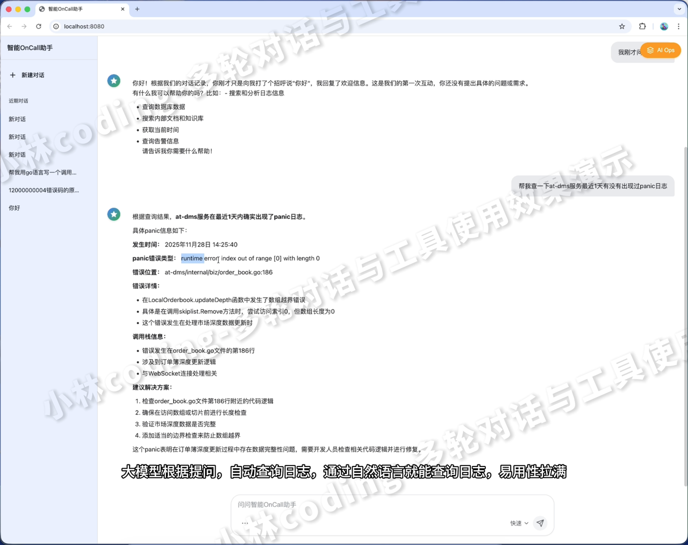
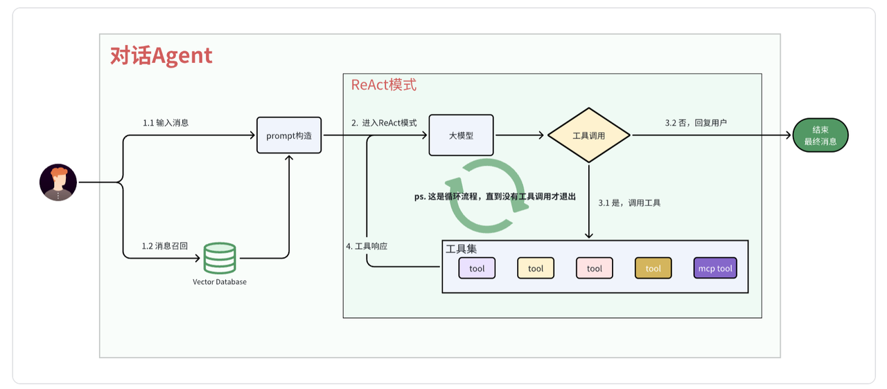
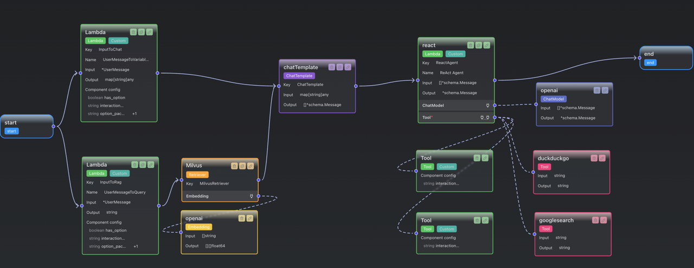

|  |  |
| -------------------------------------------------------------------- | -------------------------------------------------------------------- |

# 从RAG召回到ReAct多轮交互

## 架构总览

对话Agent的核心目标是结合外部知识（RAG召回）与工具调用能力（ReAct模式），解决复杂问题。

整体流程可概括为：

1. 用户输入 -> embedding -> 向量数据库召回

2. 构建带上下文(召回的内容)的 prompt

3) ReAct模式多轮交互

4) 最终输出答案

## 核心流程拆解

### RAG召回：让Agent学习外部知识

**目标&#x20;**：从向量数据库中获取与用户问题相关的上下文信息，避免大模型出现"幻觉"。

**步骤&#x20;**：

1. 用户输入经 `InputToRag Lambda Node` 处理，生成用于召回的字符串

2. 调用 Retriever 组件 （以Milvus数据库为例），通过Embedding将问题向量化

3) 向量数据库执行相似度匹配，返回相关文档

4) 结果存入 `map["documents"]` ，作为后续Prompt的上下文来源 。

### Prompt构建：动态拼接上下文与对话历史

**目标&#x20;**：将用户输入、RAG召回内容、 对话历史 整合成大模型可理解的prompt。 prompt构建好后，将prompt移交给ReAct组件使用。

**核心组件&#x20;**： `ChatTemplate`&#x20;

* **输入&#x20;**：两个lambda node的输出合并

* **占位符设计&#x20;**：

  * `{content}` ：用户原始问题

  * **`{documents}`** **：RAG召回的相关文档**

  * `{date}` ：当前时间（增强时效性）

  * `{history}` ：历史对话

### ReAct模式：让Agent学会"思考-行动-观察"循环

**目标&#x20;**：通过多轮工具调用解决复杂问题，核心是"显式思考→工具调用→结果观察"。

**循环四步骤：**

1. **Reason（思考）&#x20;**：大模型分析问题， 判断是否需要调用工具 （如"需要查实时数据→调用搜索工具"）。

2. **Action（执行）&#x20;**：返回工具调用请求（含函数名、参数，如 `{"name":"Search","parameters":{"query":"2025世界杯冠军"}}` ，调用工具获取返回结果（如搜索到"阿根廷夺冠"）。

3) **Observation（观察）&#x20;**：工具结果返回给大模型，开始新一轮循环（若无需继续调用工具，则输出最终答案）。

## 关键组件深析

### Lambda Node ：数据流转的"转换器"

* **InputToRag&#x20;**：

  * 输入：用户原始问题（可自定义预处理，如过滤无关信息）。

  * 输出：用于RAG召回的字符串（直接影响召回精度，需确保与向量数据库存储内容匹配）。

* **InputToChat&#x20;**：

  * 输入：用户问题+对话历史。

  * 输出： `map` 结构（含 `content` / `history` 等key），作为 `ChatTemplate` 的动态参数来源。

  *

### Retriever：向量召回的"连接器"

以Milvus实现为例， `Retrieve` 方法核心逻辑：

### Tool：Agent的"双手"

Tool本质是 **带描述的函数&#x20;**，需明确告知大模型：

* 函数名称（如"查询当前时间"）

* 入参/返参格式（json来描述）

* 使用场景（如"当问题涉及当前时间时调用"）

例：定义一个时间工具

# 总结：Agent能力的三角支柱

对话Agent的智能源于三方面协同：

* **RAG召回&#x20;**：赋予外部知识记忆能力。

* **动态Prompt&#x20;**：让大模型学习外部知识，并带有记忆(历史对话)。

* **ReAct模式&#x20;**：实现复杂任务拆解与工具调用。

*
