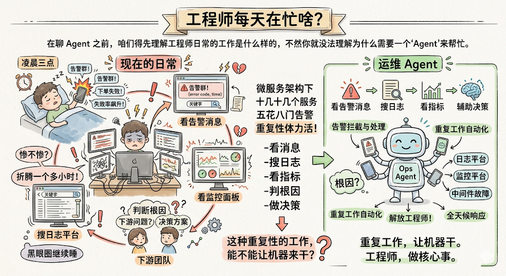
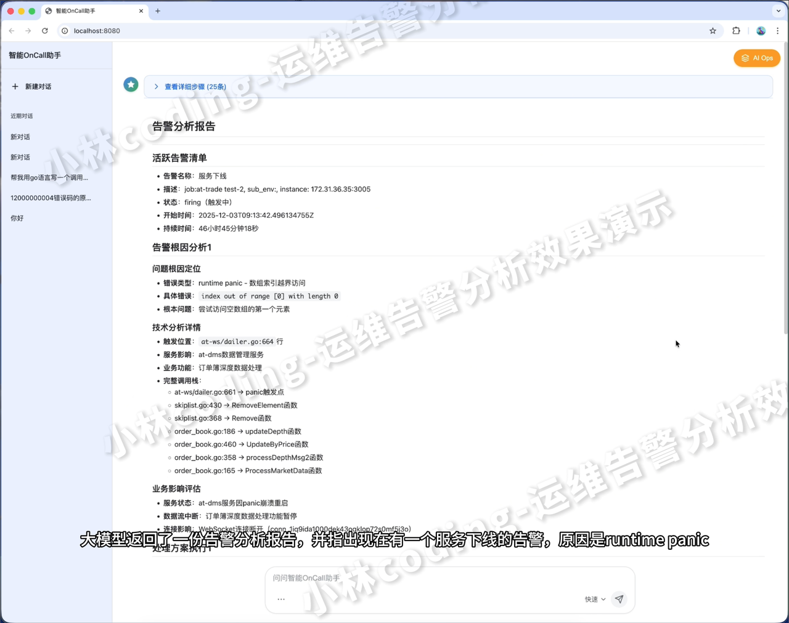
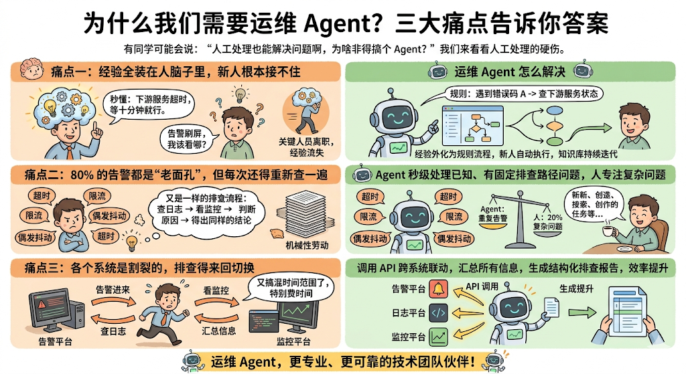
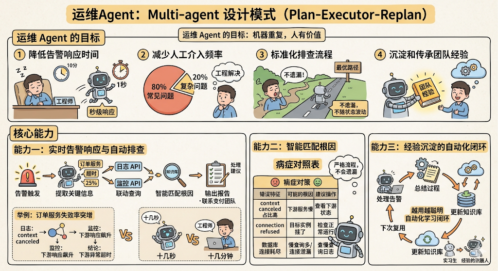

# 运维 Agent 到底是个啥？

如果你是刚入行的同学，可能会觉得"运维"这个词离自己有点远，但实际上，只要你写的代码上了线、跑在服务器上，你就已经和运维打上交道了。

别急，咱们一步一步来，从最基础的场景讲起。

## 先搞清楚一个问题：工程师每天在忙啥？

在聊 Agent 之前，咱们得先理解工程师日常的工作是什么样的，不然你就没法理解为什么需要一个"Agent"来帮忙。

想象一下这样的场景：

听起来是不是挺惨的？但这就是很多团队真实的日常。

在现在流行的 **微服务架构&#x20;**&#x4E0B;（简单理解就是：一个大系统被拆成了很多小服务，彼此通过网络调用协作），每个团队可能同时维护着十几甚至几十个服务。告警类型也五花八门：接口超时、数据库连接异常、中间件故障、下游依赖挂了……

而处理这些告警的流程，说白了就是一套 **重复的体力活&#x20;**：

1. 看告警消息，提取关键信息（哪个服务？什么错误？什么时间？）

1) 去日志平台搜日志

1. 去监控平台看指标曲线

1) 根据经验判断根因

1. 决定处理方案（观察？重启？联系下游？）

这套流程，不管是白天还是半夜，不管是老手还是新人，每次都得走一遍。

**问题来了：这种重复性的工作，能不能让机器来干？**

答案就是——运维 Agent。

## 运维 Agent 是什么？用一句话解释

你可以把运维 Agent 理解成一个 **7×24 小时在线的、不会累的"虚拟值班工程师"&#x20;**。

它能自动接收告警，然后像一个有经验的老工程师一样，按照预设的排查步骤去查日志、看监控、分析原因，最后给出一份排查报告和处理建议。

注意这里有个关键词叫 **Agent&#x20;**，这个词在 AI 领域特指"能自主决策和执行任务的智能体"。它和普通的脚本、定时任务不一样——脚本是你写死了"第一步做什么、第二步做什么"，而 Agent 能根据中间的结果 **动态调整&#x20;**&#x4E0B;一步的动作，更像一个"会思考的助手"。

举个例子：

* **普通脚本&#x20;**：告警来了 → 固定查某个日志 → 固定发一条消息。不管查到什么，流程都一样。

* **运维 Agent&#x20;**：告警来了 → 先查日志 → 发现是超时错误 → 那就再去查下游服务的状态 → 发现下游正常 → 那就看看是不是自己服务的连接池满了 → 一步步推理下去，最终定位到根因。

看到区别了吗？Agent 的核心在于它能 **根据上一步的结果，决定下一步该干什么&#x20;**，这就比写死的脚本灵活太多了。

## 为什么我们需要运维 Agent？三大痛点告诉你答案

有同学可能会说："虽然人工处理麻烦了点，但最终也能把问题解决啊，为啥非得搞个 Agent？"

这个问题问得好，我们来看看人工处理到底有哪些硬伤。

### 痛点一：经验全装在人脑子里，新人根本接不住

运维排查非常依赖经验。一个干了三年的老工程师，看到某个错误码可能秒懂："哦，这是下游 XX 服务超时的经典表现，不慌，等十分钟就好了。"

但如果换成一个刚入职的新同学呢？告警群里消息刷屏，他可能连应该先看哪个系统都不知道，更别提快速判断根因了。

更麻烦的是，很多排查经验是靠"口口相传"的——老工程师随口提一句"这种情况你去看看 XX 指标"，但这些知识从来没有被系统地记录下来。一旦关键人员离职或转岗，这些宝贵的经验就跟着一起走了，也就是我们常说的 **知识断层&#x20;**。

**运维 Agent 怎么解决这个问题？**

Agent 的排查逻辑是被明确写成规则和流程的。比如"遇到错误码 A，先查下游服务状态；遇到错误码 B，先看连接池指标"。这些规则本质上就是把资深工程师脑子里的经验 **外化成了可执行的知识库&#x20;**。

新人不需要记住所有的排查技巧，Agent 会按照最优路径自动执行。而且这个知识库是可以持续迭代和维护的，团队里任何人都可以贡献新的规则。

### 痛点二：80% 的告警都是"老面孔"，但每次还得重新查一遍

这是最让人抓狂的一点。

你有没有这种感觉：这周处理的告警，上周也遇到过，上上周也遇到过，每次都是一样的原因、一样的处理方式，但你每次都得走一遍完整的排查流程。

实际工作中， **大约 80% 的告警都是重复出现的常见问题&#x20;**——超时、限流、偶发抖动等等。这些问题的排查步骤几乎是固定的，工程师每次都在做"查日志 → 看监控 → 判断原因 → 得出同样的结论"这种机械性劳动。

**运维 Agent 怎么解决这个问题？**

这恰恰是 Agent 最擅长的事情。对于这些已知的、有固定排查路径的问题，Agent 可以在秒级完成处理，根本不需要人来介入。只有当 Agent 遇到它无法识别的新问题时，才需要升级给人工处理。

这样一来，工程师就可以把精力放在真正需要人脑去思考的复杂问题上，而不是被淹没在重复劳动里。

### 痛点三：各个系统是割裂的，排查得来回切换

这一点可能初学者不太好理解，我多解释下。

在一个正规的技术团队里，通常会有好几套平台各司其职：

* **告警平台&#x20;**：负责告诉你"出事了"

* **日志平台&#x20;**：记录了服务运行时的详细日志（你可以理解为服务的"日记"）

* **监控平台&#x20;**：用各种图表展示服务的健康指标（比如 CPU 使用率、接口响应时间、错误率等）

这些平台之间通常是 **互相独立&#x20;**&#x7684;。也就是说，你在告警平台看到了"接口 A 失败率飙升"，但要查原因，你得自己手动切到日志平台，输入接口名和时间范围去搜索；搜完日志，你又得切到监控平台去看对应的曲线图。

这个来回切换的过程特别浪费时间，尤其是在半夜脑子不太清醒的时候，很容易遗漏信息或者搞混时间范围。

**运维 Agent 怎么解决这个问题？**

Agent 可以通过调用各个平台的 **API&#x20;**（你可以理解为"程序之间互相通信的接口"）来实现 **跨系统联动&#x20;**。

具体来说，当一条告警进来，Agent 可以：

1. 从告警消息中自动提取关键信息（服务名、接口名、时间范围）

1) 拿着这些信息去调日志平台的 API，拉回相关日志

1. 同时调监控平台的 API，拉回对应时间段的指标数据

1) 把所有信息汇总在一起，生成一份结构化的排查报告

整个过程一气呵成，不需要人来回切换系统，效率提升不是一点半点。

## 运维 Agent 的目标是什么？

聊完了痛点，我们来明确一下运维 Agent 的目标。一句话总结就是：

具体展开来说，它有这么几个目标：

**1. 降低告警响应时间**

人工响应告警，从看到消息到开始排查，可能需要几分钟甚至十几分钟（尤其是在非工作时间）。而 Agent 可以做到 **秒级响应&#x20;**，告警一来，立刻启动排查流程。

**2. 减少人工介入频率**

前面说了，80% 的告警都是常见问题。Agent 的目标就是把这 80% 的告警自动消化掉，只把剩下 20% 真正需要人脑判断的复杂问题抛给工程师。

**3. 标准化排查流程**

不同的人处理同一个告警，可能会走不同的路径，甚至可能会遗漏关键步骤。Agent 的目标是把排查流程标准化，确保每个告警都按照最优路径被处理，不会因为人的状态波动（比如半夜犯困）而影响质量。

**4. 沉淀和传承团队经验**

这一点特别重要。Agent 本身就是团队运维经验的载体。每一条排查规则、每一个错误码的处理方案，都是经验的沉淀。新成员加入团队后，不需要花大量时间去"拜师学艺"，只需要了解 Agent 的规则库就能快速上手。

## 运维 Agent 有哪些核心能力？

说了这么多"为什么"，现在来说说"是什么"——运维 Agent 到底能干些啥？

### 能力一：实时告警响应与自动排查

这是最核心的能力，也是 Agent 存在的根本意义。

当一条告警进来，Agent 的处理流程大致是这样的：

举个具体的例子来感受一下：

1. 自动调用日志 API，查询最近 1 小时包含错误关键词的日志

1) 发现 90% 的错误日志都是 `context canceled` （上下文取消，通常意味着请求超时被主动中断了）

1. 调用监控 API，拉取下游支付服务的响应时间曲线

1) 发现下游支付服务的 P99 响应时间（即 99% 的请求都在这个时间内完成）从 200ms 飙升到了 3s

1. 匹配知识库，找到规则："下游响应时间异常导致 context canceled → 联系下游团队确认是否在发布"

看到没，整个过程可能只需要十几秒，而如果是人来做，至少需要十几分钟。

### 能力二：智能匹配根因

工程师内部会维护一个 **错误码/错误特征的知识库&#x20;**。你可以把它想象成一个"病症对照表"：

| 错误特征                 | 可能的根因          | 建议操作             |
| -------------------- | -------------- | ---------------- |
| context canceled 占比高 | 下游服务响应慢，导致请求超时 | 查看下游服务状态，联系对应团队  |
| connection refused   | 目标服务实例挂了或端口不通  | 检查目标服务是否正常运行     |
| 数据库连接池耗尽             | 慢查询过多或连接泄漏     | 查看慢查询日志，检查连接释放逻辑 |

当 Agent 查完日志，拿到错误特征后，就会去这个知识库里找匹配项，然后给出对应的处理建议。

这比人工排查更靠谱的地方在于： **它不会遗漏&#x20;**。人在紧张或疲惫的时候可能会跳过某些检查步骤，但 Agent 每次都会严格按照流程走完。

### 能力三：经验沉淀的自动化闭环

这是 Agent 最有想象力的一个能力—— **它会越用越聪明&#x20;**。

怎么理解呢？我们可以把它看成一个"学习闭环"：

初期，Agent 的知识库可能比较薄弱，需要人工编写排查规则。但随着它处理的告警越来越多，知识库会越来越丰富。以前需要人工判断的问题，慢慢地 Agent 也能自己搞定了。

这就好比一个实习生刚入职时什么都要问导师，但随着经验积累，他能独立处理的事情越来越多。运维 Agent 也是同样的道理， **用得越久，它就越"靠谱"&#x20;**。

## 总结一下

最后，我们来做个简单的总结：

**运维 Agent 是什么？**
&#x20;→ 一个能自动接收告警、排查问题、分析根因的智能助手。

**它的核心价值是什么？**
&#x20;→ 用机器的速度和准确性，解决运维中 80% 的重复劳动，让工程师聚焦在更有价值的事情上。

**它的目标是什么？**
&#x20;→ 秒级响应告警、减少人工介入、标准化排查流程、沉淀团队经验。

**它有哪些核心能力？**
&#x20;→ 实时告警响应、跨系统联动查询、智能匹配根因、周期性问题汇总、经验自动沉淀。

有一点需要特别强调： **运维 Agent 不是来替代工程师的，而是来当工程师的助手的&#x20;**。它负责处理那些重复的、机械的工作，而真正复杂的系统设计、架构优化、疑难问题攻关，依然需要人的经验和创造力。

在微服务规模不断扩大、告警量越来越多的今天，拥有一个靠谱的运维 Agent，对于保障服务稳定性来说，已经不是"锦上添花"，而是"刚需"了。

好了，关于运维 Agent 的作用、价值和核心能力，今天就聊到这里。后面我们会进一步聊聊怎么一步步把这样一个 Agent 给搭建起来，敬请期待\~
