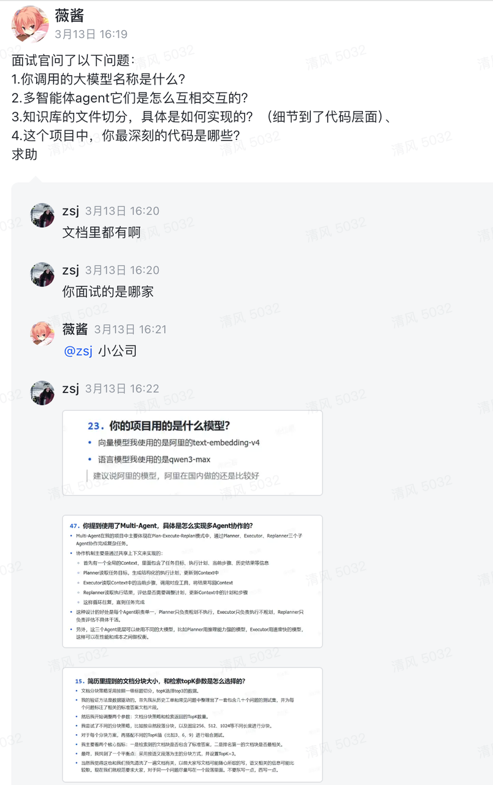
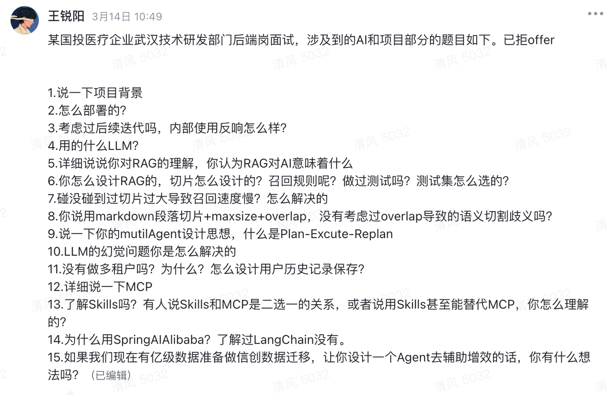
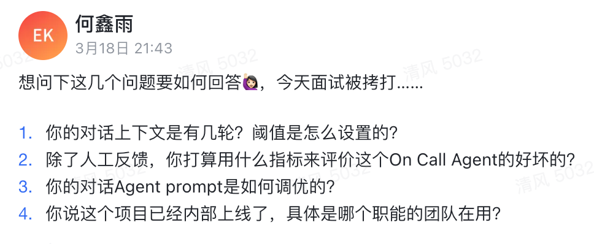
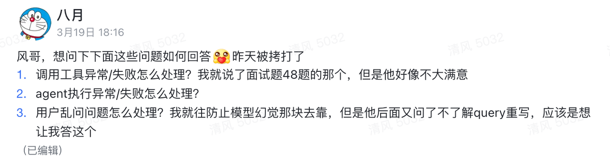
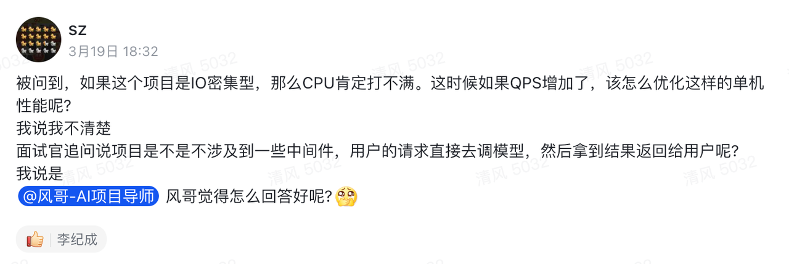
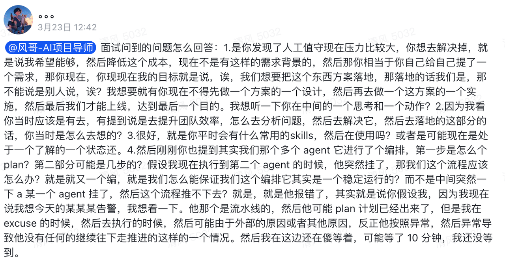
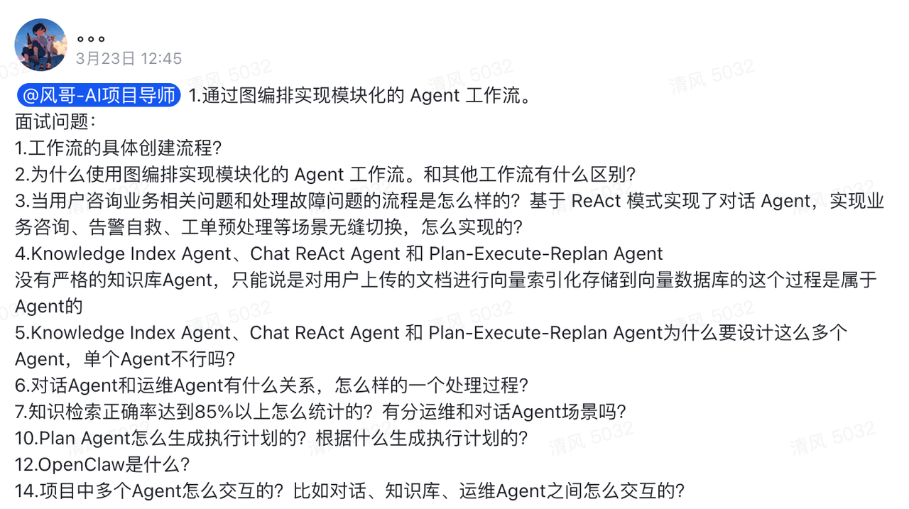
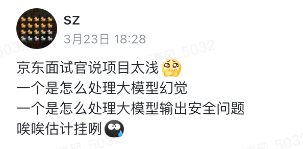
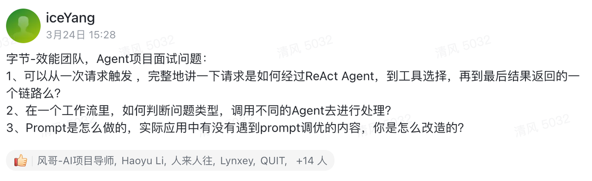
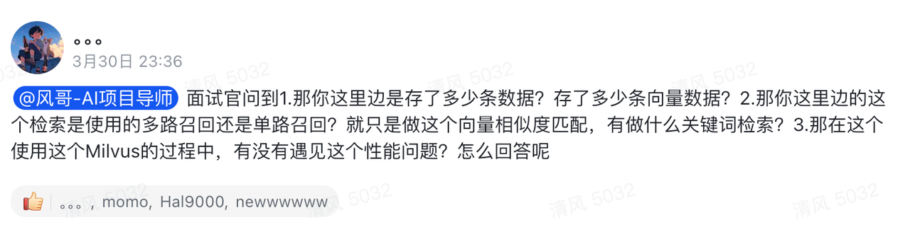

看到很多同学在飞书群里会分享面经，风哥导师也会处理答疑，所以这个文档后面就会收录，群里发过的面经，方便大家后续复习。

本文更倾向于记录面经与回答思路～

# 2026-03-13

## 面试题目分享

我理解这属于分享，题库都有答案的

# 2026-03-14

## 面试题目分享

# 2026-03-18

## 你的对话上下文是有几轮？阈值是怎么设置的？

* 基于你面试说的场景看情况定一个阈值（轮数），比如10轮/70%上下文

* 紧接着可能会调整你为什么是10轮/70%上下文。

* 你就说之前看过xxx文章，看里面是这么做的，当上下文太多的时候需要压缩

## 除了人工反馈，你打算用什么指标来评价这个On Call Agent的好坏的

* 进线率/拦截率

## 你的对话Agent prompt是如何调优的

* 题库里有

* prompt工程那一套，【减少大模型幻觉，你必须要掌握的 6 个方法！-哔哩哔哩】 <https://b23.tv/G2O7fRC>

## 你说这个项目已经内部上线了，具体是哪个职能的团队在用？

* 看自己的场景，最好说自己的组内

# 2026-03-19

## 调用工具异常/失败怎么处理？

* 调用工具失败，本质上就是函数error，可以for 1 < 3 retry ; 也可以直接返回失败。

* 本来就是ReAct 、 Plan 模式，失败了大模型也可能会重试的，把这俩情况说一下我觉得就行了。

## agent执行异常/失败怎么处理？

* agent执行异常，一般是无限调用Tool，循环。

* 一般我们会设置一个最大Step，超过Step就强制中断了。

* 第二个就是检查你的prompt，为什么会出现这个情况，是prompt写的有问题，还是模型选的太垃圾

## 用户乱问问题怎么处理？我就往防止模型幻觉那块去靠，但是他后面又问了不了解query重写，应该是想让我答这个

* 如果你不了解query重写，那就往幻觉靠，然后明确你的项目立意，是能站住脚的，如果还挑战你，你就投降：面试官这一块我确实还没来得及了解，等面试结束我就去看

* 针对乱问问题，意图识别也没用，一般都是prompt工程里做一些限制，比如“如果用户的提问与你的专业知识无关，则回复不知道。”

## 如果这个项目是IO密集型，那么CPU肯定打不满。这时候如果QPS增加了，该怎么优化这样的单机性能呢?

* 这个项目一定不是CPU密集型，打不满就打不满，就是在等大模型回复。

* QPS增加了那也是大模型的压力增加了，对我们的服务没有任何影响

* 面试官的这个提问非常奇怪，建议和面试官对齐一下，他到底想问什么，单看这个问题我没Get到他想问什么

# 2026-03-21

## 问我qps多少

* 首先我们项目标准的立意是日常值班使用的，所以QPS不会太高

* 我觉得你这个回答是可以的，没问题。如果说QPS有100反而很奇怪

* 从项目立意来说，QPS有1，2都不错了。使用并不频繁。

# 2026-03-22

## 能不能补充项目实际会出现的问题？

* 你回答文档处理当然简单啊...

这个问题其实需要往幻觉和项目迭代的方向引：

1. 刚开始简单粗暴塞文档，发现效果不好

2. 做RAG，效果好了，但是还有幻觉，胡说八道的情况

3) ReAct多步推理的好处是什么？

4) prompt工程，参考题库那一套

* 这个问题需要你具备讲故事的能力，而不是真的遇到了什么难点，既然是难点，你都解决了那还是难点吗？另外，后端增删改查真的有啥难点吗，如果面试官一直挑战难点，那就是故意的～

* 面试官想挑刺的时候，要去讲故事规避和投降

# 2026-03-23

* 先不谈技术细节，你这个提问不换行，我要是面试官我就想给你挂了

## 这个需求是你自己提的，那你在中间方案设计和上线是怎么做的，怎么思考的？

* 这个项目源于真实的痛点，参考题库1。----先把问题讲清楚

* 第一版本是直接把整个文档传入上下文。----出现了什么问题

* 然后采用ReAct、PlanExecutor------解决了什么问题，他们的区别是什么

* 最后就是怎么上线----看你公司是怎么发布的呗，这个每个人的回答都不一样

* 面试官问这个问题，就是想看你对这个项目立意的思考，为什么要做这个项目，怎么做的，技术是怎么选的。

* 如果你看过题库，基本都能回答出来。我认为这是一个考察沟通能力的问题

* 看你能不能把你做的事情讲清楚

## 我看你提到提升团队效率，怎么分析问题、解决问题。你当时是怎么想的？

* 这个我觉得就是题库1，你为什么要做这个项目，好处是什么

* 而且这个问题非常好，能体现出你自己的思考和主观能动性

* 挺好回答的，就是有痛点，去解决痛点。

## 你平常会有什么常用的skills

* 题库44

* 我自己也没有常用的，建议把话题引到了，我去了解过skills，他和mcp的区别是什么，好处是什么

## 多Agent的时候，如果某个Agent挂掉了，怎么保证它稳定性，怎么及时发现

* 这个问题其实就是可观测怎么做

* 怎么发现：埋点，监控告警那一套东西

## 工作流的具体创建流程

* 其实就是chain、点和边连起来。可以通过代码实现，也可以通过低代码可视化实现

## 为什么使用图编排，和其他工作流有什么区别

* 这个就是对话Agent，在ReAct前面加了一个RAG召回的流程而已

* 为什么使用？因为可视化编排很快，懒得写代码呗，写代码也可以实现

* 和其他工作流有什么区别，没什么区别，只是后面用的是ReAct，其他工作流可能是ReAct，也可能直接是LLM了。

* 面试官问题比较模糊，简历对齐问题。什么叫其他工作流，工作流编排不是随心所欲的吗，怎么定义其他两个字

## 当用户咨询业务相关问题和处理故障问题的流程是怎么样的？基于 ReAct 模式实现了对话 Agent，实现业务咨询、告警自救、工单预处理等场景无缝切换，怎么实现的？

* 直接看题库吧，一个是对话Agent，一个是运维Agent

* 中间一些问题，这种题库有的，以后请不要问了

## 项目中多个Agent怎么交互的？比如对话、知识库、运维Agent之间怎么交互的

* 对话、运维 Agent是独立的，他们不交互

* 知识库不算Agent

## 大模型怎么处理幻觉

* 题库里有

## 大模型输出安全问题

* 这个问题太宽泛了，我猜测是想问敏感词怎么过滤，这个网上搜一下常见做法

# 2026-03-24

## 面试题目分享，题库里面都有

# 2026-03-30

## 你的向量数据库存了多少记录

* 这个问题要牢记你的项目立意，如果是值班场景，你的db里面其实就存了告警处理手册，不会很多。服务数量 \* 20 来算，我感觉差不多了。谨慎牛逼吹太大和项目立意不符合

## 你是多路召回还是单路，有没有做关键词检索

* 能问出这个问题的，面试官还是听懂的，建议保守点回答

* 单路召回，只用的余弦相似度

## 有没有遇到过性能问题？

* 没有遇到过

* 我们这个项目只是内部使用，数据量并不大

# 2026-04-01

## 有了skill之后，你的项目那里可以改进

* 优化点就是RAG去掉，改成skill

* 不同的问题就是不同的skill

* 本身我们RAG就是想把怎么处理告警的SOP拿出来，现在有了skill后，天然的可以替换掉RAG了

## 公司内部的服务，为什么会通过腾讯云收集

* 好智障的问题啊，日志上传到cls或者sls上面，可以用云服务商的能力检索日志呀

* 如果不用云，那就是自建ELK这种东西。现在基本都选择托管到云服务商了～自建ELK也需要存储和运维成本的

## 日志是怎么上传到云服务的？

* 在服务器上安装一个日志采集器，配置采集路径，就完事了

* 建议去实操一把，1块钱都用不到。

