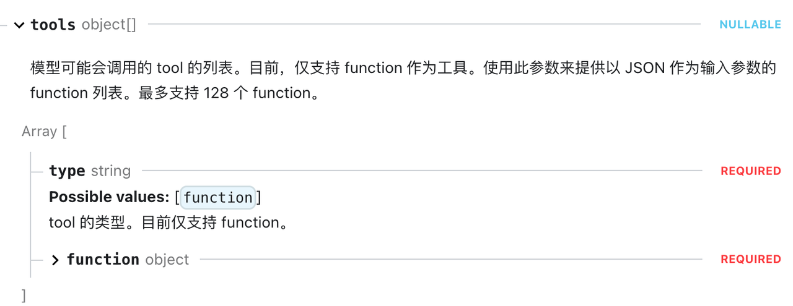
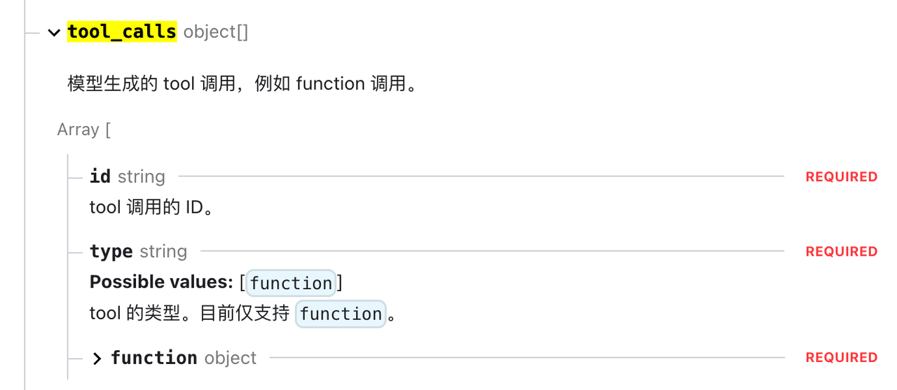

* https://xiaolinnote.com/ai/ （大模型面试题）

* [万字长文图解 Agent 面试题 ](https://mp.weixin.qq.com/s/82Aj1X1SX1-megVaQ1TcCQ)（8道超高频的agent面试题）

* [万字长文图解 oepnclaw 面试题 ](https://mp.weixin.qq.com/s/1RkWpmZBT11sXJYtv93NHA)

* [ 面经分享记录](https://my.feishu.cn/wiki/FEUawoGNOii8FvkyEDdcjXt6nNf)

***

## 简单介绍一下这个项目

* 这个项⽬源于我们团队内部的⼀个真实痛点 ，传统的OnCall依赖⼈⼯值守和排查问题，响应慢且占⽤⼤量研发精⼒。

* 就比如之前上游同事天天问同一个问题报错怎么解决，明明文档里写了解决方案还反复问。把时间耗在重复回答上，非常的打杂，所以我就思考怎么样能主动去突破，做一些高价值工作。

* 其实这两年AI非常火嘛，我就在想能不能用AI技术，打造⼀个智能化的OnCall助⼿，让它能⾃动回答常见问题，并在故障发⽣时主动进⾏初步排查。

* 首先我基于Eino框架设计搭建了RAG知识库来让AI能基于内部⽂档回答问题，然后实现了⼏类Agent，⽐如⽤于对话的对话Agent和⽤于运维排障的运维Agent。

* 最终，系统上线后，很多重复性的咨询和告警都能由Agent⾃动处理并给出解决方案，显著减轻了值班的负担。

## 简单说说Eino是什么框架

* Eino框架是字节跳动开源的一个大模型应用开发框架，核⼼思想是⽤图Graph来定义Agent的⼯作流。

* 在我的理解⾥，图中的每个节点代表⼀个原⼦能⼒，⽐如⼤模型节点、召回使用的Retriever节点等。

* 边则代表了这些节点之间的执⾏顺序和数据流向。

* 在项⽬中，我⽤Eino来构建不同的Agent。⽐如ChatAgent，把召回、Prompt构建、ReAct定义成节点，然后⽤边把它们连起来。这样，整个Agent的执行过程就变得⾮常清晰和可配置。

* 选择Eino主要是看中它这种直观的图编排能⼒和对⼯作流状态的维护，让我们能相对容易地构建和调试复杂的Agent。

## 简单说说Spring-AI-Alibaba是什么框架

* Spring-AI-Alibaba是阿里开源的一个大模型应用开发框架，面向Java开发者。

* 是一个一站式 Agent 平台，支持可视化 Agent 开发、可观测、 MCP 管理等。它还与 Dify 等开源低代码平台集成。

* 在项⽬中，我⽤这个框架来构建不同的Agent。⽐如ChatAgent，把召回、Prompt构建、ReAct定义成节点，然后⽤边把它们串联起来。这样，整个Agent的执行过程就变得⾮常清晰和可配置。

* 选择Spring-AI-Alibaba主要是看中它这种直观的编排能⼒和对⼯作流状态的维护，让我们能相对容易地构建和调试复杂的Agent。

## 为什么选择用Eino，不用langchain

* 这个其实要从它们适合的场景来分析

* 选择Eino的场景：

  * 高性能生产环境：需要处理高并发请求

  * 强类型要求：需要编译时类型安全

  * Go技术栈：团队主要使用Go语言

* 选择LangChain的场景

  * 快速原型开发：需要快速验证想法

  * 社区资源：需要大量的示例和教程

  * Python生态：团队熟悉Python和相关库

* 在实际项目中，技术选型应该基于团队的技术栈、项目需求、性能要求和长期维护考虑。

* 对于追求性能和稳定性的生产环境，Eino提供了优秀的Go原生解决方案。

* 而对于快速迭代和研究型项目，LangChain的灵活性和生态优势更加明显。

* Eino 虽在生态覆盖度上略逊于langchain，但其强类型带来的稳定性、Graph 编排的开发效率、字节实践的可靠性，更适合企业级生产落地。

## 为什么选择用Spring-AI-Alibaba，不用langchain

* 这个其实要从它们适合的场景来分析

* 选择Spring-AI-Alibaba的场景：

  * 高性能生产环境：需要处理高并发请求

  * 强类型要求：需要编译时类型安全

  * java技术栈：团队主要使用java语言

* 选择LangChain的场景

  * 快速原型开发：需要快速验证想法

  * 社区资源：需要大量的示例和教程

  * Python生态：团队熟悉Python和相关库

* 在实际项目中，技术选型应该基于团队的技术栈、项目需求、性能要求和长期维护考虑。

* 对于追求性能和稳定性的生产环境，Spring-AI-Alibaba提供了优秀的Java原生解决方案。

* 而对于快速迭代和研究型项目，LangChain的灵活性和生态优势更加明显。

* Spring-AI-Alibaba虽在生态覆盖度上略逊于langchain，但其强类型带来的稳定性、Graph 编排的开发效率、实践的可靠性，更适合企业级生产落地。

## 简单介绍一下你设计的几个Agent

* 好的，在项目里一共实现了3个Agent，分别是知识库Agent、对话Agent和运维Agent。

* 知识库Agent的核心目标是作为团队文档管理和AI应用的基础设施 ，通过自动化流程，将我们日常积累的文档(告警处理手册、技术方案、错误码文档)，转化为可被AI高效检索的向量，为后续的RAG提供了高质量的向量数据支撑。举个最常见的例子，当我们想根据一个模糊的回忆找文档的时候，可以根据模糊的提问快速检索到对应文档，不再需要再嵌套目录里面一个一个翻了。

* 对话Agent本质上是一个基于大模型+知识库构造的智能交互系统。你可以把它看作是一个能够像真人一样理解问题、调用知识库检索并给出精准回答的小助手。它最重要的使命就是帮助团队挡掉高频的重复咨询，加速问题解决，从而提高整体的工作效率。

* 运维 Agent 是为了解决值班排查问题的痛点而做的。我们团队维护了多个服务，这些告警从服务错误、性能波动，到中间件异常、下游依赖故障，告警太多了。传统的处理方式往往依赖于人工排查：看告警、查日志、查监控，最终才能判断问题的根源。整个过程重复、耗时，特别是在晚上或节假日，响应效率和准确性更是难以保障，值班的时候告警一多就很痛苦。 运维 Agent 可以通过调用各平台的 API ，实现跨系统联动， **一站式**完成排查。例如，它可以自动从告警中提取接口名和时间范围，查询日志、查询监控、查询告警处理手册，将所有信息汇总成一份结构化的故障排查报告。

## 知识库的使用场景 是什 么

* 知识库的使用场景主要围绕团队知识的高效复用与AI应用召回能力的支撑，比如以下这些场景：

* 对话Agent在处理业务方咨询时，比如询问某个API接口怎么接，有哪些字段。那么Agent会通过知识库的相似性检索能力，快速定位文档中的关键内容，如XX服务API接口手册。让大模型根据召回的文档内容，生成精准回答。避免大模型因为缺少这部分的知识而出现幻觉乱回答。

* 赋能运维Agent的故障排查场景：运维Agent查询到告警后，会调用知识库召回错误码、告警信息与历史处理经验。比如遇到特定错误码时，知识库能返回文档里面写的错误码对应的错误原因，帮助Agent快速分析根因。

* 这些场景的核心是让静态文档转化为动态可调用的东西，既提升大模型输出的准确性，也解放团队人力，再也不需要手动翻文档了。

## 对话Agent的使用场景是什么

* 对话Agent的核心是用 大模型+知识库+ReAct模式 替代人工，处理高频重复的交互场景，帮团队从琐事中解放出来。结合我们团队的落地实践，主要有几个典型场景：

* 业务支持场景：上游业务同事经常会问：这个API为什么报错、你们这个接口怎么接；即使文档里有解决方案也总找人工。值班的时候80%时间都在当全职客服。现在把技术文档、告警手册、接口文档上传到知识库后，让对话Agent通过RAG技术快速回复业务方，响应时间从分钟变成秒回。只要我文档里面写的足够清楚，那你就不要再来重复问我了，再问就diss你。解决相同问题被重复询问和文档看都不看直接来问你的痛点。

* 值班自救场景：告警群收到告警后，每次翻手册比较麻烦，还容易遗漏步骤。现在把告警信息发给Agent，它能快速检索《告警处理手册》里的标准化方案。并且对话Agent里面还使用到了ReAct模式，我们还可以问它最近5分钟内的XX接口的错误日志是什么，Agent能调用日志查询工具进行查询，并结合知识库里面的文档给出分析。

* 工单预处理场景：其实对话Agent还可以对接工单平台。原来新工单进来，研发要逐条查看，80%的简单问题（比如常见报错，他们就是喜欢动不动提工单，而工单还必须要解决）占用大量时间。根据对话Agent的特点，工单进行先召回一遍历史工单记录，如果遇到相同问题直接AI自动回复，提前过滤掉重复工单。只把复杂问题流转给人工，让团队聚焦真正需要人工解决的疑难杂症。

* 这些都是我们团队的真实痛点转化来的场景，有了Agent确实帮我们从很多琐事中解放出来。

## 你刚才提到RAG，详细说下RAG吧

* RAG是构建 **智能客服、企业知识库、产品问答助手**的核心技术，RAG全称是Retrieval-Augmented Generation，也就是检索增强生成。

* 当你需要让大模型回答特定领域问题（如内部文档）时，直接将长文本发送给模型，会受限于模型的上下文窗口大小，导致 **成本高、速度慢、准确率低**。RAG通过 **先检索相关内容再生成答案**的方式，完美解决了这些问题， **在对话Agent和运维Agent里，都会使用到RAG。**

* 具体流程是：用户提出问题后，系统先从知识库检索相关的真实信息，再把这些检索到的可靠知识和问题一起输入给生成模型，让模型基于这些有据可依的内容生成回答。这样输出的结果不仅更准确，还能追溯信息来源，也能覆盖模型训练数据之外的新知识

* RAG的核心流程分为两部分

  * 提问前（离线处理，数据准备）分为3个步骤：分片 -> embedding -> 存储

  * 提问后（在线处理，回答生成）分为3个步骤：召回 -> 重排 -> 生成

## 你刚才提到ReAct，详细说下ReAct吧

* ReAct的本质是Reasoning推理+ Acting行动。核心是让大模型像人类一样，通过先思考，再行动来解决复杂的问题。传统的大模型只能进行你问我答，无法处理任务，ReAct解决了这个问题，它会先思考问题，然后通过调用工具的处理任务。

* 举个例子：问地球和火星质量相加是多少，ReAct会进行多轮循环如下：

  * 第1次循环：

    * 思考：我需要地球和火星的质量，得先查地球质量。

    * 行动：调用 查星球质量 工具，输入 地球

    * 观察：工具返回 地球质量≈5.97×10²⁴ kg

  * 第2次循环：

    * 思考：有了地球质量，还缺火星的，继续查火星。

    * 行动：调用 查星球质量 工具，输入 火星

    * 观察：工具返回 火星质量≈6.42×10²³ kg

  * 第3次循环：

    * 思考：现在有两个数了，需要相加，得用计算器。

    * 行动：调用 计算器 工具，输入 5.97e24 + 6.42e23

    * 观察：工具返回 ≈6.61×10²⁴ kg

  * 最终输出答案，循环终止。

* ReAct就是让大模型执行这个过程：遇到问题不直接瞎猜答案 ，而是先想该查什么，再调用工具，拿到结果后判断够不够回答，不够就继续查，直到能给出最终答案。

* ReAct核心优势是让Agent能实时决策、动态调用工具，处理需要外部信息支撑的复杂问题。例如对话Agent中，用户问某个req id的error日志，ReAct能拆分步骤并调用日志工具获取日志信息。

## 运维Agent的使用场景是什么

* 运维 Agent 是为了解决值班排查问题的痛点而做的。我们团队维护了多个服务，这些告警从服务错误、性能波动，到中间件异常、下游依赖故障，告警太多了。

* 传统的处理方式往往依赖于人工排查：看告警、查日志、查监控，最终才能判断问题的根源。整个过程重复、耗时，特别是在晚上或节假日，响应效率和准确性更是难以保障，值班的时候告警一多就很痛苦。

* 运维 Agent 主要是使用了Plan-Execute-Replan设计模式，自动规划排查步骤，通过调用各平台的 API，实现跨系统联动，一站式完成排查。

* 例如，它可以自动从告警中提取接口名和时间范围，查询日志、查询监控、查询告警处理手册，将所有信息汇总成一份结构化的故障排查报告。

* 主要覆盖以下几个高频实用场景：

  * 实时告警的自动响应与智能排查 ：面对服务接口失败率大于80%等紧急告警时，Agent能秒级启动结构化流程。它会先规划排查步骤：1. 查最近1小时错误日志 2. 若日志无异常则动态调整计划 3. 若日志有异常，根据错误信息召回处理手册信息。替代人工反复切换系统的操作，即使遇到预设外的情况也能自主推进。

  * 跨系统联动的故障根因分析：针对日志、监控、告警等信息分散的问题，Agent能统一调用多系统工具，聚合数据。比如接口超时告警时，它会结合告警信息，自动查询日志中的context cancel错误，快速定位是否为下游依赖故障，避免人工在多个平台间来回切换。

  * 经验沉淀的自动化闭环：每次处理完告警后，Agent会自动总结排查过程并更新到知识库，形成处理-沉淀-复用的循环。例如某次解决了grpc调用下游超时问题后，Agent会将该案例存入知识库，后续遇到同类告警可直接复用方案，用得越久准确率越高。

## 你刚才提到的Plan-Execute-Replan是什么意思

* Plan-Execute-Replan 是 Agent 的结构化任务执行模式。核心是先规划执行步骤，再按步骤行动，随时校准方向，通过规划，执行，评估，让 Agent 像人类一样拆解复杂任务、稳步推进，还能应对突发变化。

* 这个模式靠三个子Agent协同： 

  * Planner（规划）：任务拆解者，把模糊目标转化为结构化步骤，关键能力是理解复杂逻辑、生成清晰步骤

  * Executor（执行）：工具执行者，只专注执行规划出来的第一步，不负责整体规划，核心是准确调用工具

  * Replanner（重规划）：进度监理，评估执行结果。如果结果有效则推进执行下一步；如果结果异常，则调整计划；如果计划执行完成，则终止并返回结果。

举个例子：服务器凌晨突发CPU使用率100%告警，运维Agent自动排查根因：

* Planner接到排查CPU突增根因的目标后，结合运维经验生成结构化计划：

* Executor按计划启动第一步，调用日志工具

* Replanner分析执行结果：日志无异常，说明问题可能不在应用错误，需优先定位高耗CPU进程，于是调整计划顺序：

* 继续执行与动态调整，Executor 执行更新后的步骤1，调用监控工具

* Replanner 再次评估，已定位异常进程，需进一步查该进程日志确认原因，计划无需调整，继续执行步骤2。

* Executor 调用日志工具，参数更新为进程名=data-sync-service，时间范围=近1小时，返回结果：

* Replanner 最终评估已明确根因：全量同步任务未分页导致CPU过载，无需继续执行步骤3（因问题已定位，且历史工单中类似场景解决方案明确），终止任务并返回结论。

* 最终输出结果

* 核心逻辑是结构化推进+动态校准，流程如下：

  * 输入目标：排查CPU突增根因

  * Plan：Planner生成结构化步骤

  * Execute：Executor执行第一步

  * Replan：Replanner评估结果，决定继续/调整/终止

  * 循环：直到任务完成，返回最终结论

* 核心优势：让复杂任务可控又灵活

  * 结构化拆解：把一团乱麻的复杂任务拆成步步可执行的步骤，降低认知负荷。

  * 动态适应变化：遇到执行问题时，Replan 机制能及时调整计划，避免一条道走到黑。

## ReAct和Plan-Execute-Replan有什么区别？

* ReAct适合边想边做，没有固定步骤

* Plan-Execute-Replan适合处理复杂任务，先拆解步骤，再执行，根据执行结果判断要不要修改计划

* 所以在我的项目中，对话场景用ReAct，因为用户问题灵活，需实时决策。它的职责是处理开放式的，多轮的业务咨询，⽐如回答某个API怎么用，特点是灵活，能根据对话历史动态决定下⼀步做什么，但执⾏链条不会预设得特别长。

* 运维场景用Plan-Execute-Replan，⽐如专门处理告警。它的职责是接受⼀个明确⽬标，然后制定⼀个可能包含多步骤的排查计划，并严格按计划调⽤各⼯具执⾏。

* 它们底层共享同⼀套⼯具集和知识库，但⼯作模式和⽬标不同。

## 我看你提到运维响应时间从小时级降低到分钟级，这个数据是怎么来的？

* 这个数据的验证我们主要做了两⽅⾯⼯作。

* ⼀是回顾性分析，我们统计了我们组前三个月的工单和平均解决时间，确实在1～4小时之间，这包括等待处理，排查问题，一直到处理结束。

* 二是使用Agent后的效果统计，我们写脚本把工单问题让AI进行处理，从触发到生成解决方案平均在2～5分钟之间。

## 简历里提到的文档分块大小，和检索topK参数是怎么选择的？

* 文档分块策略采用按照一级标题切分，topK选择top3的数据。

* 我的验证⽅法是数据驱动的。 ⾸先我从历史⼯单和常见问题中整理出了⼀套包含⼏⼗个问题的测试集，并为每个问题标注了相关的标准答案⽂档⽚段。

* 然后我开始调整两个参数：⽂档分块策略和检索返回的TopK数量。

* 我尝试了不同的分块策略，⽐如按⾃然段落分块，以及固定256、512、1024等不同长度进⾏分块。

* 对于每个分块⽅案，再搭配不同的TopK值（⽐如3，6，9）进⾏组合测试。

* 我主要看两个核⼼指标：⼀是检索到的⽂档块是否包含了标准答案，⼆是排名第⼀的⽂档块是否最相关。

* 最终，我找到了⼀个平衡点：采⽤按语义段落为主的分块⽅式，并设置TopK=3。

* 当然我觉得这也和我们预先清洗了一遍文档有关，以前大家写文档可能随心所欲的写，语义相关的信息可能比较散。现在我们就规范要求大家，对于同一个问题尽量写在一个段落里面。不要东写一点，西写一点。

## 简历里提到的多轮对话和上下文记忆是什么意思？

* 多轮对话就是指， 和大模型进行多轮沟通 ，大模型能记得之前沟通的内容。

* 那么历史沟通的对话就是上下文，我们设计一个机制保持上下文，在新一次对话的时候，把上下文发送给大模型，这样大模型就仿佛拥有了记忆。

* 项目里我设计了分层的记忆管理机制。最简单的最近⼏轮对话，我们直接放在内存里，作为短期记忆，这能保证对话的连贯性。

* 当对话轮数增多，我们会把之前的对话内容进⾏处理，比如 对前30轮历史对话进⾏总结摘要 ，作为长期记忆。

* 这样，模型就能同时记住最近聊了什么，以及过去聊的关键信息。

* 对历史对话做总结的目的，主要是为了避免太多的对话超过大模型的上下文窗口。

* 大模型上下文窗口就是一次对话中，能够记住和处理的信息总量的上限。 说白了就是输入token+输出token的最大限制。

## 你提到通过SSE技术实现对话的流式输出，为什么不用websocket？

* SSE和WebSocket都是实现实时通信的技术，但原理和适⽤场景不同。SSE，也就是服务器发送事件，它是基于HTTP协议的。它的⼯作⽅式是，客户端发起⼀个普通的HTTP请求，但服务器不⽴即关闭连接，⽽是保持这个连接打开，并按照特定的格式（text/event-stream）持续地、⼀段⼀段地向客户端推送数据。

* ⽽WebSocket是⼀个独⽴的协议，它在初次连接时通过HTTP协议进⾏握⼿，握⼿成功后，连接就升级为WebSocket协议，之后双⽅就可以在这个连接上进⾏全双⼯的双向通信了，服务器可以随时发消息给客户端，客户端也可以随时发消息给服务器。

* 在选择时，我会考虑：如果需要双向实时交互，⽐如在线聊天、协同编辑，肯定选WebSocket。

* 如果只需要服务器向客户端推送实时数据，⽐如股票⾏情、通知、或者像我项⽬⾥的AI对话流，SSE就⾜够且更简单，因为它基于HTTP，不需要处理新的协议，后端实现和调试也⽅便⼀些。

* 选择SSE主要是出于简单和够⽤的考虑，我们的场景主要是服务器向浏览器单向推送AI⽣成的⽂本，不需要双向 通信 ，SSE的协议⽐WebSocket更轻量，实现起来也简单，对于流式⽂本这种场景⾮常适。⽤户体验就像是在看⼀个⼈实时打字。

## 你能详细说一下SSE吗，核心是怎么实现的？

* SSE基于HTTP协议，不需要特殊的协议支持，使用标准的HTTP连接。在建立连接后，将HTTP头部的 `Content-Type` 改成 `text/event-stream` 就可以了，后续发送消息要按照SSE数据格式发送。

* SSE的数据格式非常简单，每条消息由多个字段组成，每个字段由字段名、冒号和字段值组成，以换行符分隔。

* 一个完整的SSE消息示例：

* 其中，双换行符（ `\n\n` ）表示一条消息的结束。

## 我看你简历上还写了MCP工具，谈谈你对MCP的理解

* 我们可以把MCP想象成电脑的USB-C接口

* 键盘、U盘、显示器就是不同的MCP Server，它们提供各自独特的功能。

* 电脑就是Agent，它作为MCP Client，通过统一的USB-C接口（即MCP协议）来连接和使用所有外设(MCP Server)。

* 这样一来，无论你更换电脑还是外设，只要都支持USB-C标准，就能即插即用，非常方便。

* MCP协议正是为AI使用工具带来了这种即插即用的便利性。最直观的感受就是相同的Tool，可以给很多Agent使用，不需要重复写代码。

## 你的工具集有哪些Tool，分别有什么功能？

* 其实设计tool就是要思考Agent需要哪些功能

* 首先想到的是知识库召回工具，从向量数据库中召回最相关的3份片段

* 然后是日志查询工具，日志查询是通过腾讯云日志平台的MCP实现的，他们的MCP支持用自然语言查询日志

* 还有告警查询工具，对接监控系统的/alerts接口，直接获取当前活跃告警信息

* 其实在测试过程中，我还发现大模型不能精准知道当前时刻的时间，所以还编写了一个时间查询工具，为Agent提供实时时间信息

* 最后还有一个联网查询工具，集成外部搜索引擎，让大模型也有搜谷歌的能力

## 向量数据库为什么使用Milvus

* 目前市面上有四种类型的向量数据库：

  * 集成了向量搜索插件的现有关系型或列型数据库，比如PG Vector

  * 支持密集向量索引的传统倒排索引的ElasticSearch

  * 基于向量搜索库构建的轻量级向量数据库，Chroma

  * 专用向量数据库：这类数据库专门为向量搜索而设计的向量数据库

* 其实选用Milvus完全就是 拍脑袋 决定的，当时我是在谷歌上搜了向量数据库，返回的第一个就是Milvus的首页

* 然后我点进去看了一下，github上有42k的star，说明社区很活跃。并且使用案例里面有很多大公司的Logo，加上Eino框架里面也提供了Milvus的相关sdk，所以就选择了Milvus。

## 你的项目怎么部署的

* 其实我的项目就分为向量数据库，前端，后端。

* 整个项目是部署在办公环境开发机里面的，分别编写为dockerfile用docker启动。

* 这样我们在办公网就可以直接使用了。

* 在开发机里面部署的好处是办公网可以直接使用，不必为 现 上网络和办公网络打通而烦恼。

## 你的项目用的是什么模型？

* 向量模型我使用的是阿里的text-embedding-v4

* 语言模型我使用的是 qwen3-max

## 为什么用这个模型？

* 因为是在国内使用，公司使用，所以选择模型最好还是选择国内的。

* 搭建RAG时选择合适的embedding模型很重要，Huggingface有一个MTEB（Massive Multilingual Text Embedding Benchmark）评测标准是一个业界比较公认的标准。

* 打开MTEB的官网，阿里的模型就排在第三，所以embedding就选择使用阿里的模型了。

* 语言模型还是选择阿里主要还是考虑到embedding模型都用阿里的了，就一块用吧。

* 而且阿里的模型挺好看，我之前看公众号说qwen3-max横扫榜单，我自己使用下来感觉也挺聪明的。

## 你做这个项目遇到过什么困难/挑战？

* 其实最大的困难是在于写文档，之前的告警处理手册其实是很多人都会往里面加东西

* 很多步骤可能表述的不是很清晰，最蛋疼的是有些超链接，链接到其他文档，写的不完整

* 那对于我们做RAG来说，第一步就是要把文档写完整完善，否则会影响召回的质量，以及大模型的判断

* 另外我觉得印象比较深刻的点在于，这个项目是我 实习 到时候偷摸做的，因为实习的时候安排我也值班。

* 值班我就发现了这些痛点，太浪费时间了值班。老是要翻日志看监控，回复很多相同的问题。

* 说白了就是比较打杂，维护老项目。让我打杂但是我不能真打杂浪费时间啊，所以我偷偷做这个项目，好在最后做出来了，不论是对其他人值班，还是对自己值班，真有帮助。我还觉得挺有成就感的。

## 召回与重排的区别是什么？

* 召回：快速捞出相关片段

  * 将用户问题通过Embedding模型转化为向量。

  * 用向量相似度算法计算问题向量与数据库中所有片段向量的相似度，挑出Top N（如10个）最相关的片段。

  * 特点：速度快、成本低，但准确率有限，适合初步筛选

* 重排：给片段排优先级

  * 使用 专门计算文本对相似度的模型 ，逐对计算用户问题与每个召回片段的语义相关性。

  * 从10个片段中选出Top K（如3个）最相关的片段。

* 为什么不直接召回3个？召回用向量相似度（快但准度低），重排用Cross Encoder模型（慢但准度高）， 二者结合实现 先广撒网再精挑细选 ，效果优于一步到位 。

## 简历里提到的Agent，Agent是什么意思？

* Agent中文解释有很多，代理、智能体之类的，但其实很难精准的描述它的含义。

* 先从简单的和大模型对话说起吧，最早的时候我们只能和chatgpt对话，chatgpt其实不能执行任务，所谓的任务就比如说让它帮忙整理电脑的文件

* 即使我们给大模型的提示词写得再详细，大模型只能回答问题或者给出建议，实际动手的还是得靠我们自己，那有没有办法让AI自己完成任务呢？

* 这就需要在用户和 AI 中间引入一个智能体Agent来帮忙了 。智能体Agent就像一个中间人，本质上就是我们写的程序，它负责接收用户的指令，并协调 AI 和实际工具来干活。

* 具体来说，我们先给智能体agent准备好一些基本工具，比如查找文件、读取文件、移动文件等工具。

* 当用户发出指令，比如帮我读取C盘目录下的hello\_world.cpp文件，移动到D盘目录下，最后总结文件内容：

* 那么整个流程会按照下面的步骤执行：

  1. 智能体agent会先把这个请求传给 AI ，并附带告诉 AI 它可以使用哪些工具，工具有哪些作用。

  2. AI 经过思考后，会告诉智能体agent：调用读取文件工具，路径是C://hello\_world.cpp。

  3) 智能体agent收到指示后，就实际操作工具读取文件，然后把读取的内容反馈给 AI。

  4) AI 根据结果决定下一步该做什么，比如可能还需要移动文件，会告诉智能体agent：调用移动文件工具，路径是C://hello\_world.cpp 到 D://hello\_world.cpp。

  5. 智能体agent收到指示后，就实际操作工具移动文件，然后把移动结果反馈给 AI。

  6. AI 收到移动完成的进度后，返回总结内容给智能体。

  7) 智能体收到 AI 传来的结果后，向用户报告结果。这样一步步推进，智能体agent全程协调，直到任务完成。

* 简单来说，智能体agent 让 AI 不再是只动嘴的参谋，而是变成了能动手的实干家，整个过程更自动化、更智能。Agent与Tool定义：

  * Agent：在AI、工具、用户间协调的程序

  * Tool：提供给 AI 调用的函数。

## Agent是怎么实现工具调用的？

* 在没有function call技术之前，工具描述是放在system prompt中的。

* 就是在Agent中我们提到，我们会将工具信息告诉AI。

* 这完全依赖于字符串解析，导致大模型经常会出现问题

* 比如告诉大模型有一个查询天气的工具，参数是城市和日期

* 大模型返回字符串可能是：调用工具：查询天气的工具，输入上海，明天

* 然后我们后端解析字符串，解析到了要调用天气工具，但是参数错了！明天不是一个日期！

* 再后来，有了function call之后就好多了，function call把工具描述从 system prompt中剥离，用JSON格式统一定义函数名，函数介绍，参数字段，并规范AI调用工具的回复格式。

* 开发者不用自己写代码检测AI回复是否正确，若AI回复错误，AI的服务器端可检测并自动重试，降低用户端开发难度和token开销。

## 听你说的还是有点抽象，Function Call的实现流程是什么？

* 其实function call的本质就是，让我们用json来描述你写的函数的函数名，函数作用，以及参数

* 然后通过调用大模型的接口，比如deepseek的对话接口 `https://api.deepseek.com/chat/completions`

* 这个接口有一个字段是 tools，我们调用这个接口之前，给tools字段赋值，按照function call的规范写好赋值就行了

* 那么这个接口返回的消息里面，有一个tool\_calls字段，代表大模型选择调用哪个工具，那么我们的程序只需要按照接口规范解析这个字段，就知道要不要调用工具了，而不需要很原始的通过prompt来解析。

## Embedding是什么意思？

* Embedding就是向量化的意思，或者说一个过程的感觉，我们一般提到embedding

* 就是指用专门的Embedding模型将文本片段转化为向量。

* 为什么要向量化？语义相近的文本，向量距离更近。 方便后面召回做相似度匹配

* 向量是数学中的基础概念，代表有大小、有方向的量，用数组表示（比如 `[1, 2, 3]` 是三维向量），维度=数组长度。低维向量（1-3维）可画在坐标轴上，高维向量（几百/几千维）虽无法可视化，但高维向量包含的信息更丰富，能更细腻地表达文本特征。 通过Embedding模型将文本片段转化为向量后，就能用数学方法计算语义相似度。比如 小林写python 和 小林写golang 的向量会非常接近。

* Embedding 简单说就是把文字转成向量的过程，意思相近的句子向量也相近 。 比如 小林写python 和 小林写golang 这两句话意思相近，经过 Embedding 后会变成两个非常相似的向量（比如 `[0.8, 0.2, -0.5]` 和 `[0.78, 0.22, -0.48]` ），而 牛牛玛特 的向量则会和它们相差很远。大模型本身看不懂文字，只能处理数字。通过 Embedding，文字的语义被转化成向量后，计算机就能通过计算向量之间的相似度来判断两句话是否相关。

* 当用户提问时，问题会先转成向量，向量数据库通过计算向量相似度，快速从海量片段中找出最相关的结果（比如从 小林写python 能关联到 小林写golang ）

## 召回的相似度算法是什么？

* 当用户提问后，第一步是从向量数据库中召回相关片段：

* 将用户问题通过Embedding模型转化为向量。

* 用向量相似度算法计算问题向量与数据库中所有片段向量的相似度

* 我们在召回的时候一般使用余弦相似度

  * 原理：计算两个向量夹角的余弦值，范围在-1到1之间。夹角越小，余弦值越接近1，相似度越高。

  * 特点：只关注方向，不考虑向量长度，适合文本语义匹配。

* 其他还有很多相似度算法，比如欧式距离。但是最适合做语义匹配一般都用余弦相似度

## 你的对话 Agent Prompt 是怎么写的？

## 你的运维Agent Prompt是怎么写的？

## 如果你的Agent召回的答案不准确，大模型会胡说八道吗？

* 这里我使用到了相似度阈值这个参数，这是用于筛选向量检索结果的关键参数，用于判断检索到的文档片段与用户查询的相关性。该阈值通常以余弦相似度（范围 0–1）表示，高于此值的文档会被保留并输入大模型生成答案，低于此值的则被过滤。

* 在项目里我设置的阈值是0.8。为什么设置这么高呢？是因为我们使用的场景主要是针对告警的处理，所以一定要准确准确再准确。

* 那其实还会有另一个问题，如果没有召回任何片段，大模型会有幻觉，乱回答吗？

* 实际上不会的，因为我从prompt里面约束了大模型。

* “严格按照文档的内容回答，不允许使用文档外的任何信息。”

* “如果请求超出了你的能力范围，清晰地说明你的局限性”

* 针对这种这种场景我还给大模型的回复加一个 [👎 ](https://www.ifreesite.com/emoji-%F0%9F%91%8E.htm)的功能。

* 用户按了这个👎按钮后，我们后端就会把这次对话的log id发送到群里面，然后我人工通过log id，trace整个生命流程的日志，看看为什么会反馈不好。

* 通常是因为某个告警是第一次出现，我们的文档里没有对应的解决方案。会导致这种情况出现，那么遇到了这种情况，就需要人工去把文档写好。下一次就不会再出现了。

## 你知道Agentic RAG吗？

* Agentic 就是让Agent不在回答问题之前检索文档，而是在ReAct逐步推理过程中，由Agent来决定什么时候进行检索，以及如何检索信息。

* 说白了，最早的RAG就是先检索信息，再把信息交给大模型来增强生成。

* 那么现在的Agentic本质上就是把检索作为一个Tool，交给大模型，让大模型自己选择调用检索。

* 我项目里是混合RAG，调用前的检索和推理中检索都实现了。

## 混合RAG有什么好处？

* Agentic RAG工具检索可以让大模型自主选择使用文档搜索，非常灵活。

* 普通RAG在 Agent 开始时查询，只执行一次，避免每次 reasoning 循环都调用，降低成本，提高检索质量。

* 这样的灵活组合结合了 Agentic RAG 的灵活性和普通 RAG 的质量控制。非常适合问答系统，具备高准确性。

## 你们的项目是什么背景? / 为什么会有这个项目?

* 这个项⽬源于我们团队内部的⼀个真实痛点，传统的OnCall依赖⼈⼯值守和排查问题，响应慢且占⽤⼤量研发精⼒。

* 就比如之前上游同事天天问同一个问题报错怎么解决，明明文档里写了解决方案还反复问。把时间耗在重复回答上，非常的打杂，所以我就思考怎么样能主动去突破，做一些高价值工作。

* 其实这两年AI非常火嘛，我就在想能不能用AI技术，打造⼀个智能化的OnCall助⼿，让它能⾃动回答常见问题，并在故障发⽣时主动进⾏初步排查。

* 首先我基于Eino框架设计搭建了RAG知识库来让AI能基于内部⽂档回答问题，然后实现了⼏类Agent，⽐如⽤于对话的对话Agent和⽤于运维排障的运维Agent。

* 最终，系统上线后，很多重复性的咨询和告警都能由Agent⾃动处理并给出解决方案，显著减轻了值班的负担。

## 你这个项目是用来做什么的?

* 项目里一共实现了3个Agent，分别是知识库Agent、对话Agent和运维Agent。

* 知识库Agent的核心目标是作为团队文档管理和AI应用的基础设施，通过自动化流程，将我们日常积累的文档(告警处理手册、技术方案、错误码文档)，转化为可被AI高效检索的向量，为后续的RAG提供了高质量的向量数据支撑。举个最常见的例子，当我们想根据一个模糊的回忆找文档的时候，可以根据模糊的提问快速检索到对应文档，不再需要再嵌套目录里面一个一个翻了。

* 对话Agent本质上是一个基于大模型+知识库构造的智能交互系统。你可以把它看作是一个能够像真人一样理解问题、调用知识库检索并给出精准回答的小助手。它最重要的使命就是帮助团队挡掉高频的重复咨询，加速问题解决，从而提高整体的工作效率。

* 运维 Agent 是为了解决值班排查问题的痛点而做的。我们团队维护了多个服务，这些告警从服务错误、性能波动，到中间件异常、下游依赖故障，告警太多了。传统的处理方式往往依赖于人工排查：看告警、查日志、查监控，最终才能判断问题的根源。整个过程重复、耗时，特别是在晚上或节假日，响应效率和准确性更是难以保障，值班的时候告警一多就很痛苦。运维 Agent 可以通过调用各平台的 API，实现跨系统联动， **一站式**完成排查。例如，它可以自动从告警中提取接口名和时间范围，查询日志、查询监控、查询告警处理手册，将所有信息汇总成一份结构化的故障排查报告。

## 你在项目里是什么角色?

* 这个项目完全由我从0到1实现。

* 就如我之前说的，之前上游同事天天问同一个问题报错怎么解决，明明文档里写了解决方案还反复问。

* 把时间耗在重复回答上，非常的打杂，所以我就思考怎么样能主动去突破，做一些高价值工作。

* 把值班OnCall的痛点给解决了，所以我在工作之外，自己从0到1偷偷搞的一个项目。

## 你们项目的核心指标?

* 其实我这个项目是完全内对实用的，所以评判的标准是回答是否合理准确。

* 对于对话Agent，问答这种场景来说，我给大模型的回复加一个 [👎 ](https://www.ifreesite.com/emoji-%F0%9F%91%8E.htm)的功能。

* 同事按了这个👎按钮后，后端就会把这次对话的log id发送到群里面，然后我人工通过log id，trace整个生命流程的日志，以及去询问一下对应的同事，看看为什么会反馈不好。

* 通常是因为某个告警是第一次出现，我们的文档里没有对应的解决方案。会导致这种情况出现，那么遇到了这种情况，就需要人工去把文档写好。下一次就不会再出现了。

## 项目的难点是什么? 你遇到的最大的困难?

* 其实最大的困难是在于 写文档 ，之前的告警处理手册其实是很多人都会往里面加东西

* 很多步骤可能表述的不是很清晰，最蛋疼的是有些超链接，链接到其他文档，写的不完整

* 那对于我们做RAG来说，第一步就是要把文档写完整完善，否则会影响召回的质量，以及大模型的判断

* 另外我觉得印象比较深刻的点在于，这个项目是我实习到时候 偷摸 做的，因为实习的时候安排我也值班。

* 值班我就发现了这些痛点，太浪费时间了值班。老是要翻日志看监控，回复很多相同的问题。

* 说白了就是比较打杂，维护老项目。让我打杂但是我不能真打杂浪费时间啊，所以我偷偷做这个项目，好在最后做出来了，不论是对其他人值班，还是对自己值班，真有帮助。我还觉得挺有成就感的。

## 你觉得做的最好的点是什么?

* 做的最好的点当然是解决了值班的痛点啦，哈哈哈。

* 以前值班⼈⼯值守和排查问题，响应慢且占⽤⼤量研发精⼒。太累了

* 系统上线后，很多重复性的咨询和告警都能由Agent⾃动处理并给出解决方案，显著减轻了值班的负担。

* 果然懒人改变世界，哈哈哈。

## 你觉得项目有哪些不足?如何改进?

* 其实这个项目上线至今反馈都还挺好的。

* 不足和改进呢，其实我希望能把这个项目一直维护，更新下去。

* 从我1个人，到其他同事也加入进来共建。那么以后可能就不止我们组内部使用。

* 希望能维护迭代下去，形成一个司内的公共中台服务，不同业务组都可以搭建使用。

## 你知道 Agent Skills 吗？

* 2025年10月16日，Anthropic推出Agent Skills，起初用于提升Claude在某些任务的表现。

* 但是由于这个东西比较好用，VS Code、Codex、Cursor等工具迅速跟进支持。

* 在这样的背景下，2025年12月18日，Anthropic将其发布为开放标准，支持跨平台、跨产品复用。

* Skills的核心设计是渐进式披露结构，主要分为

  * 元数据层、包含所有skill的名称、描述。这是始终加载的。

  * 指令层，对应skill.md之间的内容，这部分是按需加载，作用是提供具体任务处理规则。

  * 资源层，包含Reference文件和Script文件，按需中的按需加载，提供补充信息或执行自动化操作。

* Skill和MCP的区别：

| 特性         | Agent Skill                | MCP              |
| ---------- | -------------------------- | ---------------- |
| **核心功能**   | 教会模型如何处理数据（规则定义）           | 为模型供给数据（数据连接）    |
| **本质**     | 结构化说明文档                    | 独立运行程序           |
| **代码执行能力** | 适合轻量脚本、简单逻辑                | 安全性和稳定性更优，适合复杂任务 |
| **典型应用**   | 格式标准化、规则校验、轻量自动化           | 数据查询、系统集成、复杂业务逻辑 |
| **数据加载方式** | 分层按需加载，节省token             | 持续连接，实时数据获取      |
| **最佳实践**   | 可与MCP结合使用，实现数据供给+规则处理的完整流程 | -                |

## 你的对话Agent如何处理超出上下文窗口的长对话？

* 这个问题在实际使用中确实会遇到，我 设计了一个分层记忆管理机制 ：

* 第一层是滑动窗口记忆，保留最近5轮对话的完整内容，这部分会直接放入prompt中，保证对话的连贯性。

* 第二层是摘要记忆，当对话轮数超过5轮时，会把第5轮之前的对话进行摘要压缩。摘要会保留关键信息，比如用户提到的核心问题、重要参数、已经解决的问题等， 把10轮对话压缩成2-3句话。

* 第三层是向量记忆，所有历史对话都会向量化存储在向量数据库中。当用户提到"之前说的那个问题"时，可以通过向量检索找回历史对话内容。

* 这三层记忆相互配合，既保证了短期对话的连贯性，又支持长期对话的信息检索，还避免了上下文窗口溢出的问题。

* 在实现上，我会在每次调用大模型前检查token数量，如果超过阈值（比如上下文窗口的80%），就触发摘要压缩逻辑。这样可以确保系统稳定运行。

## 你的RAG系统如何处理文档更新？增量索引是怎么做的？

* 文档更新是RAG系统的常见场景，我设计了一套增量索引机制来处理：

* 首先在数据库中维护了一张文档元数据表，记录每个文档的路径、最后修改时间、索引状态等信息。

* 当有新文档上传或文档更新时，系统会比对最后修改时间，识别出需要重新索引的文档。

* 对于需要重新索引的文档，会先从向量数据库中删除该文档的旧的向量数据，然后重新执行加载、分块、向量化、存储的流程。

* 这个过程是异步的，不会影响正常的查询服务。用户上传文档后会立即返回，后台会有一个定时任务或消息队列来处理索引任务。

* 整个增量索引的流程大概需要几秒到几十秒，取决于文档大小。这样既保证了数据的时效性，又不影响系统的可用性。

## 你提到使用了Multi-Agent，具体是怎么实现多Agent协作的？

* Multi-Agent在我的项目中主要体现在Plan-Execute-Replan模式中，通过Planner、Executor、Replanner三个子Agent协作完成复杂任务。

* 协作机制主要是通过共享上下文来实现的：

  * 首先有一个全局的Context，里面包含了任务目标、执行计划、当前步骤、历史结果等信息

  * Planner读取任务目标，生成结构化的执行计划，更新到Context中

  * Executor读取Context中的当前步骤，调用对应工具，将结果写回Context

  * Replanner读取执行结果，评估是否需要调整计划，更新Context中的计划和步骤

  * 这样循环往复，直到任务完成

* 这种设计的好处是每个Agent职责单一，Planner只负责规划不执行，Executor只负责执行不规划，Replanner只负责评估不具体干活。

* 另外，这三个Agent底层可以使用不同的大模型，比如Planner用推理能力强的模型，Executor用速度快的模型，这样可以在性能和成本之间做权衡。

## 你的系统如何保证大模型不会调用错误的工具或传递错误的参数？

* 这个问题很关键，我主要从三个层面来保障：

* 第一层是工具描述的精确性。在定义function call的时候，我会非常详细地描述每个工具的功能、适用场景、参数格式、参数约束。比如日志查询工具，我会明确说明时间参数必须是RFC3339格式，地域参数必须是指定的枚举值。

* 第二层是参数校验机制。在工具实际执行前，我会对大模型传递的参数进行严格校验，包括类型检查、范围检查、格式检查。如果参数不合法，会返回详细的错误信息给大模型，让它重新调用。

* 第三层是容错重试机制。如果大模型调用工具失败，Replanner会分析失败原因，并在下一次规划中修正参数。通过这种自我纠错机制，即使第一次调用失败，后续也能成功。

* 实践中，通过这三层保障，工具调用的成功率能达到95%以上，除了网络问题导致的报错，我几乎没看到过其他的报错日志，大大提升了系统的稳定性。

## 你的系统如何避免大模型产生幻觉？

* 大模型幻觉是AI应用中最需要关注的问题，我主要从四个方面来控制：

* 第一是强约束的Prompt设计，在系统Prompt中明确要求："严格按照文档内容回答，不允许使用文档外的任何信息"、"如果不知道答案，明确说不知道，不要编造"。这样可以从源头上约束大模型的输出。

* 第二是RAG增强，通过检索相关文档片段，给大模型提供可靠的事实依据。在对话Agent中，我会把召回的文档片段明确标记为"参考文档"，让大模型基于这些文档来回答。

* 第三是相似度阈值过滤，我设置了0.8的高阈值。如果召回的文档相似度低于这个值，说明知识库中没有相关信息，这时会直接告诉用户"知识库中暂无相关信息"，而不是让大模型凭空猜测。

* 第四是人工反馈闭环，我在系统中加入了👎功能。用户如果觉得回答不准确，可以点击反馈，后台会记录log id并通知到群里。我会人工分析原因，如果是文档缺失就补充文档，如果是prompt问题就优化prompt。

* 通过这四层防护，大部分情况下都能给出可靠的答案。

## 如果让你重新设计这个系统，你会做哪些改进？或者说你的系统还可以怎么迭代？

* 经过一段时间的实践，我确实有一些改进的想法：

* 第一是增强多模态能力，目前只支持文本，但实际场景中经常需要分析监控图表、日志截图等。可以接入多模态大模型，让Agent能够理解和分析图片。

* 第二是构建评测基准，建立一套标准化的评测数据集和评测指标，定期评估系统的效果。目前主要靠人工反馈，不够系统化。打算参考LLM评测领域的一些做法， 比如自动化的准确率、召回率、F1-score等指标 。

* 第三是支持多租户，目前是单一团队使用，如果要推广到其他团队，需要做多租户隔离，包括知识库隔离、权限隔离、资源隔离等。

* 最后还需要增强可观测性，目前的日志和监控还比较基础。可以引入更细粒度的trace，比如每个工具调用的耗时、每次召回的相似度分布、大模型的token消耗等，方便性能分析和问题排查。

##

## 怎么解决幻觉？

* 引入外部知识库和外部工具（api搜索）等，多维度查询真实数据 ；

* 特定微调，只回答指定类型问题，成本较高，需要准备大量高质量数据，使用rag时，可以选择使用一些特定垂直类行业微调后的模型使用，降低微调成本；

* 多模型混用，用多个模型同时回答同一个问题做比较，也可以用一个回答另一个专门来做检查验证；

* 后处理规则，对既知的逻辑可以直接用程序对大模型结果做一些验证，跟上面说的多模型交叉验证差不多

* 人工干预和反馈，人工对结果评价，事后纠正，也可以人工直接干预在关键步骤需要人工来处理，人工加入工作流（比如让人工去选择）；

* 优化提示词：

  * 明确指令和上下文：提示词越清晰，推理方向越明确

  * 引入假设约束：通过提示词明确输入输出大概是怎么样的，可以减少不符合条件的答案

  * 提供背景信息：模型通过上下文做推理，背景信息可以帮助模型理解问题

  * 让模型给出来源或参考：督促模型生成内容更谨慎

  * 要求分步骤推理：涉及复杂问题，要求模型分步推理

  * 限制模型输出：通过严格的输出范围或者约束条件，减少内容的多样性

  * 鼓励模型承认不确定性：如果你不知道就说不知道

  * 反向提示：主动写出来排除一些内容

* 温度：限制模型的创造力，温度值越低越严谨，温度越高越开放

## 怎么评价你的prompt写的好坏，如何评测？

* 其实刚开始做这个项目写prompt的时候，写的还是挺随意的，导致回答不准，有幻觉

* 然后我就去看了一些prompt工程的文档，prompt和解决幻觉一般用 xxx（参考51题 解决幻觉 [【飞书文档】项目面试题 ](https://icnaxnmh86kx.feishu.cn/wiki/JMwhwT4Rti6lSrkf101cyENrntb#share-V34dd3xZnoa2yyx5MYjciXnlnbb)）这些方案

* 修改了之后，跑出来的项目就挺好的。至于测评我还没有开始做

* 因为我本身不是专业搞这个的，更多的精力还是放在工作上，这个项目是为了提升自己的效率才做的（不要打肿脸充胖子，说没做没什么的）

## 怎么实现用户的意图识别？

* 我们这个场景比较简单，其实不需要意图识别，因为就是针对告警来的

* 如果你想回答高大上一点，可以学习这个视频 https://www.bilibili.com/video/BV19r5yzPENP

* 但是我还是推荐不要回答，比较难说的清楚，不如不给自己挖坑

## 没做多租户吗？为什么？

* 其实我们会对每个新打开对话框的网页分配一个随机的session id

* 但是没有去做RBAC权限控制，因为本来就是内部自己几个人使用

* 在服务里通过session id来区分不同用户的历史记录。

## 如果让你去设计一个Agent去辅助增效，你有什么想法吗

* 我觉得首先是挖掘痛点，凭空想象一个增效没有意义

* 挖掘到痛点，比如值班很痛苦之后，就可以思考，值班这件事情能不能让AI代替

* 很明显是可以的。再举一个例子，打电话，以前有电销，而现在很多都是AI打电话了。所以首先要挖掘痛点，再针对性的分析

* 面试官你那边是否有什么痛点，我们可以聊聊

## 压力面-你们这个项目的TPM是多少？

* 内心：面试官你太专业了，我都没听过TPM是什么东西，直接投降

* 面试官你说的这个TPM我没听过，这个项目是我为了提效做的，不是像豆包那样toc对接很多人的agent项目

* 所以这种比较专业的测评之类的，我还没开始做，后面我去了解一下

## 压力面-你的项目看起来很简单，是很常见的方案？这个项目你有没有做的比较深入的技术点？

* 内心：你装你m呢，大家不都是用这些？你造出一个新的来？skill怎么不是你发明的

* 如果遇到了这种问题，就是压力面，遇到压力面就投降，顺着面试官说好话，不要跟他犟，也不要心态崩。 **压力面看的就是你能不能抗压**

* 面试官您是资深或者专家级别的，看我做的肯定很简单。但是对于我这个初级程序员来说，确实还是有一些挑战。虽然方案都是比较常见的，但实际做起来的时候，细节还是比较多的，比如怎么解决幻觉

* 这个时候，先投降，然后把问题引导到幻觉上面，幻觉的回答，参考5 1 题 （ [【飞书文档】项目面试题 ](https://icnaxnmh86kx.feishu.cn/wiki/JMwhwT4Rti6lSrkf101cyENrntb#share-V34dd3xZnoa2yyx5MYjciXnlnbb)）

## Agent执行异常/失败怎么处理？

* agent执行异常，一般是无限调用Tool，循环。

* 一般我们会设置一个最大Step，超过Step就强制中断了。

* 第二个就是检查你的prompt，为什么会出现这个情况，是prompt写的有问题，还是模型选的太垃圾

## 有了skill之后，你的项目那里可以改进

* 优化点就是RAG去掉，改成skill

* 不同的问题就是不同的skill

* 本身我们RAG就是想把怎么处理告警的SOP拿出来，现在有了skill后，天然的可以替换掉RAG了

## 日志为什么在腾讯云上？是怎么上传的？

* 日志要么使用云厂商的能力，要么就是自建ELK。现在用云上能力比较多

* 在服务器上按照一个日志采集器，配置采集路径，即可实现自动采集

* 采集器是腾讯云CLS提供的，一行命令按照以下就好了

* https://cloud.tencent.com/document/product/614/17414?from=console\_document\_search
