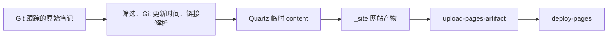

# 用 GitHub Actions 发布 Obsidian 笔记：Quartz 4

本文记录 `learning-notes` 使用 Quartz 4 构建 GitHub Pages 的流程。从 Git 已跟踪的原始笔记导出临时内容，再由固定版本的 Quartz 生成 `_site/`，通过 GitHub Actions 上传并部署。发布仍由 `main` 分支 push 或手动运行触发，笔记筛选和更新时间沿用仓库规则。

复现时使用下表中的固定提交，并取得配套文件。文中的命令在新克隆的目录里执行；开始前先阅读该目录的 `AGENTS.md`，确认修改范围。

| 实现部分 | 本仓库复现基线 | 生成器版本 | 状态 |
| --- | --- | --- | --- |
| Quartz 基础构建 | `af3c83afb0616ed996ac8a9841cd713fbb44e109` | Quartz 4.5.2，上游提交 `d25a6eabf96751ffca56f8a8139272def7a65041` | 已提交的基础方案 |
| Quartz 自定义主页 | 基于上述 Quartz 版本的本地工作区 | Quartz 4.5.2 | 主题仍在审阅，尚未提交；克隆上述提交不会得到这版主题 |

本文依据仓库构建代码和官方文档编写，因此 `sources` 为空；实现出处见各节中的固定版本链接。

## 1. 发布目录与构建约定

| 路径 | 用途 | 如何处理 |
| --- | --- | --- |
| 顶层主题目录中的笔记 | 人维护的原始来源 | 构建时只读，保留原文 |
| `tools/site/` | 发布筛选、链接适配、主题配置和构建入口 | 随代码版本管理 |
| `.site-cache/` | Quartz 上游源码、导出的 Markdown 和安装缓存 | 生成目录，已被 Git 忽略 |
| `_site/` | 最终 HTML、CSS、JS、搜索索引等网站文件 | 保留供上传和预览，已被 Git 忽略，不提交 |

`_site/` 是 Pages 的发布产物。Quartz 构建命令通过 `--output` 指向它，workflow 随后上传整个目录。它可以重新生成，但在上传或本地预览前必须存在。



`tools/site/build.py` 实现了以下发布规则，迁移时应保留：

- `git ls-files` 决定候选笔记，尚未加入 Git 跟踪的新文件不会出现在网站上。顶层目录形成主题，主题下第一层子目录形成分组。
- `EXCLUDE_DIRS`、`EXCLUDE_FILES` 和 `TOPIC_INDEX_RE` 决定排除范围；包括 `KnowledgeBase/`、仓库顶层 Markdown 和主题根目录的 `index.md`。完整排除规则以代码为准，不用生成器默认规则替代。
- 标题优先取 frontmatter 的 `title`，其次取首个非空行的 H1，最后取文件名。
- 更新时间取 Git 历史中该路径最后一次被修改的提交时间；查不到时才回退到文件 mtime。首页显示最近 15 篇。当前实现按路径统计，不追踪重命名前的历史；日期显示还受执行环境时区影响。
- wikilink 优先匹配完整路径；只有文件名且存在重名时，先选同目录的唯一候选，否则按路径长度、路径字典序选择。未找到或被排除的目标显示为普通文字。

本文位于 `AI/Obsidian/`，被 Git 跟踪后会按现有筛选规则参与 Pages 构建；`KnowledgeBase/` 中的摘要和导航仍不参与公开发布。

发布使用 `.github/workflows/deploy-pages.yml`，触发、权限和部署约定如下：

- `on.push.branches: [main]`，另保留 `workflow_dispatch`；不要照抄上游仓库的分支名。
- `contents: read`、`pages: write`、`id-token: write`，部署环境为 `github-pages`。
- `concurrency.group: pages`，`cancel-in-progress: false`。
- `fetch-depth: 0` 保留 Git 历史；`filter: blob:none` 配合 `git log --no-renames`，减少读取历史文件内容的需要。
- 最后依次执行 `configure-pages`、`upload-pages-artifact` 和 `deploy-pages`，上传路径为 `_site`。

新仓库需要在 **Settings → Pages → Build and deployment → Source** 选择 **GitHub Actions**。如果拆成构建和部署两个 job，部署 job 还需要通过 `needs` 等待构建 job；下文沿用单 job。权限、artifact 和 environment 的要求见 [GitHub 官方说明](https://docs.github.com/en/pages/getting-started-with-github-pages/using-custom-workflows-with-github-pages)。

## 2. Quartz 4 构建流程

### 2.1 固定上游，保留本仓库的适配层

Quartz 官方仓库提供 Markdown 到静态网站的构建器。本仓库把自己的发布规则放在 Python 导出器里，将筛选结果交给固定版本的 Quartz；不直接用 vault 根目录作为 Quartz 的 `content`。

配套文件为：

- `tools/site/build.py` 和 `tools/site/requirements.txt`；Python 依赖为 `PyYAML~=6.0`。
- `tools/site/quartz/upstream.json`、`quartz.config.ts`、`quartz.layout.ts`、`custom.scss`、`vault-links.ts`。
- `.github/workflows/deploy-pages.yml`。

`tools/site/quartz/upstream.json`：

```json
{
  "repository": "https://github.com/jackyzha0/quartz.git",
  "branch": "v4",
  "version": "4.5.2",
  "revision": "d25a6eabf96751ffca56f8a8139272def7a65041"
}
```

仓库层面的基线与 Quartz 上游版本是两个不同提交。前者固定我们的导出器和配置，后者固定生成器源码、插件 API 和 `package-lock.json`。`branch: v4` 用于首次克隆，最终仍按 `revision` 检查和切换源码。

Quartz 4.5.2 要求 Node.js ≥22、npm ≥10.9.2；本仓库 CI 使用 Node 22。按这版代码复现时，配置、组件和文档都应对应 v4，不能直接套用后续主版本的 API。[固定版本的 hosting 文档](https://github.com/jackyzha0/quartz/blob/d25a6eabf96751ffca56f8a8139272def7a65041/docs/hosting.md)、[package.json](https://github.com/jackyzha0/quartz/blob/d25a6eabf96751ffca56f8a8139272def7a65041/package.json)

### 2.2 本地构建与命令顺序

```bash
git clone https://github.com/hangx969/learning-notes.git learning-notes-quartz
cd learning-notes-quartz
git checkout --detach af3c83afb0616ed996ac8a9841cd713fbb44e109

python3.12 -m venv ../learning-notes-quartz-venv
source ../learning-notes-quartz-venv/bin/activate
python -m pip install -r tools/site/requirements.txt

# 若版本低于要求，先切换到 Node 22 和符合要求的 npm。
node --version
npm --version

# 准备固定源码、导出笔记、必要时安装 npm 依赖，然后构建。
python tools/site/build.py
test -f _site/index.html

# 已完成构建后的本地预览；此参数不会自行安装缺失的依赖。
python tools/site/build.py --skip-install --serve --port 8081
```

上述基线的预览地址为 `http://127.0.0.1:8081/learning-notes/`，停止服务用 `Ctrl+C`。命令从 vault 根目录执行。`--serve` 监听的是导出到临时 `content` 的文件；改动原始笔记后，应停止预览，重新运行导出和构建命令。

| 参数 | 执行到哪一步 | 使用条件 |
| --- | --- | --- |
| `--prepare` | 克隆并切换上游提交，覆盖本仓库配置 | CI 设置 npm cache 前先取得上游 lockfile |
| `--export` | 准备上游，再导出 Markdown、附件和解析清单 | 检查导出内容；不会完成 HTML 构建 |
| 无参数 | 准备、导出、必要时安装依赖、构建 `_site` | 常规本地构建 |
| `--skip-install` | 省略自动 `npm ci`，其余构建步骤照常执行 | `node_modules` 已准备好 |
| `--serve --port 8081` | 构建后启动预览 | 本地审阅；不部署网站 |

首次构建需要网络访问 GitHub 和 npm registry。上游源码及锁文件位于 `.site-cache/upstream/`，导出笔记位于其 `content/`。修改缓存中的配置会在下一次准备时被覆盖，应修改受版本管理的 `tools/site/quartz/` 文件。

实现出处：[Quartz 构建入口](https://github.com/hangx969/learning-notes/blob/af3c83afb0616ed996ac8a9841cd713fbb44e109/tools/site/build.py)、[本仓库配置目录](https://github.com/hangx969/learning-notes/tree/af3c83afb0616ed996ac8a9841cd713fbb44e109/tools/site/quartz)。

### 2.3 导出和链接兼容

导出器保留原始目录结构，在临时 Markdown 中加入 `sourcePath`、`modified` 和源文件链接；`modified` 来自 Git 提交时间。主题页和首页重新生成，符合媒体扩展名和筛选规则的已跟踪附件也会复制到临时目录。每次导出只重建生成的 `content/`，不回写原始笔记。

`vault-manifest.json` 记录文章路径和 wikilink 的确定性消歧结果。`vault-links.ts` 在 Markdown AST 上应用这些结果，再交给 `ObsidianFlavoredMarkdown`，避免把代码块里的 `[[...]]` 当作正文链接改写。

迁移还要保留两个兼容插件：

- `LegacyUrls` 为旧的 `文章路径/index.html` 输出跳转页，目标是 Quartz 的 `.html` 页面，并保留查询参数和 `#锚点`。
- `LegacyAnchors` 在文章中补入旧站使用的标题 ID，使已保存的旧锚点仍能定位。

旧站使用目录 URL，Quartz 的文章页面以 `.html` 输出。保留上述适配，才能兼容旧书签和旧站内链接。实现见 [vault-links.ts](https://github.com/hangx969/learning-notes/blob/af3c83afb0616ed996ac8a9841cd713fbb44e109/tools/site/quartz/vault-links.ts)。

本地预览还需要区分旧目录跳转页和 Quartz 页面。当前已提交基线使用 Quartz 自带预览服务；迁移检查中发现，无扩展名链接可能先匹配旧目录页。在审阅中的主题工作区已将预览换为 Python 服务，对不带末尾 `/` 的路径优先返回对应 `.html`。这项预览修复尚未进入本文的提交基线；复现基础方案时，要把直接访问 `.html`、旧目录跳转和导航点击分别检查。

### 2.4 基础主题与可定制位置

`quartz.config.ts` 设置标题、语言、`baseUrl`、字体、日夜配色和插件；`quartz.layout.ts` 组合组件；`custom.scss` 调整样式。当前基线包含 `Search`、`Darkmode`、`Explorer`、目录、图谱和反向链接。`Darkmode` 提供日夜切换，配色分别来自 `theme.colors.lightMode` 和 `theme.colors.darkMode`。

`baseUrl` 的当前值为 `hangx969.github.io/learning-notes`，不含 `https://`，它用于生成 sitemap、RSS 等地址。发布筛选由导出器完成，因此配置中的 `ignorePatterns` 和 filters 没有另加一套排除规则。

如果制作类似 Socratica Toolbox 的主页，可以在这一层增加首页组件，使用导出器提供的主题统计和最近更新数据，再由布局引入组件。通常无需修改上游的通用页面渲染器。

本地正在审阅的版本增加了 `notebook-theme.tsx` 和 `notebook-repository.inline.ts`，并配套修改导出器、配置、布局和 SCSS：主页使用自定义卡片布局，保留原生搜索和日夜开关；页头 GitHub 入口在浏览器读取公开仓库的 star、fork 数量，读取失败时仍可点击仓库链接。

这版主题尚未提交。若要复现它，需要取得整套 `tools/site/quartz/` 与匹配的 `tools/site/build.py`，还要保留 `prepare_quartz()` 对新增组件、脚本的复制逻辑。只复制 SCSS 或只克隆基础提交都不能得到同样的页面。主题审阅通过并提交后，再把文档中的主题基线补成对应提交。

### 2.5 GitHub Actions workflow

保存为 `.github/workflows/deploy-pages.yml`：

```yaml
name: Deploy Pages

on:
  push:
    branches: [main]
  workflow_dispatch:

permissions:
  contents: read
  pages: write
  id-token: write

concurrency:
  group: pages
  cancel-in-progress: false

jobs:
  build-and-deploy:
    runs-on: ubuntu-latest
    environment:
      name: github-pages
      url: ${{ steps.deployment.outputs.page_url }}
    steps:
      - uses: actions/checkout@v4
        with:
          fetch-depth: 0        # 首页“最近更新”依赖全量 git 历史取文件提交时间
          filter: blob:none     # 无 blob 部分克隆：只下载 commit/tree 元数据，
                                # HEAD 工作区 blob 按需拉取（约 10MB，而非全量 256MB 历史）

      - uses: actions/setup-python@v5
        with:
          python-version: "3.12"
          cache: pip
          cache-dependency-path: tools/site/requirements.txt

      - name: Install site dependencies
        run: pip install -r tools/site/requirements.txt

      - name: Prepare Quartz 4
        run: python tools/site/build.py --prepare

      - uses: actions/setup-node@v4
        with:
          node-version: "22"
          cache: npm
          cache-dependency-path: .site-cache/upstream/package-lock.json

      - name: Install Quartz dependencies
        working-directory: .site-cache/upstream
        run: npm ci

      - name: Build with Quartz 4
        run: python tools/site/build.py --skip-install

      - uses: actions/configure-pages@v5

      - uses: actions/upload-pages-artifact@v3
        with:
          path: _site

      - id: deployment
        uses: actions/deploy-pages@v4
```

`--prepare` 必须先于 `setup-node` 的 npm cache：`package-lock.json` 在上游被克隆之后才存在。随后在 `.site-cache/upstream` 执行 `npm ci`，最后让 Python 构建入口以 `--skip-install` 运行，避免再次安装。

这份 workflow 使用本仓库基线的 Action 版本，不表示它们是最新版。Quartz 官方示例中的分支和目录需要按仓库调整；这里保持 `main` 触发并上传 `_site`。

## 3. 迁移到其他仓库时修改哪些值

| 位置 | 当前值或约定 | 需要确认的内容 |
| --- | --- | --- |
| workflow 的分支 | `main` | 必须匹配目标仓库的发布分支 |
| Quartz `configuration.baseUrl` | `hangx969.github.io/learning-notes` | 域名和项目路径；不带协议 |
| Quartz 导出器的 `source_url` | 固定 GitHub 仓库、`blob/main/` | 同时修改仓库和源文件所在分支 |
| Quartz 布局及自定义主页的仓库入口 | 本仓库 GitHub 地址 | 页脚、页头和统计请求应指向同一个仓库 |
| Quartz 本地预览 `--baseDir` | `/learning-notes` | 仓库路径改变时同步调整预览前缀 |
| 发布筛选 | Python 中的既有规则 | 先确定原始来源目录；不要把整个 vault 自动公开 |
| Pages Source | GitHub Actions | 仓库设置与 artifact 部署方式一致 |

如果更换域名或仓库名，应搜索原域名、仓库名及 `/learning-notes`，逐处确认用途。相对资源路径还需要在项目子路径下检查；在本地根路径能显示，不代表部署到 `/仓库名/` 后仍能加载。

## 4. Agent 执行顺序与验收

### 4.1 开始前

1. 读取 `AGENTS.md`，运行 `git status --short` 和 `git rev-parse HEAD`，记录原有改动与当前提交。
2. 取得 Quartz 固定基线的配套文件；保留现有发布范围和 workflow 触发。
3. 在新克隆或经授权的工作区修改发布层文件，原始笔记只读。新生成目录保持 Git 忽略。
4. 先核对 Python、Node 和依赖版本，再构建；Quartz 的 `--skip-install` 只能在依赖已安装时使用。

### 4.2 本地验收

| 检查 | 成功条件 |
| --- | --- |
| 构建 | Quartz 构建退出码为 0，`_site/index.html` 存在 |
| 发布范围 | 发布数量、主题数量符合该内容快照，排除目录未进入产物 |
| 原始来源 | 原始 Markdown 的 diff 或构建前后校验值不变 |
| 导航与链接 | 首页、主题页、文章、源文件入口可打开；中文路径和 `C++` 路径可访问 |
| Obsidian 语法 | 检查带别名、锚点、重名的 wikilink，以及代码块中的示例 |
| 迁移兼容 | 旧文章目录 URL、查询参数和旧标题锚点跳转正确 |
| 日期与统计 | 最近更新来自 Git 时间，列表为最近 15 篇；内容变化后统计随之更新 |
| 主题 | 日夜模式均可阅读，切换后设置保留，窄屏无横向溢出 |
| 资源与搜索 | CSS、脚本、本地附件没有 404，搜索能找到中英文笔记 |

验收数量以内容快照为准，不能把一次构建的 411 篇写成永久固定值。新文章未被 Git 跟踪时，构建结果不变是当前收集规则的表现。

### 4.3 发布验收

本地检查通过后，按仓库授权范围提交代码或创建待审阅变更。需要发布时，将 Quartz workflow 放在发布分支，通过原有 push 或 `workflow_dispatch` 触发。检查 Actions 中构建、artifact 上传、Pages 部署分别成功，再打开部署步骤输出的地址核对项目路径和资源。

汇报时分别说明本地构建、GitHub Actions 和实际部署的结果。无需运行 Quartz 的 `sync` 命令来构建；该命令可能提交或推送内容，不适用于这里只读导出和本地审阅的步骤。

## 5. 常见问题

| 现象 | 原因或检查方向 | 处理 |
| --- | --- | --- |
| Node 引擎报错 | 使用了低于 Quartz 4.5.2 要求的 Node/npm | 切换到 Node 22，并确认 npm ≥10.9.2 后重新安装依赖 |
| setup-node 找不到 lockfile | 缓存设置先于 Quartz 源码准备 | 把 `python tools/site/build.py --prepare` 放在它前面 |
| 新笔记没有出现在首页 | 文件没有被 Git 跟踪，或符合排除规则 | 检查跟踪状态与筛选代码，再按授权范围处理 |
| 最近更新日期不对 | checkout 历史不全，或本地和 CI 时区不同 | 保留 `fetch-depth: 0`，核对提交时间和显示时区 |
| 中文路径或 `C++` 链接失败 | URL 编码或子路径处理变化 | 沿用现有链接转换，在实际项目路径下验证 |
| Quartz 旧链接或锚点失效 | 兼容插件没有迁移，或被新插件顺序影响 | 保留 `VaultLinks`、`LegacyUrls`、`LegacyAnchors` 并验证跳转 |
| 本地点击文章空白或循环跳转 | `.html` 页面与旧目录跳转页的匹配顺序冲突 | 分别测试两种 URL；迁移审阅版的预览修复时保留完整服务实现 |
| 页面样式改了又恢复 | 直接改了 `.site-cache/upstream` | 把配置、样式或组件修改放回 `tools/site/quartz/` |

## 6. 本次验证记录

截至 2026-10-03，Quartz 4.5.2 的本地主题审阅版已完成构建、TypeScript 检查和日夜模式、手机宽度检查。迁移检查还覆盖旧目录 URL、wikilink 和旧锚点。以上是本地验证结果。本次编写文档没有触发 GitHub Actions，也没有发布新的 Pages 部署。

## 7. 相关页面

- [[KnowledgeBase/concepts/CICD|CI/CD]]：构建、验收与部署阶段的关系。
- [[KnowledgeBase/entities/Obsidian|Obsidian]]：vault、wikilink 和知识库维护约定。

## 8. 参考资料

- [GitHub Pages 自定义 workflow](https://docs.github.com/en/pages/getting-started-with-github-pages/using-custom-workflows-with-github-pages)
- [Quartz 4.5.2 hosting 文档](https://github.com/jackyzha0/quartz/blob/d25a6eabf96751ffca56f8a8139272def7a65041/docs/hosting.md)
- [Quartz 基线构建入口](https://github.com/hangx969/learning-notes/blob/af3c83afb0616ed996ac8a9841cd713fbb44e109/tools/site/build.py)
