DeepSeek 这一趴可以通过直接用 [<u>DeepSeek 官方的 API </u>](https://paicoding.com/article/detail/2526722310813698)，也可以调用本地的 DeepSeek。 这一篇主要来讲本地的 DeepSeek 部署。

## 第一步，安装 ollama

Ollama 是一个本地运行大语言模型（LLM）的工具，支持 DeepSeek、Llama、Mistral 等开源 AI 模型，允许用户在本地推理和交互。

能够提供高效的模型管理、轻量级 API，并支持CPU 和 GPU 加速。相比云端 API，Ollama 更安全、可离线运行，适用于本地开发、私有数据处理和 AI 应用开发。

下载地址： [<u>https://ollama.com/download/mac</u>](https://ollama.com/download/mac)

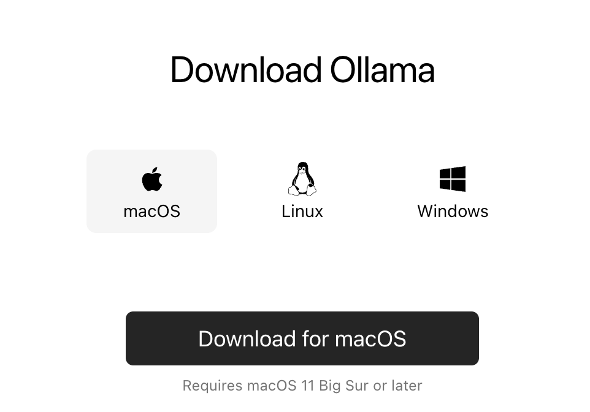

我本机是 macOS，如果你是 Windows，下载 Windows 版本就可以了。

### MacOS 安装

下载完成后，macOS 是不需要安装的，双击就可以解压，把 App 拖到应用程序当中就可以了。

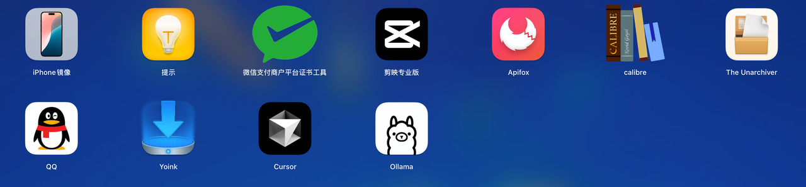

双击。

就完成了 ollama 的运行，注意没有任何界面。

可以在导航栏看到这个可爱的小图标，就表示 Ollama 已经成功运行了。

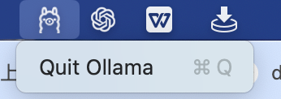

也可以在浏览器输入 [<u>http://localhost:11434/ </u>](http://localhost:11434/)，查看运行状态。

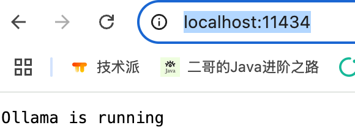

### Windows 安装

windows 用户安装的时候可以直接双击安装包安装，也可以通过命令行工具进行安装，默认情况下 ollama 会安装到 C 盘，使用命令行工具可以自定义指定 ollama的安装路径，有 C 盘 洁癖的同学可以使用命令行进行安装。安装命令如下：

```bash
OllamaSetup.exe /dir=<自定义目录>
```

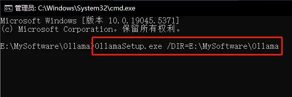

输入命令敲回车即可：

安装完成之后先别着急拉模型，可以添加两个环境变量：

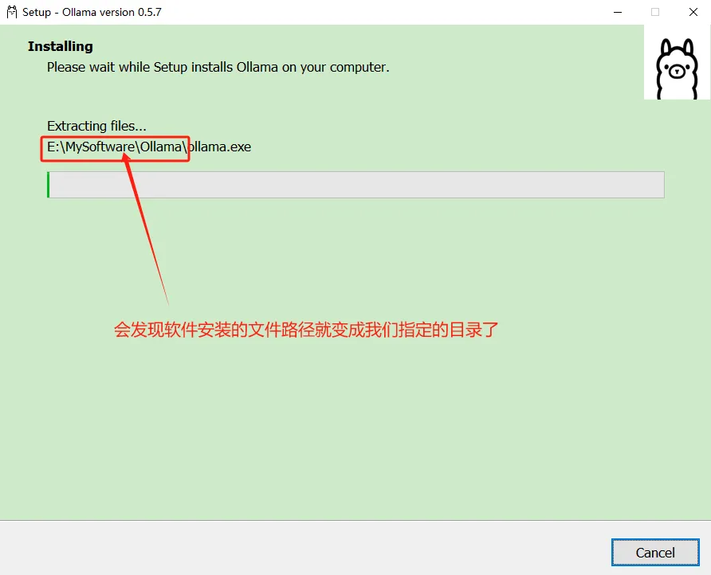

```markdown
OLLAMA_HOST                  0.0.0.0:11434
OLLAMA_MODELS                E:\MySoftware\Ollama\models
复制代码
```

其中 `OLLAMA_HOST` 用来定义 ollama的主机地址，允许其他用户可以调用，否则仅能使用 localhost 进行 本地调用 `OLLAMA_MODELS` 用来定义模型的下载地址，否则默认还是会下载 C 盘

**设置完环境变量后，切记要重新启动一下 ollama，保证配置生效**

## 第二步，拉取deepseek-r1 模型

DeepSeek-R1 是 DeepSeek 团队推出的一款开源、支持 128K 长文本上下文的 Transformer 大语言模型，在代码生成、数学推理等任务上表现出色。

ollama 支持 deepseek 的全尺寸版本，比如说 1.5b、7b、8b、14b 等，本地建议安装 7b 版本，体积大小最合适。

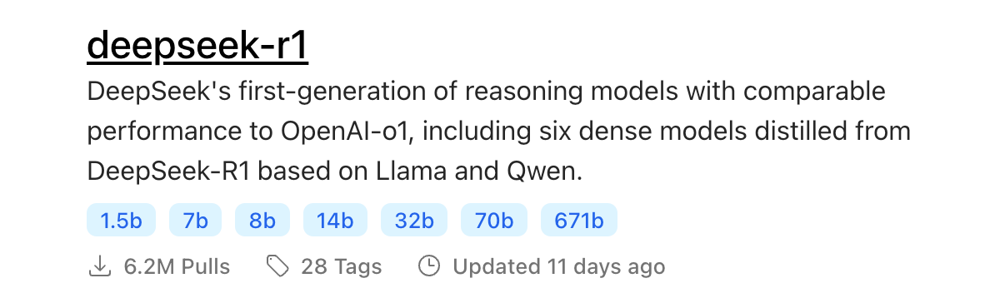

然后在控制台输入 ollama run deepseek-r1:7b 运行，我家的网速很一般，这里拉取模型花了不少时间。

截图这会有 2.5M/s，但不是很稳定，慢的时候只有 300 多 kb，所以这一步需要花时间耐心等一下。

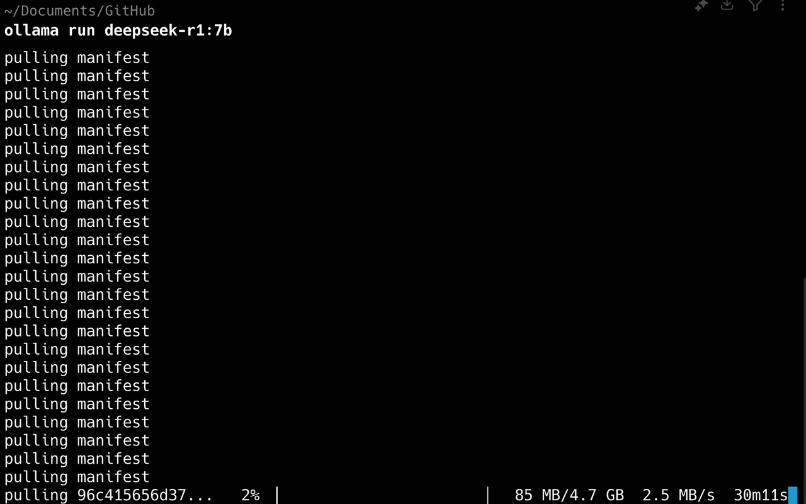

*image.png*


我差不多是花了一个晚上才搞定，截图都到第二天了，非常消耗耐心。

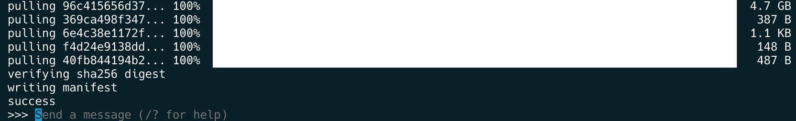

等 deepseek 拉取完成后，就可以在控制台进行交互了，直接输入文本进行提问就可以了。


补充：如果大家在拉取模型的时候，也遇到二哥拉取模型时的下载速度问题（开始速度快，结束时候慢），可以尝试 ctrl+c中断下载，然后重新执行 ollama run deepseek-r1:7b命令进行下载即可，ollama有类似断点续传的效果，它会接着之前的进度继续下载的，并不是从 0 开始重新下载，速度也会重新提上来😁

## 第三步，启动 ollama 和 DeepSeek-r1 本地模型

如果你之前已经安装了 ollama 和 DeepSeek，那么只需要先启动 ollama，然后 run deepseek 就好了。

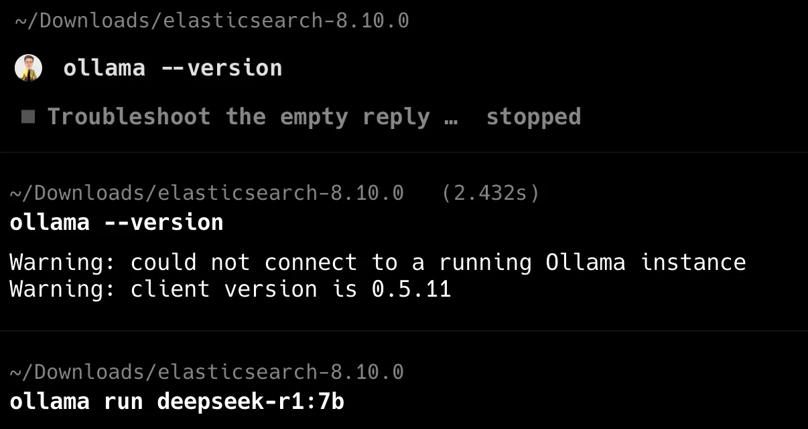

application.yml 中我做了说明。注意本地和 DeepSeek 官方的 URL 不太一样，model 也不一样，key 本地的话不用填写，我本地用的是 7b 版本。

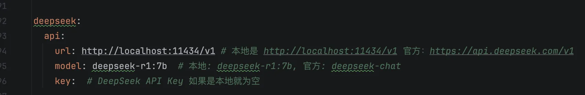

如果成功配置，可以在聊天助手这里进行测试。后台也不会报错。

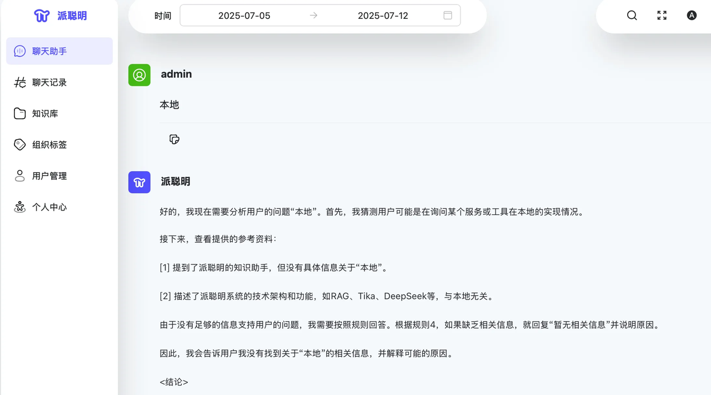

