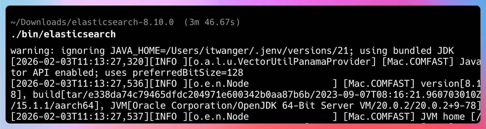
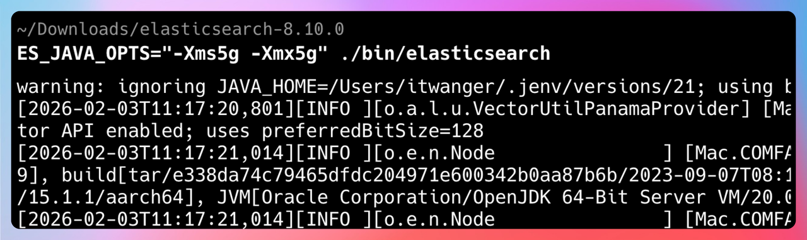
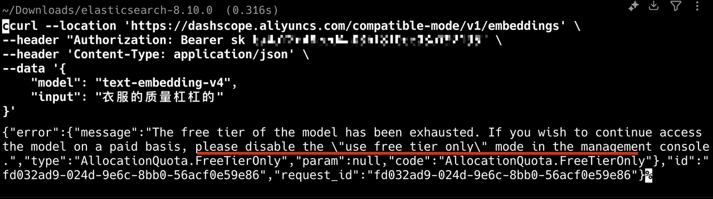
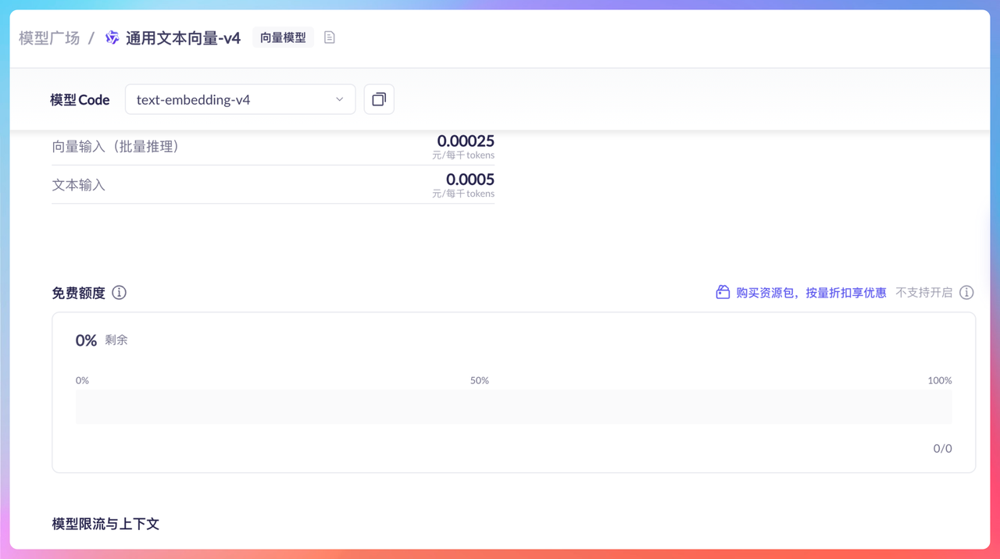
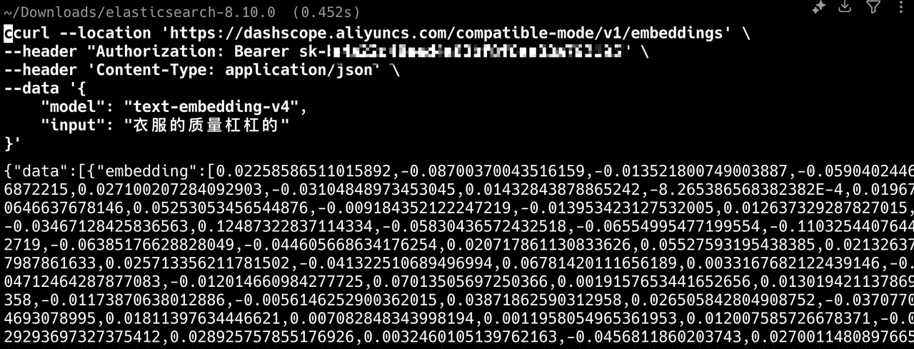

## 01、ElasticSearch 需要配置JDK吗？

就我自己的使用体感来说，是不需要的。但需要ElasticSearch下载的包是完整的，我之前就经历过被AI智能桌面工具删了一些东西，导致没办法启动了。



## 02、ElasticSearch需要配置内存大小吗？

我建议配置，否则占用内容会特别大。我的命令是 `ES_JAVA_OPTS="-Xms5g -Xmx5g" ./bin/elasticsearch`



## 03、阿里的向量API无法解析怎么办？

看看是不是欠费了，可以在命令行执行这个查看。

```rust
curl --location 'https://dashscope.aliyuncs.com/compatible-mode/v1/embeddings' \
--header "Authorization: Bearer sk-你的APIkey" \
--header 'Content-Type: application/json' \
--data '{
    "model": "text-embedding-v4",
    "input": "沉默王二是个傻缺"
}'
```

如果你出现类似的错误，就说明免费额度用完了。



需要购买资源包。

v4 最小一次可以充值100元。



完事把免费额度用完就关掉的选项关掉。再试一次。

如果没问题就表示OK了。



