# 大模型本地部署选型：Ollama、vLLM、SGLang 与 vLLM-Omni

在 GPU 服务器上部署大模型，真正的问题不只是“模型能不能跑起来”，还包括：

- 模型从哪里下载，如何离线送入数据中心；
- 如何规划模型目录，避免权重重复和缓存失控；
- 选择哪一种推理引擎，怎样控制显存和并发；
- 使用宿主机还是容器，怎样隔离 CUDA、PyTorch 和运行时依赖；
- 如何统一 API，让业务系统不绑定具体模型与底层 Runtime；
- 从单机测试扩展到多 GPU、多节点生产平台时，架构如何演进。

> [!important] 先区分三个概念
> **模型权重**（DeepSeek、Qwen、Wan、FLUX）是数据资产；**推理 Runtime**（Ollama、vLLM、SGLang、vLLM-Omni）负责加载权重并执行推理；**Model Gateway** 为业务系统提供稳定的能力入口。三者不是一回事。

> [!warning] 版本边界
> 推理框架发展很快，命令参数、模型支持范围和 API 会随版本变化。本文保留可复用的工程方法；落地前仍需用目标版本的官方文档与 `--help` 核对参数，尤其是 vLLM-Omni 的模型支持矩阵。

## 1. 先看结论：按工作负载选择 Runtime

| 工具 | 核心定位 | 最适合 | 不应作为首选的场景 |
|---|---|---|---|
| Ollama | 本地模型下载、管理与运行的一体化工具 | 个人电脑、开发、Demo、PoC | 大规模 GPU 高吞吐和复杂集群调度 |
| vLLM | 通用 LLM 高吞吐 Serving Runtime | OpenAI 兼容 API、成熟生产推理 | 以图像/视频生成为主的 Diffusion 工作负载 |
| SGLang | 高性能 LLM/VLM 与复杂生成 Serving | Agent、结构化生成、Prefix 高复用、PD 分离 | 小规模、追求最低运维复杂度的场景 |
| vLLM-Omni | 多模态与非自回归生成 Serving | 图像、视频、音频、Omni 模型 | 未进入支持矩阵的模型或 ComfyUI 零散组件目录 |

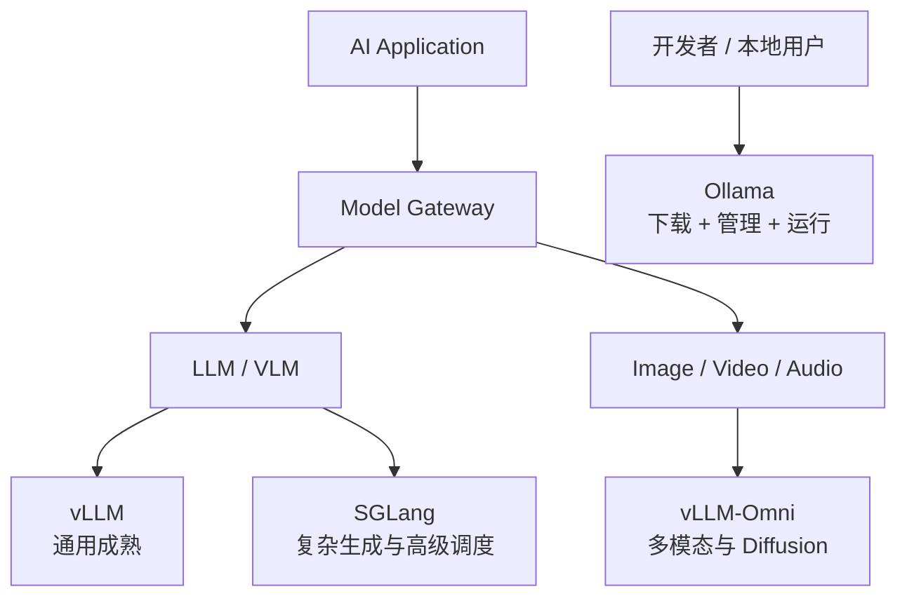

简单选择逻辑：

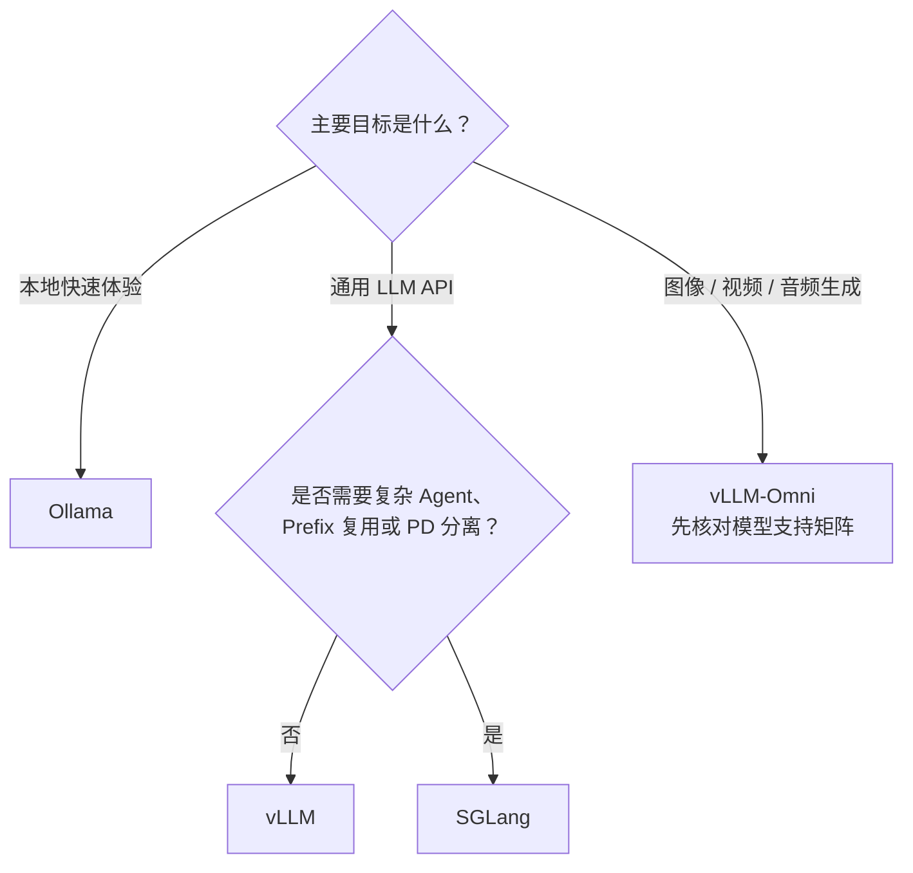

Ollama 与另外三者并非完全同类：它强调“把模型快速跑起来”的整体体验；vLLM、SGLang 和 vLLM-Omni 更接近可调优、可扩展的 Serving Runtime。

## 2. 模型资产与离线交付

### 2.1 国内环境优先考虑 ModelScope

海外模型通常发布在 Hugging Face，但国内数据中心可能遭遇 DNS、TLS 超时、速度慢、大文件中断和代理不稳定。可将 ModelScope 作为下载来源之一：

```bash
pip install -U modelscope
```

通用下载命令：

```bash
modelscope download \
  --model <模型ID> \
  --local_dir <本地目录>
```

例如：

```bash
modelscope download \
  --model deepseek-ai/DeepSeek-R1-Distill-Qwen-7B \
  --local_dir /<本地目录>/ai-models/vllm/DeepSeek-R1-Distill-Qwen-7B
```

后台下载并查看进度：

```bash
mkdir -p /<本地目录>/ai-models/vllm/DeepSeek-R1-Distill-Qwen-7B

nohup modelscope download \
  --model deepseek-ai/DeepSeek-R1-Distill-Qwen-7B \
  --local_dir /<本地目录>/ai-models/vllm/DeepSeek-R1-Distill-Qwen-7B \
  > /tmp/deepseek-download.log 2>&1 &

tail -f /tmp/deepseek-download.log
```

### 2.2 提前规划模型盘

不要让全部模型默认落入 `/root/.cache`。建议将完整模型仓库与 ComfyUI 组件模型分开管理：

```text
/<本地目录>/ai-models/
├── vllm/
│   └── DeepSeek-R1-Distill-Qwen-7B/
├── vllm-omni/
│   └── Qwen-Image-Edit-2509/
├── flux/
│   └── FLUX.1-dev/
├── wan/
│   └── Wan2.2-TI2V-5B/
├── tts/
│   └── Fun-CosyVoice3-0.5B-2512/
├── diffusion_models/
├── text_encoders/
├── vae/
└── loras/
```

两类资产的边界：

- **完整 Repository 模型**：DeepSeek、Qwen、FLUX、Wan 等完整仓库，通常包含配置、Tokenizer、Scheduler 和权重目录。
- **ComfyUI 组件模型**：`diffusion_models/`、`text_encoders/`、`vae/`、`loras/` 等可组合组件。

不要假设 ComfyUI 能加载的零散 `.safetensors` 文件能被 Serving Runtime 直接加载。不同 Runtime 对目录结构和配置文件的要求不同。

### 2.3 用 rsync 搬运大模型

下载机与服务器网络互通时，优先使用支持断点续传的 `rsync`：

```bash
rsync -avP \
  /<本地目录>/ai-models/vllm/DeepSeek-R1-Distill-Qwen-7B/ \
  root@IP:/<本地目录>/ai-models/vllm/DeepSeek-R1-Distill-Qwen-7B/
```

- `-a`：归档模式，保留常用文件属性；
- `-v`：显示详细过程；
- `-P`：等价于 `--partial --progress`，保留部分文件并显示进度。

如果目录中有大量小文件，可先打包再传输：

```bash
tar -cf DeepSeek-7B.tar DeepSeek-R1-Distill-Qwen-7B

rsync -avP \
  DeepSeek-7B.tar \
  root@IP:/<本地目录>/ai-models/

tar -xf DeepSeek-7B.tar
```

`.safetensors` 等大权重文件再次 gzip 的收益通常有限。是否使用 `tar -czf` 应以网络带宽、CPU 时间和实测压缩率决定；单纯减少小文件元数据开销时，`tar -cf` 往往更实用。

### 2.4 Runtime 镜像也要进入离线交付链路

模型文件离线并不够，GPU 服务器还需要匹配的 Runtime 镜像：

```bash
# 联网机
docker pull <image>
docker save -o runtime.tar <image>

# 传输
rsync -avP runtime.tar root@IP:/home/hzy/

# 离线服务器
docker load -i /home/hzy/runtime.tar
docker images
```

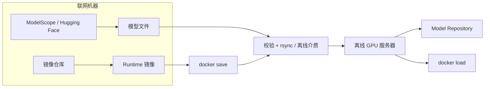

交付时应同时记录模型版本/Revision、镜像 Digest、校验和、CUDA/驱动最低要求与许可证，避免“文件传到了但无法复现”。

## 3. Ollama：本地开发与快速验证

Ollama 面向开发者和个人用户，封装了模型下载、缓存、管理、Runtime 与 API。它的优势是简单、快速、跨平台体验统一。

常用命令：

```bash
ollama pull qwen3:8b
ollama run qwen3:8b
ollama list
ollama rm qwen3:8b
```

适用场景：

- Windows、Linux、macOS 与 Apple Silicon 上的本地体验；
- 个人开发、Demo、PoC、快速模型验证；
- 不希望一开始就调节 Tensor Parallel、KV Cache、Continuous Batching 或 Scheduler 的团队。

主要边界：

- 大量并发、多节点集群、大模型 TP/EP、Prefill/Decode 分离并非它的主要优势；
- Ollama 常用 GGUF 或其自身的模型管理方式，GPU 生产推理则常见 Safetensors、BF16、FP8、AWQ、GPTQ；
- 同时维护 Ollama 与 vLLM/SGLang 的模型副本可能造成重复存储。

因此，可让开发人员先用 Ollama 验证交互与 Prompt，正式 GPU Serving 再迁移到 vLLM 或 SGLang。

## 4. vLLM：通用高吞吐 LLM Serving

vLLM 面向 DeepSeek、Qwen、Llama、Gemma、Mistral 等自回归模型，重点解决：

- KV Cache 的高效管理；
- Continuous Batching；
- GPU 显存分配；
- 请求调度；
- OpenAI 兼容 API；
- 单机多 GPU 与分布式 Serving。

Continuous Batching 会动态组合处于不同生成阶段的请求，提高 GPU 利用率和吞吐，降低单位请求成本。

### 4.1 启动示例

```bash
vllm serve \
  /models/vllm/DeepSeek-R1-Distill-Qwen-7B \
  --host 0.0.0.0 \
  --port 8001 \
  --served-model-name deepseek-r1-7b \
  --trust-remote-code
```

> [!warning] `--trust-remote-code`
> 该参数允许执行模型仓库提供的自定义代码。只对经过审查并固定 Revision 的可信模型使用，不应把它当作无条件默认值。

### 4.2 常用参数与显存边界

| 参数 | 含义 | 工程注意事项 |
|---|---|---|
| `--host 0.0.0.0` | 监听所有网卡 | 需要配合鉴权、网络策略或反向代理，不能等价于安全暴露 |
| `--port 8001` | API 监听端口 | 多实例时要建立端口与服务名映射 |
| `--served-model-name deepseek-r1-7b` | 对外服务名 | 让业务系统与真实模型目录解耦 |
| `--tensor-parallel-size 2` | 用两个 TP rank 切分模型 | GPU 数量、拓扑和 NCCL 通信会影响收益 |
| `--gpu-memory-utilization 0.5` | 当前实例可使用的 GPU 显存目标比例 | 是单实例限制，不是跨进程硬隔离 |
| `--max-model-len 16384` | 最大模型上下文长度 | 越大通常意味着 KV Cache 越多、并发容量越低 |

Tensor Parallel 将模型权重切分到多张 GPU：

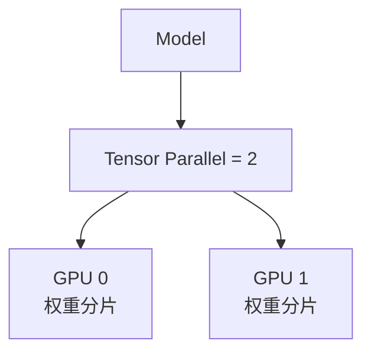

同一张 H200 上配置两个 `--gpu-memory-utilization 0.45` 的实例，只代表每个实例按自身视角规划约 45% 显存，并不会形成类似 MIG 的硬隔离。仍需为以下开销留余量并压测：

- CUDA Context；
- 模型加载峰值；
- KV Cache；
- 临时 Tensor；
- CUDA Graph 与运行时波动；
- 其他进程的显存占用。

`--max-model-len` 也不是越大越好：

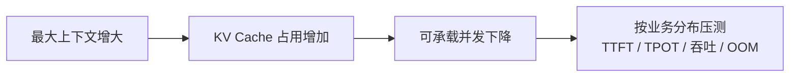

vLLM 的优势是生态成熟、模型覆盖广、高吞吐、多 GPU 能力和生产 Serving 经验丰富；代价是参数更多，并且需要认真处理 CUDA、PyTorch、驱动与模型版本兼容。

## 5. SGLang：复杂生成与高级调度

SGLang 与 vLLM 在高性能 LLM Serving 上高度重叠，但更强调：

- Structured Generation；
- Agent 与复杂推理工作流；
- Prefix Cache 与 RadixAttention；
- 大规模调度；
- Prefill/Decode Disaggregation（PD 分离）。

PD 分离把计算密集的 Prefill 与内存带宽敏感的 Decode 放到不同 Worker，并通过 KV 传输连接：

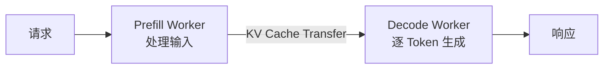

启动示例：

```bash
python3 -m sglang.launch_server \
  --model-path /models/vllm/DeepSeek-R1-Distill-Qwen-7B \
  --host 0.0.0.0 \
  --port 8002 \
  --tp-size 1 \
  --mem-fraction-static 0.8 \
  --max-running-requests 64
```

常用参数：

- `--tp-size`：Tensor Parallel 大小；
- `--mem-fraction-static`：静态显存池比例；
- `--max-running-requests`：同时运行的请求数量。

SGLang 适合复杂 Agent、结构化输出、Prefix 高复用、PD 分离与超大规模 Serving；它的高级能力也意味着更多参数、组件和运维复杂度。小规模常规 OpenAI API 服务未必能从这些能力中获得足够收益。

### vLLM 与 SGLang 怎么选

| 场景 | 更自然的起点 |
|---|---|
| 通用 OpenAI 兼容 API、快速生产落地、团队经验偏成熟稳定 | vLLM |
| Agent、结构化生成、共享 Prefix 明显、需要 PD 分离 | SGLang |
| 结果主要由团队已掌握的框架和真实压测决定 | 两者都应进入基准测试 |

不要只比较“峰值 tokens/s”。至少同时观察吞吐、首 Token 延迟（TTFT）、每 Token 延迟（TPOT）、P95/P99、显存占用、错误率和运维复杂度。

## 6. vLLM-Omni：图像、视频、音频与 Omni Serving

传统 vLLM 以文本自回归模型为核心。vLLM-Omni 将 Serving 扩展到文本、图像、音频、视频、动作数据，以及 Diffusion Transformer 等非自回归架构。

可能覆盖的模型类别包括：

- Qwen Omni 系列；
- Qwen Image / Image Edit；
- Wan、SANA-Video 等视频生成模型；
- FLUX 等图像生成模型（以实际支持矩阵为准）；
- CosyVoice 等 TTS 模型（以具体模型与版本为准）。

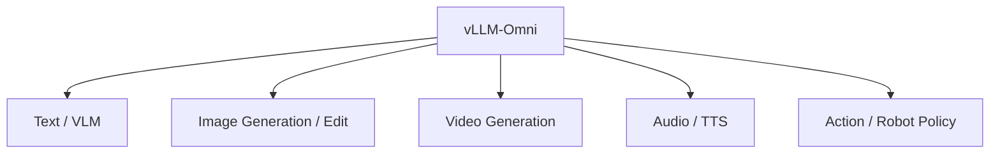

启动形式通常类似：

```bash
vllm serve <model> --omni --port 8091
```

不同模型可能还需要专用 Deployment Config 或模型参数。当前 Serving API 包括 OpenAI 兼容端点及图像、音频、视频等扩展端点；例如视频生成推荐使用异步任务：

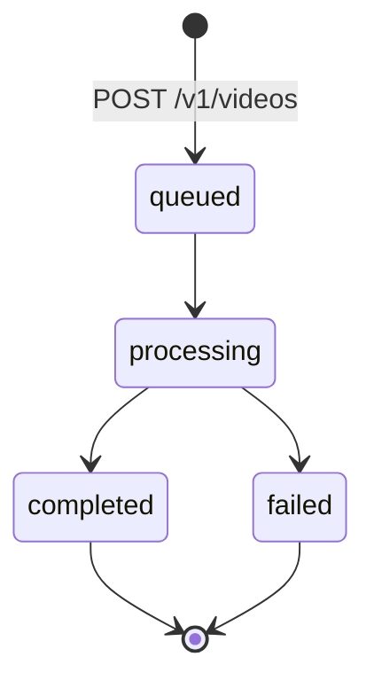

长耗时视频任务采用“提交任务 → 返回 ID → 查询状态 → 下载结果”的方式，比占用一个同步 HTTP 请求更合理。

关键限制：

- 模型支持范围与 vLLM-Omni 版本、硬件后端和模型仓库结构强相关；
- 不同 Diffusion Pipeline 的参数差异很大；
- 完整 Diffusers/Hugging Face Repository 通常包含 `model_index.json`、`transformer/`、`vae/`、`scheduler/`、`tokenizer/` 等；
- ComfyUI 的 `wan_high_noise.safetensors`、`vae.safetensors`、`text_encoder.safetensors` 等零散组件不能直接等价为可服务的完整仓库；
- 每个服务实例通常承载一个模型，扩容和隔离应按 Worker 设计。

## 7. 四种 Runtime 的工程对比

| 维度 | Ollama | vLLM | SGLang | vLLM-Omni |
|---|---|---|---|---|
| 核心定位 | 本地模型运行与管理 | LLM Serving | 高性能 LLM/VLM 与复杂生成 Serving | Omni / Diffusion Serving |
| 上手难度 | 最低 | 中等 | 较高 | 较高 |
| LLM | 支持 | 强 | 强 | 支持 |
| VLM | 部分支持 | 支持 | 支持 | 支持 |
| 图像生成 | 非主定位 | 非主定位 | 非主定位 | 强，取决于模型矩阵 |
| 视频生成 | 非主定位 | 非主定位 | 非主定位 | 强，取决于模型矩阵 |
| TTS | 部分生态 | 非主力 | 非主力 | 支持部分模型 |
| 高并发 | 中 | 强 | 强 | 持续演进 |
| Agent / 结构化生成 | 中 | 强 | 很强 | 非核心 |
| 模型管理 | 最方便 | 手工/平台化 | 手工/平台化 | 手工/平台化 |
| 集群能力 | 较弱 | 强 | 很强 | 强 |
| 本地开发 | 非常适合 | 适合 | 一般 | 适合 |
| 生产 Serving | 适合轻量场景 | 很适合 | 很适合 | 适合受支持的生成类模型 |

这张表是选型起点，不是基准测试结论。最终结果取决于模型、精度、上下文、请求分布、GPU 型号、拓扑和框架版本。

## 8. Docker 还是宿主机直接运行

### 8.1 宿主机运行

```bash
pip install vllm
vllm serve <model>
```

宿主机依赖栈：

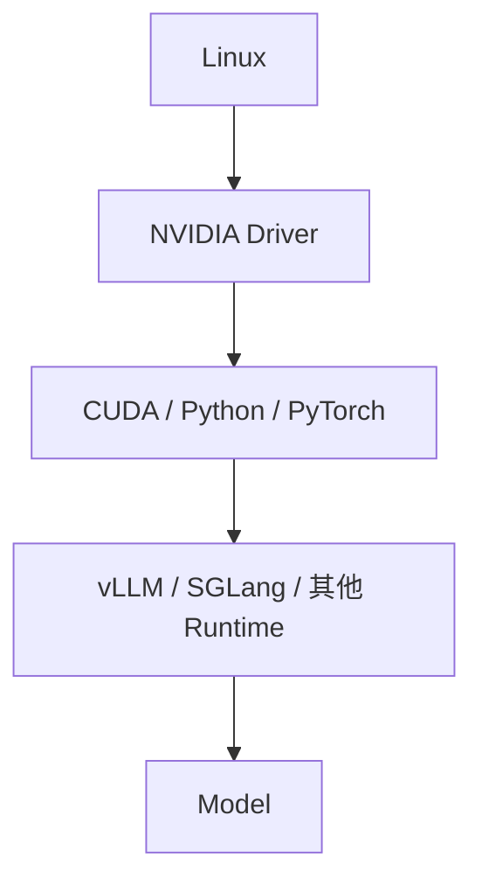

优点：

- 可直接使用 Python、`nvidia-smi`、`strace`、`gdb` 等工具；
- 文件访问无需 Volume 映射；
- 适合频繁修改 Python、编译 CUDA Kernel、调试模型代码和依赖的研究环境。

缺点是依赖污染。vLLM、SGLang、ComfyUI 和 CosyVoice 可能需要不同的 Torch、Transformers 或 CUDA 用户态库，反复 `pip install` 很容易破坏其他环境。Conda/venv 能隔离 Python 包，但不能消除所有系统库、驱动和磁盘管理问题。

### 8.2 Docker 运行

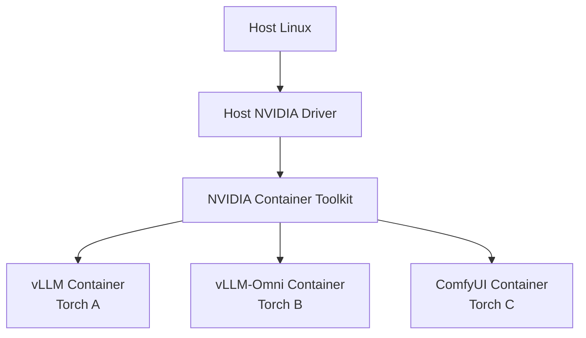

Docker 的主要价值是：

1. **环境隔离**：不同 Runtime 维护各自的 PyTorch、CUDA Runtime 和 Python 依赖；
2. **复制与回滚**：镜像可通过 Digest 固定，并用 `docker save/load` 离线迁移；
3. **GPU 可见性控制**：便于把不同进程分配到指定 GPU；
4. **部署标准化**：把入口命令、依赖和健康检查固化在镜像/编排配置中。

GPU 选择示例：

```bash
docker run --gpus '"device=0,1"' <image>
docker run --gpus '"device=2,3"' <image>
```

常见容器参数还包括：

```bash
docker run \
  --gpus all \
  --ipc=host \
  -v /nvme1n1/ai-models:/models \
  <image>
```

`--ipc=host` 会放宽 IPC 隔离，应确认 Runtime 是否确实需要，并结合安全要求评估。生产环境还需规划共享内存、网络、只读挂载、用户权限、日志和健康检查。

### 8.3 性能与运维取舍

容器通过 NVIDIA Container Toolkit 使用宿主机驱动，并不是一台 GPU 虚拟机。正确配置时，GPU 计算性能通常接近宿主机；更大的变量往往是：

- Batch Size 与调度策略；
- KV Cache 与上下文长度；
- 模型精度与量化；
- TP、PP、DP、EP；
- 显存带宽；
- NUMA、PCIe、NVLink 与网络拓扑。

| 维度 | Docker | 宿主机直接运行 |
|---|---|---|
| GPU 性能 | 通常接近裸机 | 裸机 |
| 环境隔离 | 好 | 较差 |
| 部署复制与回滚 | 方便 | 较难 |
| 离线迁移 | 方便 | 需要重建环境 |
| 深度调试 | 较方便 | 最方便 |
| 多 Runtime 共存 | 更适合 | 容易污染 |
| GPU 可见性控制 | 简单 | 需手工配置 |
| 镜像磁盘占用 | 有，常达 10–30 GB 以上 | 无镜像开销 |
| 推荐场景 | 多模型、生产、离线交付 | 单模型、临时实验、研究开发 |

## 9. 测试与生产的部署粒度

### 9.1 测试环境：一个容器运行多个进程

一个容器可以启动多个 Runtime 进程，每个进程监听独立端口并使用指定 GPU：

```bash
CUDA_VISIBLE_DEVICES=0 \
vllm serve /models/modelA --port 8101 &

CUDA_VISIBLE_DEVICES=1 \
vllm serve /models/modelB --port 8102 &

wait
```

```text
vLLM Container
├── :8001 DeepSeek（进程 1）
├── :8002 Qwen（进程 2）
└── :8003 Other LLM（进程 3）
```

优点是容器少、配置集中、测试方便；缺点是故障隔离差、单模型扩容麻烦、健康检查复杂、GPU 调度不灵活。这里是“一个容器多个 Runtime 进程”，不是“一个 vLLM 进程同时加载任意多个独立基础模型”。

### 9.2 生产环境：一个 Worker 一个容器

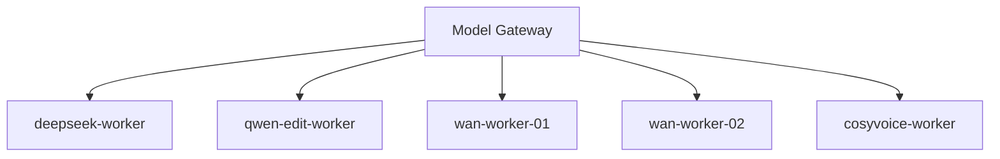

这样某个模型 OOM 时只重启对应 Worker；扩容、健康检查、资源限制、灰度发布和版本回滚也能按模型独立进行。在 Kubernetes 中，可进一步用 Deployment/InferenceService、GPU 调度和自动扩缩容管理这些 Worker。

## 10. 从模型池到推理平台

### 10.1 AI 短剧模型池示例

| 能力 | 示例模型 | Runtime 起点 |
|---|---|---|
| 剧本理解、分镜、Prompt、结构化输出 | DeepSeek-R1-Distill-Qwen-7B | vLLM；复杂结构化/Agent 场景可评估 SGLang |
| 人物定妆、场景图、关键帧 | FLUX.1-dev | vLLM-Omni 或专用 Diffusion Runtime |
| 角色一致性、换背景、换动作 | Qwen-Image-Edit-2509 | vLLM-Omni，先核对版本支持 |
| Text/Image to Video | Wan2.2-TI2V-5B | vLLM-Omni，先核对模型格式 |
| TTS、音色克隆、角色配音 | CosyVoice3 | CosyVoice Runtime；受支持版本可评估 vLLM-Omni |

### 10.2 能力路由

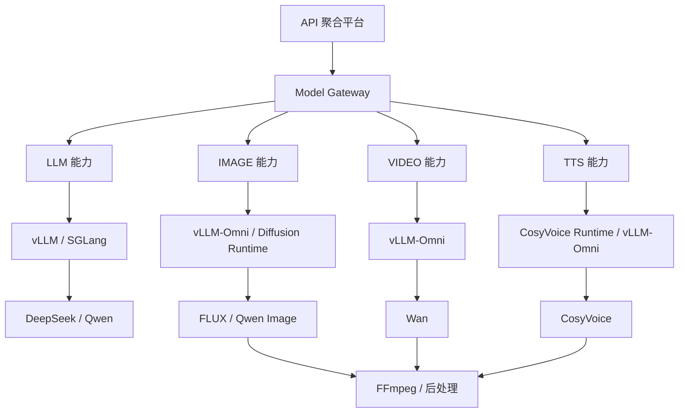

### 10.3 多节点平台演进

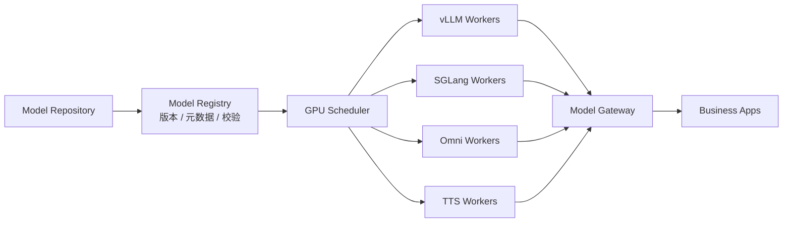

业务系统应尽量只认识稳定的能力接口，例如 `LLM`、`IMAGE`、`VIDEO`、`TTS`，而不绑定 DeepSeek、Qwen、Wan、FLUX 或某个 Runtime。这样替换模型或升级引擎时，业务层不必整体重构。

对于 Kubernetes 生产环境，单个 Deployment 能运行 vLLM，但如果需要声明式 Runtime、统一网关、自动扩缩容和模型服务生命周期，可进一步参考 [[AI/企业级私有化大模型/一个 Deployment 就能跑 vLLM，为什么还需要 KServe？|KServe 部署 vLLM]]。

## 11. 落地检查清单

### 模型资产

- [ ] 模型来源、Revision、许可证和校验和已记录；
- [ ] 完整 Repository 与 ComfyUI 组件目录已分开；
- [ ] 模型盘容量、inode、缓存与清理策略已规划；
- [ ] 离线模型和 Runtime 镜像能够从清单复现。

### GPU 与 Runtime

- [ ] 驱动、CUDA、PyTorch、Runtime 和 GPU 架构兼容；
- [ ] 通过实际请求分布测试 TTFT、TPOT、吞吐和 P95/P99；
- [ ] `max-model-len`、KV Cache、并发和显存余量经过压测；
- [ ] TP/PP/DP/EP 与 GPU/NVLink/网络拓扑匹配；
- [ ] 模型支持范围和启动参数已用目标版本文档确认。

### 服务与安全

- [ ] API 有鉴权、限流、超时和请求体大小限制；
- [ ] `0.0.0.0` 监听没有直接暴露到不可信网络；
- [ ] 仅对可信且固定 Revision 的仓库使用 `--trust-remote-code`；
- [ ] 远程图片、视频 URL 等多模态输入具有 SSRF 与内容安全策略；
- [ ] 每个生产 Worker 有健康检查、资源限制、日志、指标和回滚方案。

### 架构

- [ ] 业务通过 Model Gateway 使用稳定能力名；
- [ ] 测试环境与生产环境的容器粒度明确；
- [ ] 模型 OOM、单 Worker 故障和版本升级不会拖垮全部能力；
- [ ] 多节点扩展时已规划模型分发、GPU 调度和弹性伸缩。

## 相关文档

- [[AI/企业级私有化大模型/基于vLLM和LiteLLM的私有化大模型理论及部署]]
- [[AI/企业级私有化大模型/基于K8s部署vLLM和LiteLLM]]
- [[AI/企业级私有化大模型/KV Cache-从原理到集群调度]]
- [[AI/企业级私有化大模型/大模型精度与量化：FP64到NVFP4]]
- [[AI/企业级私有化大模型/一个 Deployment 就能跑 vLLM，为什么还需要 KServe？]]

## 参考资料

- [vLLM Serve CLI](https://docs.vllm.ai/en/latest/cli/serve/)
- [vLLM 显存优化](https://docs.vllm.ai/en/latest/configuration/conserving_memory/)
- [SGLang PD Disaggregation](https://docs.sglang.ai/backend/pd_disaggregation.html)
- [vLLM-Omni 文档](https://docs.vllm.ai/projects/vllm-omni/en/latest/)
- [vLLM-Omni API Server](https://docs.vllm.ai/projects/vllm-omni/en/latest/serving/)
- [ModelScope 模型下载](https://www.modelscope.cn/docs/models/download)
