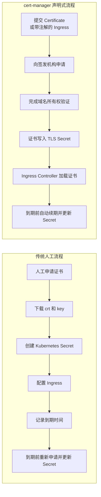
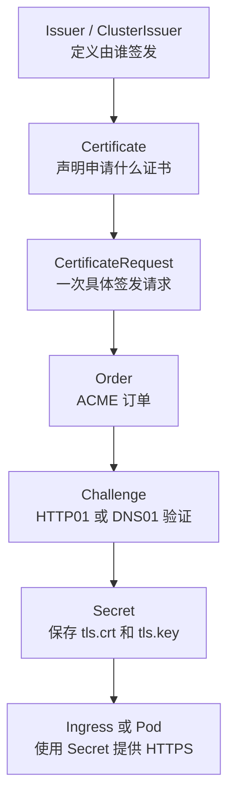
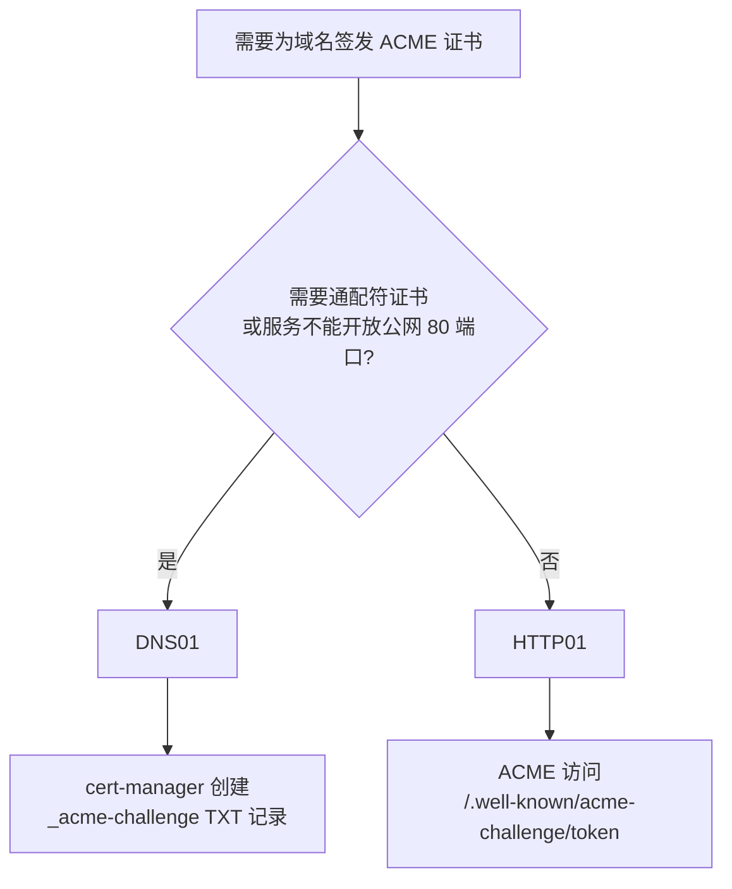
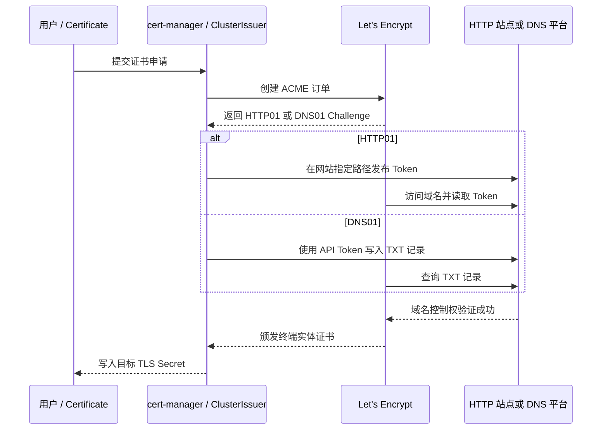
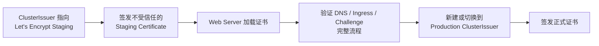
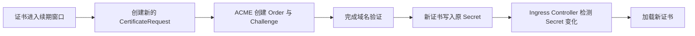

# cert-manager 实战：Helm 部署、TLS 自动签发与续期

Kubernetes 中的 HTTPS 证书如果靠人工维护，容易出现三类问题：证书散落在不同 Namespace、到期前无人发现，以及更新 Secret 后 Ingress 没有及时加载。

[cert-manager](https://cert-manager.io/docs/) 把证书管理变成声明式流程：只需要声明域名、签发机构和目标 Secret，它就会负责申请、验证、保存、续期和状态跟踪。它既能基于 [ACME](https://tools.ietf.org/html/rfc8555) 协议向 [Let's Encrypt CA](https://letsencrypt.org/) 申请免费证书，也能对接企业内部 CA、Vault、Venafi 以及其他 Issuer 实现。

## 证书分类

| 证书类型 | 用途 | 特征 |
| --- | --- | --- |
| **Root CA 证书** | 证书链的根，签发中间 CA | 自签名，无域名限制 |
| **中间 CA 证书** | 签发终端实体证书 | 由 Root CA 签发，无域名限制 |
| **终端实体证书**（End-entity Certificate） | 实际服务使用 | 绑定具体域名，不能签发其他证书 |

Let's Encrypt 不颁发 CA 证书，只颁发终端实体证书。

## cert-manager 解决什么问题



cert-manager 的价值不只是创建一个 TLS Secret，而是把证书从一次性文件变成可观察、可续期、可审计的 Kubernetes 资源。

## 核心组件与资源对象

Helm 安装后通常包含三个核心组件：

| 组件 | 作用 |
| --- | --- |
| cert-manager controller | 处理 Certificate、Issuer、Order、Challenge 等资源 |
| webhook | 校验和转换 cert-manager 自定义资源 |
| cainjector | 把 CA 证书注入 Webhook、APIService 等对象 |

最常用的资源关系如下：



日常运维主要操作 Issuer、ClusterIssuer、Certificate 和 Secret。Order、Challenge 通常由控制器自动创建，故障时再检查。

### Issuer 与 ClusterIssuer

| 对象 | 作用范围 | 适用场景 |
| --- | --- | --- |
| Issuer | 只在所在 Namespace 生效 | 团队独立管理、租户隔离 |
| ClusterIssuer | 整个集群可引用 | 统一公共 CA、统一 Let's Encrypt |

Issuer 是命名空间级资源：

```yaml
apiVersion: cert-manager.io/v1
kind: Issuer
metadata:
  name: internal-ca
  namespace: production
spec:
  ca:
    secretName: internal-ca-keypair
```

ClusterIssuer 是集群级资源：

```yaml
apiVersion: cert-manager.io/v1
kind: ClusterIssuer
metadata:
  name: letsencrypt-prod
spec:
  acme:
    server: https://acme-v02.api.letsencrypt.org/directory
    email: ops@example.com
    privateKeySecretRef:
      name: letsencrypt-prod-account
    solvers:
      - http01:
          ingress:
            ingressClassName: nginx
```

ClusterIssuer 虽然是集群级对象，但签发后的证书 Secret 仍然创建在 Certificate 所在 Namespace，不能跨 Namespace 直接引用。Certificate 与它生成的 Secret 必须位于同一个 Namespace，Pod 也只能挂载同一 Namespace 下的 Secret。

生产环境中，平台团队可以维护少量 ClusterIssuer，业务团队只创建 Certificate；对合规隔离要求高的团队则使用独立 Issuer。

## Helm 安装 cert-manager

### 方式一：使用 OCI Chart

官方新版本推荐使用 OCI Helm Chart。版本需要固定，不要直接依赖 `latest`：

```shell
helm upgrade --install cert-manager \
  oci://quay.io/jetstack/charts/cert-manager \
  --version v1.21.1 \
  --namespace cert-manager \
  --create-namespace \
  --set crds.enabled=true
```

这里的 `v1.21.1` 是原文写作时的示例。实际部署前应到官方 Release 确认稳定版本，并核对 Kubernetes 兼容矩阵。

### 方式二：先拉取 Chart，再从本地安装

以下保留既有环境中使用 `v1.16.1` 的本地 Chart 流程：

```shell
helm repo add jetstack https://charts.jetstack.io
helm repo update jetstack
helm pull jetstack/cert-manager --version v1.16.1
```

根据部署环境调整 `values.yaml`。既有配置特别要求启用并保留 CRD：

```yaml
# 参照 ADO code 调整
# 注意：crds.enabled 额外设置成 true，crds.keep 设置成 true，
# 因为 cert-manager-cainjector 需要这些 CRD 才能正常工作。
crds:
  enabled: true
  keep: true
```

安装并等待 Pod Ready：

```shell
helm upgrade -i cert-manager -n cert-manager . --values values.yaml --create-namespace
kubectl wait --for=condition=Ready pods --all -n cert-manager
```

### 验证安装

```shell
kubectl get pods -n cert-manager
kubectl get deployment -n cert-manager
kubectl get crd | grep cert-manager
```

期望 controller、webhook、cainjector 全部处于 Running，并存在以下 CRD：

```text
certificates.cert-manager.io
certificaterequests.cert-manager.io
issuers.cert-manager.io
clusterissuers.cert-manager.io
orders.acme.cert-manager.io
challenges.acme.cert-manager.io
```

检查 Webhook：

```shell
kubectl get validatingwebhookconfiguration | grep cert-manager
kubectl get mutatingwebhookconfiguration | grep cert-manager
kubectl get endpointslice -n cert-manager
```

Webhook 异常时，创建 Certificate 等资源可能直接失败，因此不能只检查 controller Pod。

## 使用场景与签发方式选型

cert-manager 服务部署完成后，可以创建 Issuer/ClusterIssuer 和 Certificate 资源：

- Issuer/ClusterIssuer 让 cert-manager 识别证书颁发机构，例如 Let's Encrypt。
- Certificate 绑定 Issuer，并声明用于保存证书的 Kubernetes Secret。

### 自签名证书与公有 CA 证书

- Lab 或内部服务可以用自签名证书简化验证流程。
- 公网服务可以用 ACME 与 Let's Encrypt 自动签发受信任的终端实体证书。
- Pod 间 TLS 和 Ingress TLS 都可以使用 Certificate 生成的 Secret，但使用者与 Secret 必须位于同一个 Namespace。

### HTTP01 与 DNS01

ACME 需要验证你对域名的控制权，常用 HTTP01 和 DNS01 两种方式：



#### HTTP01

验证机构访问：

```text
http://app.example.com/.well-known/acme-challenge/<token>
```

cert-manager 会临时创建 solver Pod、Service 和 Ingress，对外提供验证内容。

优点：

- 配置简单。
- 不需要 DNS 平台接口权限。
- 普通单域名 Ingress 很适合使用。

限制：

- 域名必须解析到可从公网访问的 Ingress。
- 80 端口必须可达。
- 不支持通配符证书。
- 多 Ingress Controller 时必须指定正确的 IngressClass。
- 内网 Web 环境通常无法被 Let's Encrypt 访问。

#### DNS01

cert-manager 在域名下创建 TXT 记录：

```text
_acme-challenge.example.com
```

优点：

- 支持 `*.example.com` 通配符证书。
- 服务不必直接暴露公网 80 端口。
- 更适合私网入口、多个集群或复杂域名场景。

限制：

- 需要 DNS 平台自动化能力，并为 cert-manager 提供 API Token 或工作负载身份。
- 受 DNS 传播和缓存影响。
- 权限配置错误会导致 Challenge 长期 Pending。
- DNS Resolver 必须是 cert-manager 支持的类型。

选择原则：公网单域名 Ingress 可用 HTTP01；通配符证书、私网服务或不能开放 80 端口的场景使用 DNS01；没有 DNS 自动化条件时使用 HTTP01。

### ACME 域名校验原理

Let's Encrypt CA 利用 ACME（Automated Certificate Management Environment，自动证书管理）协议校验域名归属，校验成功后自动颁发证书。证书有效期为 90 天，无法更改，建议每 60 天更新一次。cert-manager 会在到期前重新完成校验并续期，从而持续使用免费证书。



## 自签名证书：Pod 间 TLS 实战

Lab 环境为了简化处理，可以不连接外部 CA，直接使用自签名证书。[Certificate 示例](https://github.com/HoussemDellai/aks-course/blob/main/34_https_pod_certmanager_letsencrypt/certificate.yaml)

### 创建自签名 ClusterIssuer

ClusterIssuer 文件是证书颁发者的配置模板，用于告诉 cert-manager 如何签发证书，而不是证书本身。

```yaml
tee cluster-issuer-selfsigned <<'EOF'
apiVersion: cert-manager.io/v1
kind: ClusterIssuer
metadata:
  name: selfsigned
spec:
  selfSigned: {}
EOF
```

### 创建发给 Service 的 Certificate

```yaml
tee certificate-app01.yaml <<'EOF'
apiVersion: cert-manager.io/v1
kind: Certificate
metadata:
  name: app01
spec:
  secretName: app01-tls-cert-secret
  privateKey:
    rotationPolicy: Always
  commonName: app01.default.svc.cluster.local # 后面要部署的 Service 名称
  dnsNames:
    - app01.default.svc.cluster.local
  usages:
    - digital signature
    - key encipherment
    - server auth
  issuerRef:
    name: selfsigned
    kind: ClusterIssuer
EOF
```

查看证书：

```shell
k get clusterissuer,secret,certificate
NAME                                       READY   AGE
clusterissuer.cert-manager.io/selfsigned   True    5m27s

NAME                           TYPE                DATA   AGE
secret/app01-tls-cert-secret   kubernetes.io/tls   3      16s

NAME                                READY   SECRET                  AGE
certificate.cert-manager.io/app01   True    app01-tls-cert-secret   16s
```

### Pod 挂载 Certificate

Pod 用 Volume 挂载 Secret，并通过环境变量指定证书位置。应用本身需要提前配置好 HTTPS：

```yaml
tee deploy-app01.yaml <<'EOF'
apiVersion: apps/v1
kind: Deployment
metadata:
  labels:
    app: app01
  name: app01
spec:
  replicas: 1
  selector:
    matchLabels:
      app: app01
  template:
    metadata:
      labels:
        app: app01
    spec:
      restartPolicy: Always
      volumes:
        - name: app01-tls
          secret:
            secretName: app01-tls-cert-secret
      containers:
        - name: app01
          image: us-docker.pkg.dev/google-samples/containers/gke/hello-app-tls:1.0
          ports:
            - containerPort: 8443
          volumeMounts:
            - name: app01-tls
              mountPath: /etc/tls
              readOnly: true
          env:
            - name: TLS_CERT
              value: /etc/tls/tls.crt
            - name: TLS_KEY
              value: /etc/tls/tls.key
---
apiVersion: v1
kind: Service
metadata:
  name: app01
  # namespace: monitoring
  labels:
    app: app01
spec:
  ports:
    - port: 443
      protocol: TCP
      targetPort: 8443
  selector:
    app: app01
  type: ClusterIP
EOF
```

创建完成后，可以从另一个 Pod 测试访问：

```shell
kubectl run nginx --image=nginx
kubectl exec -it nginx -- curl --insecure https://app01.default.svc.cluster.local
kubectl exec -it nginx -- curl --insecure -v https://app01.default.svc.cluster.local
```

### Certificate 提供给 Ingress

创建 Certificate 时，将 `commonName` 和 `dnsNames` 写成 Ingress 的 Hostname，并将证书保存到 Secret。创建 Ingress 时，在 `tls` 字段引用该 Secret，例如：

```yaml
ingress:
  enabled: true
  ingressClassName: nginx-default
  annotations:
    nginx.ingress.kubernetes.io/auth-url: "http://oauth2-proxy.oauth2-proxy.svc.cluster.local/oauth2/auth"
    nginx.ingress.kubernetes.io/auth-signin: "https://oauth2proxy.hanxux.local/oauth2/start?rd=https%3A%2F%2Fkyverno.hanxux.local"
  hosts:
    - host: kyverno.hanxux.local
      paths:
        - path: /
          pathType: Prefix
  tls:
    - secretName: policy-reporter-tls-cert-secret
      hosts:
        - kyverno.hanxux.local
```

## Let's Encrypt ACME 实战

### 先用 Staging 验证，再切 Production

Let's Encrypt 生产环境有请求频率限制。配置错误时反复申请，容易触发限制。原有笔记还记录了“一个星期内只为同一个域名颁发 5 次证书”的限制示例，并指出 `todoit.tech` 和 `whoami.todoit.tech` 被视为不同域名。具体限额应以部署时的 Let's Encrypt 官方政策为准。

正确流程是先使用 Staging：

```yaml
apiVersion: cert-manager.io/v1
kind: ClusterIssuer
metadata:
  name: letsencrypt-staging
spec:
  acme:
    server: https://acme-staging-v02.api.letsencrypt.org/directory
    email: ops@example.com
    privateKeySecretRef:
      name: letsencrypt-staging-account
    solvers:
      - http01:
          ingress:
            ingressClassName: nginx
```

应用后检查：

```shell
kubectl apply -f clusterissuer-staging.yaml
kubectl get clusterissuer
kubectl describe clusterissuer letsencrypt-staging
```

看到 `Ready=True` 只表示 Issuer 账号和配置已就绪，不代表某个具体域名一定能通过验证；还需要实际创建 Certificate，测试 DNS 和 Ingress 路径。



Staging 流程完整通过后，再创建指向 Production ACME 地址的 ClusterIssuer。不要直接修改正在被大量 Certificate 引用的 Issuer；建议 Staging 和 Production 使用两个不同名称。

### 方式一：显式创建 Certificate

这是最清晰、最容易审计的方式：

```yaml
apiVersion: cert-manager.io/v1
kind: Certificate
metadata:
  name: app-example-com
  namespace: production
spec:
  secretName: app-example-com-tls
  issuerRef:
    name: letsencrypt-prod
    kind: ClusterIssuer
  dnsNames:
    - app.example.com
  duration: 2160h
  renewBefore: 360h
  privateKey:
    algorithm: ECDSA
    size: 256
```

| 字段 | 作用 |
| --- | --- |
| `secretName` | 最终保存证书和私钥的 Secret 名称 |
| `issuerRef` | 使用哪个 Issuer 或 ClusterIssuer |
| `dnsNames` | 证书 SAN 域名列表 |
| `duration` | 期望证书有效期，最终由签发机构决定 |
| `renewBefore` | 到期前多久开始续期 |
| `privateKey` | 私钥算法和规格 |

检查签发链路：

```shell
kubectl get certificate -n production
kubectl describe certificate app-example-com -n production
kubectl get certificaterequest -n production
kubectl get order,challenge -n production
kubectl get secret app-example-com-tls -n production
```

Ingress 引用同一个 Secret：

```yaml
apiVersion: networking.k8s.io/v1
kind: Ingress
metadata:
  name: app
  namespace: production
spec:
  ingressClassName: nginx
  tls:
    - hosts:
        - app.example.com
      secretName: app-example-com-tls
  rules:
    - host: app.example.com
      http:
        paths:
          - path: /
            pathType: Prefix
            backend:
              service:
                name: app
                port:
                  number: 80
```

Certificate 与 Ingress 必须引用同一个 Secret 名称，并位于同一个 Namespace。

### 方式二：通过 Ingress 注解自动申请

cert-manager 的 ingress-shim 可以根据 Ingress 注解自动创建 Certificate：

```yaml
apiVersion: networking.k8s.io/v1
kind: Ingress
metadata:
  name: app
  namespace: production
  annotations:
    cert-manager.io/cluster-issuer: letsencrypt-prod
spec:
  ingressClassName: nginx
  tls:
    - hosts:
        - app.example.com
      secretName: app-example-com-tls
  rules:
    - host: app.example.com
      http:
        paths:
          - path: /
            pathType: Prefix
            backend:
              service:
                name: app
                port:
                  number: 80
```

这种方式的优点是业务只维护 Ingress；缺点是证书需求隐藏在注解中，大量复杂证书配置时可读性不如独立 Certificate。简单单域名 Ingress 可以使用注解；多域名、通配符、私钥策略或内部证书更适合使用显式 Certificate。

## DNS01：Cloudflare 实战

参考：[Cloudflare DNS 配置](https://www.cnblogs.com/renshengdezheli/p/18211540)

### 获取并测试 Cloudflare API Token

公网域名可以使用 [Cloudflare](https://www.cloudflare.com/zh-cn/) 托管，并创建 Cloudflare API Token。Let's Encrypt 通过 cert-manager 使用该令牌向 Cloudflare DNS 写入验证记录；写入并验证成功，即证明申请方拥有域名控制权。

原有 Token 验证命令如下：

```shell
curl -X GET "https://api.cloudflare.com/client/v4/user/tokens/verify" \
```

将 API Token 写入 Kubernetes Secret：

```yaml
apiVersion: v1
kind: Secret
metadata:
  name: cloudflare-api-token-secret
type: Opaque
stringData:
  api-token: <API Token>
```

### 创建 Cloudflare DNS01 ClusterIssuer

ClusterIssuer 使用 Cloudflare Token 自动添加 CA 要求的认证信息，完成证书申请与续期：

```yaml
apiVersion: cert-manager.io/v1
kind: ClusterIssuer
metadata:
  # ClusterIssuer 名称
  name: letsencrypt-dns01
spec:
  acme:
    privateKeySecretRef:
      name: letsencrypt-dns01
    # 向 Let's Encrypt Production ACME 服务申请证书
    server: https://acme-v02.api.letsencrypt.org/directory
    solvers:
      - dns01:
          # ClusterIssuer 支持的 Resolver 类型有限，必须选择一种 DNS Server。
          # 可通过命令查看：k explain clusterissuer.spec.acme.solvers.dns01
          cloudflare:
            email: xxxxx
            # Secret 名称为 cloudflare-api-token-secret，Key 为 api-token
            apiTokenSecretRef:
              key: api-token
              name: cloudflare-api-token-secret
```

### 创建 Certificate

指定 ClusterIssuer 和目标 Secret，完成证书签发：

```yaml
apiVersion: cert-manager.io/v1
kind: Certificate
metadata:
  # Certificate 名称
  name: cert-zheli-com
spec:
  dnsNames:
    # 该证书只供 www.rengshengdezheli.xyz 使用
    - www.rengshengdezheli.xyz
  issuerRef:
    kind: ClusterIssuer
    name: letsencrypt-dns01
  # 申请到的证书保存到该 Secret
  secretName: cert-zheli-com-tls
```

查看相关资源：

```shell
kubectl get certificate -o wide
kubectl get secrets -o wide
kubectl get certificaterequests.cert-manager.io -o wide
# Challenge 用于验证证书请求是否成功。
# 证书申请成功后 Challenge 会消失，CertificateRequest 的 READY 状态变为 True。
kubectl get challenges.acme.cert-manager.io -o wide
# Secret 由 xxxx-btt2t 变为 xxxx-tls，证书已保存在 xxxx-tls 中。
```

### Ingress 挂载证书

通过 Ingress `tls.secretName` 引用证书：

```yaml
apiVersion: networking.k8s.io/v1
kind: Ingress
metadata:
  name: my-ingress
spec:
  ingressClassName: nginx-default
  tls:
    - hosts:
        - www.rengshengdezheli.xyz
      secretName: cert-zheli-com-tls
  rules:
    - host: www.rengshengdezheli.xyz
      http:
        paths:
          - path: /
            pathType: Prefix
            backend:
              service:
                name: nginx1svc
                port:
                  number: 80
```

业务 Deployment 与 Service 示例：

```yaml
# cert/whoami.yaml
apiVersion: apps/v1
kind: Deployment
metadata:
  name: whoami
  labels:
    app: containous
    name: whoami
spec:
  replicas: 2
  selector:
    matchLabels:
      app: containous
      task: whoami
  template:
    metadata:
      labels:
        app: containous
        task: whoami
    spec:
      containers:
        - name: containouswhoami
          image: containous/whoami
          resources:
          ports:
            - containerPort: 80
---
apiVersion: v1
kind: Service
metadata:
  name: whoami
spec:
  ports:
    - name: http
      port: 80
  selector:
    app: containous
    task: whoami
  type: ClusterIP
```

### 通过 Ingress 自动创建证书

添加 `cert-manager.io/cluster-issuer: "letsencrypt-dns01"` 后，创建 Ingress 时会自动使用该 ClusterIssuer 申请证书，无需单独创建 Certificate YAML；证书保存到 `tls.secretName` 指定的 Secret，并在到期后自动续约。

> [!tip] Ingress 自动续约
> ingress-shim 根据 Ingress Annotation 与 `tls` 配置维护 Certificate。
>
> - [Supported Annotations](https://cert-manager.io/docs/usage/ingress/#supported-annotations)
> - [Ingress - How it works](https://cert-manager.io/docs/usage/ingress/#how-it-works)

```yaml
apiVersion: networking.k8s.io/v1
kind: Ingress
metadata:
  name: my-ingress
  annotations:
    cert-manager.io/cluster-issuer: "letsencrypt-dns01"
spec:
  ingressClassName: nginx-default
  tls:
    - hosts:
        - www.rengshengdezheli.xyz
      secretName: cert-zheli-com-tls
  rules:
    - host: www.rengshengdezheli.xyz
      http:
        paths:
          - path: /
            pathType: Prefix
            backend:
              service:
                name: nginx1svc
                port:
                  number: 80
```

### 通配符证书与 PKCS#12

一个父域包含多个子域时，可以直接为父域申请 Wildcard Certificate。各子域的 Ingress 不需要分别配置 cert-manager，可以沿用父域的 Certificate。下面的示例还通过 `secretTemplate` 配置 kubed 跨 Namespace 同步，并生成 PKCS#12 Keystore：

```yaml
apiVersion: cert-manager.io/v1
kind: Certificate
metadata:
  name: private-wildcard-certificate-onepilot-tls
  namespace: cert-manager
spec:
  secretName: private-wildcard-certificate-onepilot-tls
  secretTemplate:
    annotations:
      kubed.appscode.com/sync: "kubernetes.io/metadata.name in (external-nginx,rabbit)"
  dnsNames:
    - "dev.onepilot.azurecn.autoheim.net"
    - "*.onepilot.azurecn.autoheim.net"
  issuerRef:
    name: letsencrypt
    kind: ClusterIssuer
  keystores:
    pkcs12:
      create: true
      passwordSecretRef: # 用于加密 Keystore 的密码
        key: password
        name: pkcs12-password-secret
```

## DNS01：Azure DNS 与 Workload Identity

参考：[Getting Started with AKS and Let's Encrypt](https://cert-manager.io/docs/tutorials/getting-started-aks-letsencrypt/#part-2)

ClusterIssuer 中的 DNS Solver 配置为 Azure DNS：

```yaml
apiVersion: cert-manager.io/v1
kind: ClusterIssuer
metadata:
  name: letsencrypt
spec:
  acme:
    server: https://acme-v02.api.letsencrypt.org/directory
    email: dl_team_xxx@xxxx.com
    privateKeySecretRef:
      name: letsencrypt-account-key
    solvers:
      - dns01:
          azureDNS:
            managedIdentity:
              clientID: {{ .Values.workload_identity_client_id }}
            subscriptionID: {{ .Values.dns.subscription_id }}
            resourceGroupName: {{ .Values.dns.resource_group_name }}
            hostedZoneName: {{ .Values.dns.domain }}
            environment: {{ .Values.dns.environment }}
```

cert-manager 本体的配置中，Pod Label 和 ServiceAccount 都要配置 Workload Identity：

```yaml
podLabels:
  azure.workload.identity/use: "true"

serviceAccount:
  labels:
    azure.workload.identity/use: "true"
  annotations:
    azure.workload.identity/client-id:
```

Azure DNS 同样应先连接 Let's Encrypt Staging Server：先签发不受信任的 Staging 证书并让 Web Server 使用它，确认流程完全正常后，再将 ClusterIssuer 指向 Production Server 签发正式证书，以免耗尽域名的证书配额。

## 自动续期机制

cert-manager 持续比较 Certificate 的期望状态、Secret 中的现有证书和到期时间：



续期不会先删除旧 Secret。只有新证书成功签发后才更新内容，避免续期失败立即中断现有 HTTPS。

手动触发续期：

```shell
cmctl renew app-example-com -n production
cmctl status certificate app-example-com -n production
```

不要通过修改 Secret 内容或随意删除 CertificateRequest 来“强制续期”；使用 `cmctl renew` 更容易保留正确状态和事件。

## 故障排查

### Certificate 一直 Not Ready

按固定顺序检查：

```shell
kubectl describe certificate <name> -n <namespace>
kubectl get certificaterequest -n <namespace>
kubectl describe certificaterequest <name> -n <namespace>
kubectl get order,challenge -n <namespace>
kubectl describe challenge <name> -n <namespace>
kubectl logs -n cert-manager deployment/cert-manager --since=10m
```

也可以使用：

```shell
cmctl status certificate <name> -n <namespace>
```

### HTTP01 常见问题

| 现象 | 常见原因 |
| --- | --- |
| Challenge self-check 404 | 域名没指向 Ingress，或路径被业务规则覆盖 |
| connection refused | 80 端口未开放，或被 LB、防火墙阻断 |
| solver Ingress 没有地址 | IngressClass 错误，或 Controller 未接管 |
| 域名解析错误 | DNS 记录未生效或仍指向旧地址 |
| 多个 Ingress Controller 同时处理 | 未明确指定 `ingressClassName` |

检查临时资源：

```shell
kubectl get pod,svc,ingress -A | grep acme-http-solver
kubectl describe ingress <solver-ingress> -n <namespace>
```

从公网验证 Challenge 路径是否可访问。只在集群内 `curl` 成功，不代表 ACME Server 从互联网也能访问。

### DNS01 常见问题

- DNS 平台权限不足。
- TXT 记录创建在错误 Zone。
- DNS 传播未完成。
- 集群内 DNS 和公网权威 DNS 结果不一致。
- CNAME 委派行为不符合预期。

检查权威 DNS 结果：

```shell
dig TXT _acme-challenge.example.com +short
dig NS example.com +short
```

不要只查询本机缓存 DNS，必要时直接查询权威 DNS Server。

### Ingress 仍显示旧证书

先检查 Secret 是否已更新：

```shell
kubectl get secret app-example-com-tls -n production \
  -o jsonpath='{.data.tls\.crt}' | base64 -d | \
  openssl x509 -noout -subject -issuer -dates -serial
```

再检查外部实际返回的证书：

```shell
openssl s_client \
  -connect app.example.com:443 \
  -servername app.example.com </dev/null 2>/dev/null | \
  openssl x509 -noout -subject -issuer -dates -serial
```

两边序列号不同，问题通常出在 Ingress Controller 加载、多个入口实例配置不一致、CDN 缓存，或请求实际进入了另一套负载均衡器。

继续检查：

```shell
kubectl logs -n ingress-nginx \
  deployment/ingress-nginx-controller --since=10m
kubectl get ingress app -n production -o yaml
```

### Webhook 证书过期

本地虚机中操作 Certificate 时曾出现以下错误：

```text
Error from server (InternalError): Internal error occurred: failed calling webhook "webhook.cert-manager.io": failed to call webhook: Post "https://cert-manager-webhook.cert-manager.svc:443/validate?timeout=30s": tls: failed to verify certificate: x509: certificate has expired or is not yet valid: current time 2024-12-23T02:30:04Z is after 2024-12-20T02:19:54Z
```

该环境通过删除 `cert-manager-webhook-86b8dc6c77-hczkm` Pod 并让它重建恢复。

### Certificate 重建后 Secret 未重建

`cert-manager-config` 部署的 Certificate 会自动创建 Secret，但重建 Certificate 后，原关联 Secret 不会随之删除。既有环境需要手动删除该 Secret，随后 cert-manager 会自动重建。

## 生产风险与安全建议

### 限制 TLS 私钥 Secret 权限

TLS Secret 包含私钥，必须限制读取权限：

- 业务 Pod 通常只需要由 Ingress 引用 Secret。
- 普通开发账号不应拥有 `get/list` 所有 Secret 的权限。
- 备份系统应加密存储证书私钥。
- 审计 Secret 访问和异常导出行为。

### DNS01 权限最小化

如果使用 DNS01，只允许 cert-manager 修改指定 Zone 或 `_acme-challenge` 记录，避免给整个 DNS 账号过大权限。

### Webhook 高可用

cert-manager webhook 位于 API 准入路径。Webhook 不可用时，Certificate 等资源创建和更新会失败。生产环境应配置合理副本、反亲和、PDB 和监控。

### 不要直接删除 CRD

cert-manager 的 Certificate、Issuer、Order 等都是 CRD 实例。删除 CRD 会连同所有对应资源一起删除，卸载前必须备份并确认影响。

官方新版本 Helm 卸载会保留 CRD 以降低误删风险，但历史版本行为不同。任何升级或卸载都要先核对当前版本文档，不能照搬旧教程。

### 监控证书到期与控制面状态

至少告警以下事件：

- `Certificate Ready=False`。
- 距离到期不足 30 天。
- 续期 CertificateRequest 失败。
- ACME Order/Challenge 长时间 Pending。
- cert-manager controller/webhook 不可用。

不能因为“自动续期”就不做证书到期监控，自动化本身也会故障。

## 上线验证

### 验证签发

```shell
kubectl get certificate -A
kubectl get certificaterequest -A
kubectl get order,challenge -A
```

### 验证 Secret

```shell
kubectl get secret app-example-com-tls -n production
```

### 验证外部证书

```shell
openssl s_client \
  -connect app.example.com:443 \
  -servername app.example.com </dev/null 2>/dev/null | \
  openssl x509 -noout -subject -issuer -dates -ext subjectAltName
```

验收内容：

- Certificate 为 `Ready=True`。
- Secret 包含 `tls.crt` 和 `tls.key`。
- 外部返回的证书颁发者正确。
- SAN 包含业务域名。
- 证书有效期正确。
- HTTP 自动跳转 HTTPS 符合预期。
- 续期监控已经配置。

## 回滚方法

如果 cert-manager 上线后影响现有 Ingress：

1. 保留原 TLS Secret 备份和原 Ingress 清单。
2. 暂停使用自动签发注解，恢复 Ingress 引用原 Secret。
3. 确认外部入口重新返回原证书。
4. 修复 Issuer 或 Challenge 后再重新启用。

```shell
kubectl annotate ingress app -n production \
  cert-manager.io/cluster-issuer-

kubectl patch ingress app -n production \
  --type=merge \
  -p '{"spec":{"tls":[{"hosts":["app.example.com"],"secretName":"app-tls-backup"}]}}'
```

不要在故障时直接删除 cert-manager CRD。即使停止 controller，现有 TLS Secret 仍可继续被 Ingress 使用；先恢复入口证书，再处理控制器和自定义资源。

## 用 Helm 管理 cert-manager 配置

ClusterIssuer、Certificate 等 YAML 文件可以继续用 Helm 管理。

创建 `cert-manager-config` 目录，在其中放置 `Chart.yaml` 和 `values.yaml`：

```shell
tee Chart.yaml <<"EOF"
apiVersion: v2
name: commoninfra-cert-manager-config
description: A Helm chart for cert manager configurations
type: application
version: 0.0.1
appVersion: "0.0.1"
EOF
```

创建 `templates` 目录，把所有需要创建的 YAML 文件放入其中，然后安装：

```shell
helm upgrade -i commoninfra-cert-manager-config . --values ./values.yaml
```

## 生产落地要点

- 先用 Staging 验证，再切换 Production。
- HTTP01 适合普通公网域名，通配符证书使用 DNS01。
- 自动续期也必须监控到期时间和失败状态。
- 升级或卸载前先备份资源，不直接删除 CRD。

## 参考资料

- [cert-manager 官方文档](https://cert-manager.io/docs/)
- [Cert-Manager Helm Installation](https://cert-manager.io/docs/installation/helm/)
- [cert-manager Helm Chart](https://artifacthub.io/packages/helm/cert-manager/cert-manager)
- [cert-manager v1.17.1 Release Notes](https://github.com/cert-manager/cert-manager/releases/tag/v1.17.1)
- [cert-manager ACME](https://cert-manager.io/docs/configuration/acme)
- [cert-manager cmctl](https://cert-manager.io/docs/reference/cmctl/)
- [Let's Encrypt Getting Started](https://letsencrypt.org/getting-started/)
- [Let's Encrypt Challenge Types：DNS-01](https://letsencrypt.org/docs/challenge-types/#dns-01-challenge)
- [Let's Encrypt 的运作方式](https://letsencrypt.org/zh-cn/how-it-works/)
- [Let's Encrypt FAQ：证书有效期](https://letsencrypt.org/zh-cn/docs/faq/#let-s-encrypt-%E8%AF%81%E4%B9%A6%E7%9A%84%E6%9C%89%E6%95%88%E6%9C%9F%E6%9C%89%E5%A4%9A%E9%95%BF-%E8%83%BD%E5%A4%9F%E4%BD%BF%E7%94%A8%E5%A4%9A%E4%B9%85)
- [Let's Encrypt Staging Environment](https://letsencrypt.org/docs/staging-environment/)
- [ACME DNS01](https://cert-manager.io/docs/configuration/acme/dns01/)
- [AKS Ingress TLS](https://learn.microsoft.com/en-us/previous-versions/azure/aks/ingress-tls?tabs=azure-cli#install-cert-manager)
- [Getting Started with AKS and Let's Encrypt](https://cert-manager.io/docs/tutorials/getting-started-aks-letsencrypt/#part-2)
- [Pod TLS 视频](https://www.youtube.com/watch?v=uTaXgZWwXzs&list=PLpbcUe4chE79sB7Jg7B4z3HytqUUEwcNE&index=93)
- [Cert-Manager 教程视频](https://www.youtube.com/watch?v=rOe9UpHcnKk&list=PLpbcUe4chE79sB7Jg7B4z3HytqUUEwcNE&index=96)
