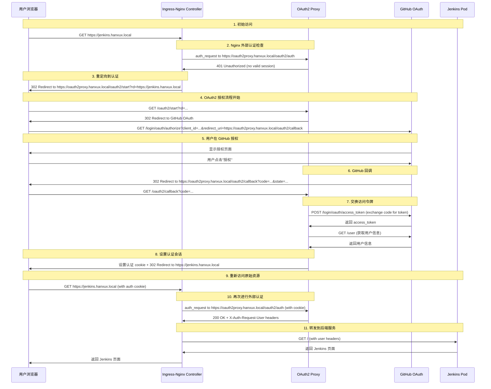

# 介绍

- 是一款对k8s应用做身份验证的反向代理。工作模式有两种：

  

  在我们的示例中，使用的是右边的middleware模式，作用于ingress-nginx。

- 官网：https://oauth2-proxy.github.io/oauth2-proxy/installation/

- github：https://github.com/oauth2-proxy/oauth2-proxy

- releases page: https://github.com/oauth2-proxy/manifests/releases

- artifact hub: https://artifacthub.io/packages/helm/oauth2-proxy/oauth2-proxy

# 下载

~~~sh
helm repo add --force-update oauth2-proxy https://oauth2-proxy.github.io/manifests
helm repo update oauth2-proxy
helm pull oauth2-proxy/oauth2-proxy --version 7.7.1
~~~

# 配置oauth2proxy

## 创建redis password

oauth的sessionStorage选择使用redis，oauth helm chart会安装redis subchart。这里需要一个redis密码，保存到secret里。

~~~sh
export REDIS_PASSWD=$( openssl rand -base64 32 | head -c 32 | base64 )
kubectl -n oauth2-proxy create secret generic oauth2-proxy-redis --from-literal=redis-password=$REDIS_PASSWD
# 需要打上标签，后续安装helm的时候会被纳入到helm管理
kubectl label secrets oauth2-proxy-redis -n oauth2-proxy "app.kubernetes.io/managed-by"="Helm"
kubectl annotate secrets oauth2-proxy-redis -n oauth2-proxy "meta.helm.sh/release-name"="oauth2-proxy"
kubectl annotate secrets oauth2-proxy-redis -n oauth2-proxy "meta.helm.sh/release-namespace"="oauth2-proxy"
~~~

> sessionStorage负责认证状态维护
>
> ```yaml
> sessionStorage:
>   type: redis     # 使用 Redis 存储用户会话状态
> redis:
>   enabled: true   # 启用内置 Redis
> ```
>
> 这样的架构使得：
>
> - Nginx 负责流量路由和认证检查
> - OAuth2 Proxy 负责具体的 OAuth 认证流程
> - Redis 负责会话状态存储
> - 所有受保护的服务都能自动获得统一的身份认证

## 集成github认证

1. 先去github生成一个OauthAPP：([Developer applications](https://github.com/settings/developers))，复制`client id`和`client secret`。

   - application name：`oauth2proxy-local`

   - Homepage URL：https://oauth2proxy.hanxux.local/

   - Authorization callback URL：https://oauth2proxy.hanxux.local/oauth2/callback

2. 创建一个cookie secret

  ~~~sh
  export COOKIE_SECRET=$( openssl rand -base64 32 | head -c 32 | base64 )
  ~~~

3. oauth2proxy的values.yaml里面添加github认证相关参数

   ~~~yaml
   config:
     existingSecret: oauth2-proxy-creds
   extraArgs:
     provider: github
     whitelist-domain: .hanxux.local
     cookie-domain: .hanxux.local
   ~~~

4. 传入gitub oauth app的client id和secret

### 方法1-创建secret保存

- 创建k8s secret

  ~~~sh
  export CLIENT_ID="Ov23liF0QvSRG51yPKq1"
  export CLIENT_SECRET="xxx"
  kubectl create namespace oauth2-proxy
  kubectl -n oauth2-proxy create secret generic oauth2-proxy-creds --from-literal=cookie-secret=$COOKIE_SECRET --from-literal=client-id=$CLIENT_ID --from-literal=client-secret=$CLIENT_SECRET
  ~~~


### 方法2-直接写入values

- 注：上面创建secret的方式oauth2proxy没有读取到。遂采取直接把cookie_secret、client_id和client_secret三个参数直接写到values.yaml里面的方式

  ~~~yaml
  config:
    # Add config annotations
    annotations: {}
    # OAuth client ID
    clientID: "Ov23liF0QvSRG51yPKq1"
    # OAuth client secret
    clientSecret: "xxx"
    # Create a new secret with the following command
    # openssl rand -base64 32 | head -c 32 | base64
    # Use an existing secret for OAuth2 credentials (see secret.yaml for required fields)
    # Example:
    #existingSecret: oauth2-proxy-creds
    cookieSecret: "xxx"
    # The name of the cookie that oauth2-proxy will create
    # If left empty, it will default to the release name
    cookieName: ""
  ~~~


### 方法3-github secrets

- 上述方式不安全，会直接暴露secret。后续修改了secret加载方式，先存到github repository secrets里面，再从workflow中读取

  ~~~sh
  export helmChartVersion=${{env.oauth2proxyVersion}}
  export helmRepoName='oauth2-proxy'
  export helmChartName='oauth2-proxy'
  export REDIS_PASSWORD=$(kubectl get secret --namespace "oauth2-proxy" oauth2-proxy-redis --kubeconfig $KUBECONFIG -o jsonpath="{.data.redis-password}" | base64 -d)

  helm upgrade -i oauth2-proxy -n oauth2-proxy \
  oci://${{ env.harborURL }}/${{ env.harborProjectName }}/$helmRepoName/$helmChartName \
  --version $helmChartVersion \
  --history-max 5 \
  -f ./base/external/oauth2-proxy/values.yaml \
  --set config.clientID='${{ secrets.OAUTH2PROXY_CLIENT_ID}}' \
  --set config.clientSecret='${{ secrets.OAUTH2PROXY_CLIENT_SECRET}}' \
  --set config.cookieSecret='${{ secrets.OAUTH2PROXY_COOKIE_SECRET}}' \
  --set global.redis.password=$REDIS_PASSWORD \
  --insecure-skip-tls-verify \
  --kubeconfig $KUBECONFIG
  ~~~

## 配置Https

- 首先部署出certmanager --> 创建clusterissuer --> 创建给oauth2proxy ingress https的secret --> helm values.yaml的ingress.tls部分配置secret、host

- 创建oauth2proxy的tls secret

~~~yaml
tee certificate-oauth2proxy.yaml <<'EOF'
apiVersion: cert-manager.io/v1
kind: Certificate
metadata:
  name: cert-oauth2proxy
  namespace: oauth2-proxy
spec:
  secretName: oauth2proxy-tls-cert-secret
  privateKey:
    rotationPolicy: Always
  commonName: oauth2proxy.hanxux.local
  dnsNames:
    - oauth2proxy.hanxux.local
  usages:
    - digital signature
    - key encipherment
    - server auth
  issuerRef:
    name: selfsigned
    kind: ClusterIssuer
EOF
~~~

- oauth2proxy的values配置ingress tls

~~~yaml
ingress:
  enabled: true
  ingressClassName: nginx-default
  hosts:
  - oauth2proxy.hanxux.local
  tls:
  - secretName: oauth2proxy-tls-cert-secret
    hosts:
    - oauth2proxy.hanxux.local
  path: /
  # Only used if API capabilities (networking.k8s.io/v1) allow it
  pathType: ImplementationSpecific
~~~

# 安装

~~~sh
helm upgrade -i oauth2-proxy -n oauth2-proxy --create-namespace . -f values.yaml
~~~

- 验证安装：`oauth2proxy.hanxux.local`也要加到本机hosts文件中，https访问hostname即可看到oauthproxy的主页，有用github登录的提示。由于lab用的是自签证书，所以浏览器会报连接不安全。

# 回调URL


回调 URL 是 OAuth2 授权流程中，**授权服务器（GitHub）在用户完成授权后，将用户重定向回去的目标地址**。

使用回调URL的优点：

1. **安全验证**

- GitHub 只会将授权码发送到预先注册的回调 URL
- 防止恶意应用窃取授权码

2. **完成授权流程**

- OAuth2 Proxy 通过这个 URL 接收 GitHub 返回的授权码
- 没有这个回调，授权流程无法完成

3. **状态管理**

- 回调中包含 `state` 参数，用于防止 CSRF 攻击
- OAuth2 Proxy 验证 state 确保请求的合法性

## 实际示例

使用的是 ingress-nginx 的**外部认证功能**来集成 OAuth2 Proxy。以访问jenkins



OAuth2 Proxy 的作用：

从流程可以看出，OAuth2 Proxy 在这里扮演两个关键角色：

1. **认证端点** (`/oauth2/auth`):
   - Nginx 每次请求都会调用这个端点检查用户是否已认证
   - 返回 200 表示已认证，401 表示未认证

2. **认证流程处理器**:
   - `/oauth2/start`: 开始 OAuth 流程
   - `/oauth2/callback`: 处理 GitHub 回调

# 使用oauth2proxy保护其他app

- 在其他应用的ingress中添加annotations，详细说明参考ingress官网：https://kubernetes.github.io/ingress-nginx/examples/auth/oauth-external-auth/
- 这两个annotations会将请求redirect到oauth2proxy，由oauth2proxy将请求转发到配置的3rd party认证endpoint (github)

~~~yaml
annotations:
  nginx.ingress.kubernetes.io/auth-url: "http://oauth2-proxy.oauth2-proxy.svc.cluster.local/oauth2/auth"
  nginx.ingress.kubernetes.io/auth-signin: "https://oauth2proxy.hanxux.local/oauth2/start?rd=https%3A%2F%2F<host>.hanxux.local"
~~~

