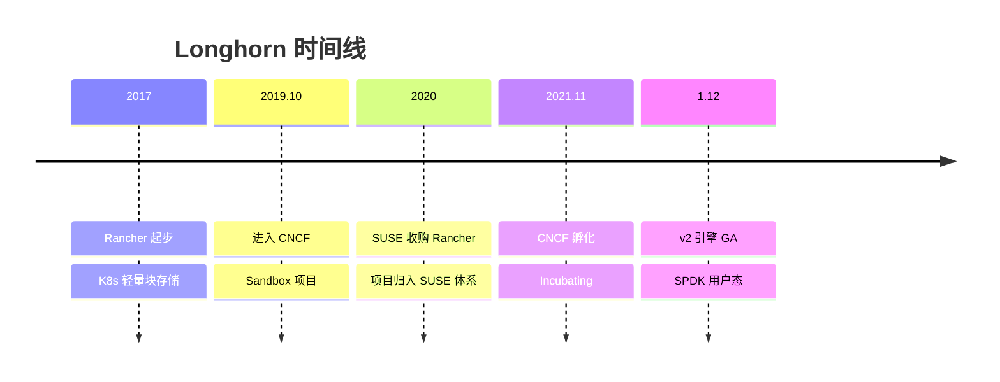
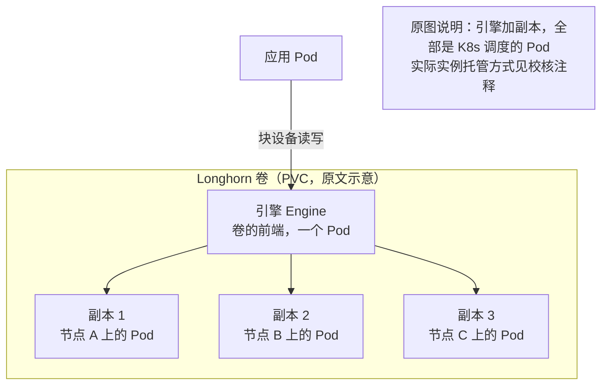
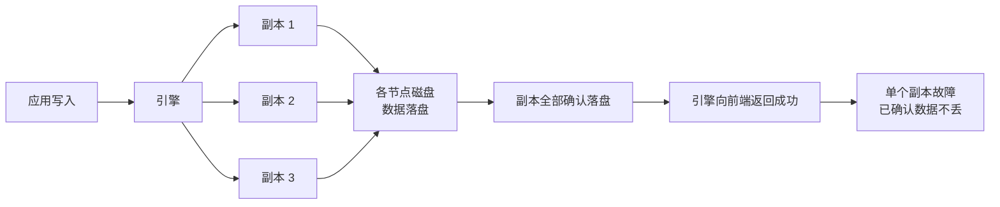
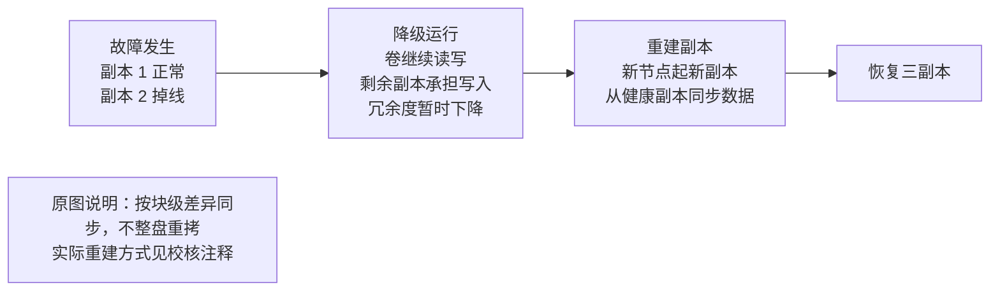
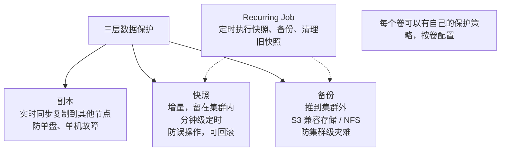
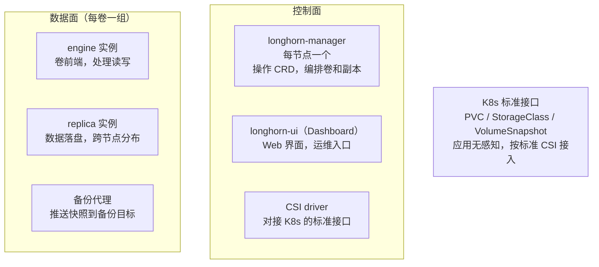

> 原文作者：Aspirer2004；发布于 2026 年 9 月 19 日 06:56。

# Longhorn，K8s的轻量块存储

> [!note]- 摄入校核（2026-10-04）
> 本文保留原文的技术主张、数字、版本和判断；下列说明是摄入时依据官方资料增加的校核，不属于原文。
> - **实例与 Pod**：原文用“一个引擎 Pod 加三个副本 Pod”解释卷。官方 1.12.0 架构说明中，同节点多个卷的引擎和副本实例由 Instance Manager Pod 托管，不能按每卷固定四个 Pod 计算规模或故障域。[官方架构](https://longhorn.io/docs/1.12.0/concepts/#12-the-instance-manager)
> - **写入路径**：原文称请求沿复制链逐级传递，原图却展示引擎向多个副本分发；Mermaid 保留原图关系。官方说明写 IO 并行，串行复制链的说法不宜用来解释 Longhorn 的实现。[Revision Counter](https://longhorn.io/docs/1.12.0/advanced-resources/deploy/revision_counter/)
> - **重建方式**：原文将重建一概描述为增量复制。官方区分完整、增量和快速重建，是否能够只同步差异取决于目标副本已有的数据及相关条件，恢复时间应实测。[Replica Rebuilding](https://longhorn.io/docs/1.12.0/advanced-resources/rebuilding/)
> - **快照边界**：增量快照仍消耗实际磁盘空间；集群停机或 etcd 故障也不自动意味着磁盘上的快照永久丢失，需区分数据丢失与暂时不可访问。[快照空间与管理](https://longhorn.io/docs/1.12.0/concepts/#24-snapshots)
> - **部署与性能**：“无外部依赖”“helm 装完即投产”是原文的简化表述；官方列出节点依赖与部署前提。v2 使用 SPDK 不代表整个应用 IO 路径均绕过内核，也不能直接保证 CPU 开销更低；本文保留其官方性能宣称，未执行部署、压测或故障演练。[安装前提](https://longhorn.io/docs/1.12.0/deploy/install/)

在 K8s 上运行数据库，首先要解决数据存储问题。云盘绑定云厂商，Ceph 需要专门的团队运维，按原文的判断，本地盘机器故障后数据就会丢失。Rancher Labs 在 2017 年启动 Longhorn，针对的就是这些方案之间的空档。

Longhorn 强调安装后即可使用：所有组件都以 Pod 形式运行在 K8s 中，没有外部依赖；Dashboard、快照、备份和定时任务都已内置，由 K8s 管理员兼顾运维。

本文讨论每卷一个引擎加多个副本的模型、同步复制、快照备份，以及 v2 引擎采用 SPDK 用户态路径后的性能与代价。

Longhorn 是 CNCF 孵化项目。本文覆盖架构、能力、运维体验、局限和选型；文中数字以原文成文时的官方资料为准。

## 一、Rancher 为什么要做存储

2017 年前后，Kubernetes 在容器编排领域确立了优势。Rancher Labs 当时开发 K8s 管理平台，客户开始尝试将有状态应用迁入 K8s，但存储支持仍不足：块存储要么没有复制能力，要么依赖外部系统。

当时主要有三个选项。云盘方便，但绑定云厂商，自建机房和多云环境用不了；Ceph RBD 功能完整，却需要运维一套独立存储集群和专门的存储团队，对十几个节点的小集群来说成本偏高；本地盘性能最好，但按原文的判断，机器故障会导致全部数据丢失，缺乏数据保护。

图：当时三个现成选项与轻量块存储之间的空档

Rancher 认为，中小规模 K8s 集群需要能按 K8s 原生方式部署的轻量块存储，由 K8s 管理员兼顾运维，无需单独配置存储团队。Longhorn 因此在 2017 年前后启动。名字取自德州长角牛，与 Rancher（牧场）沿用同一套命名风格。

Longhorn 从项目开始就采用云原生实现：没有独立安装包，所有组件都以 Pod 形式运行在 K8s 中，由 K8s 调度和重启。这种部署方式是其轻量设计的基础。

当时主流存储项目通常先构建功能完整、可大规模扩展的系统，再考虑如何接入 K8s。Longhorn 从十几个节点、没有专职存储工程师的用户出发，不追求功能齐全，而是将复制、快照、备份、监控和升级内置，让这些能力无需依赖外部组件就能运行。这一目标决定了后续的架构取舍。

图：从 Rancher 内部项目到 CNCF 孵化

2019 年 10 月，Longhorn 捐赠给 CNCF，进入沙盒；2020 年 SUSE 完成对 Rancher Labs 的收购，Longhorn 也进入 SUSE 体系；2021 年 11 月升级为 CNCF 孵化项目。项目代码开源，由 SUSE 和社区维护者共同维护。SUSE 的超融合平台 Harvester 使用 Longhorn 作为存储底座，是其在自家场景中大规模应用的例子。

同一时期，K8s 的存储接口从树内实现转向 CSI（Container Storage Interface）。2018 年前后，CSI 成为接入存储的标准方式。存储系统实现 CSI 后即可接入 K8s，无需修改 K8s 代码或维护插件分支。Longhorn 采用这条路径，能部署在 RKE、EKS、GKE、k3s 等发行版和平台上。

## 二、每个卷都是一个小型分布式系统

Longhorn 将每个卷设计成一个独立的小型分布式系统，由一个引擎和若干副本组成，默认副本数为三个。

引擎是卷的前端，对外暴露块设备并接收应用的读写请求；副本是后端，负责数据落盘。原文将引擎和每个副本描述为独立的 Pod：申请一个三副本卷，会启动一个引擎 Pod 和三个副本 Pod，共四个 Pod。

图：原文中的三副本卷示意，一个引擎 Pod 加三个副本 Pod（实现细节见校核注释）

Longhorn 默认将同一卷的副本分散到不同节点，单台机器故障时最多损失一个副本，其余副本仍保留数据。还可以设置软亲和、硬亲和规则，限制副本所在的机架，或只使用指定节点上的磁盘。

图：多个卷的副本交错分布在各节点上

引擎本身无状态，数据保存在副本中。按原文的描述，引擎 Pod 故障后，K8s 会重建 Pod、重新连接副本，卷随后恢复服务，中断时间与 Pod 重建时间相当。利用 K8s 的自愈能力，无需另建独立的 HA 机制，也是 Longhorn 降低复杂度的一种方式。

原文据此将 N 个三副本卷的开销概括为 N 个引擎和 3N 个副本，并认为它们都是 Pod：卷数增加，Pod 数量、etcd 对象数和控制面负载随之线性增长。小集群承受的压力较小，大集群则需要关注这一成本。

Ceph 将数据分块后分散到全局资源池，通过 PG 和 CRUSH 管理数据放置，一个集群可支撑大量卷，但机制复杂、运维门槛较高。Longhorn 不建全局池，而是让每个卷独立管理数据，逻辑简单、容易上手，代价是放弃超大规模扩展能力。两种设计面向不同规模：小集群引入 Ceph 全局池会增加运维负担；大集群采用 Longhorn 的每卷独立模型，又会给控制面带来压力。

Longhorn 提供节点标签和磁盘标签来控制副本放置。在存储类中指定标签后，可以让数据库卷使用 SSD 节点，日志卷使用 HDD 节点。每个节点还可预留一部分磁盘容量，避免 Longhorn 占用操作系统所需空间。这些配置在硬件规格不一致的环境中尤其有用。

## 三、同步复制怎么保证不丢数据

Longhorn 默认采用同步复制：写请求在副本确认落盘后才返回成功。单个副本故障时，已确认的数据仍有其他副本保存，这是数据库等应用的基本要求。

原文将写入路径描述为引擎与副本组成的复制链：请求逐级传递，各级落盘后再逐级确认，最后由引擎向前端返回成功。按这一描述，链上任何副本变慢都会拖慢整条链；副本的网络质量和磁盘性能直接影响卷的写入延迟。

图：同步复制，全部副本确认后返回

原文描述，副本掉线或磁盘变慢时，引擎会将其从复制链中移除，剩余副本继续服务，卷进入降级状态。随后 Longhorn 在其他节点创建新副本，从健康副本同步数据，恢复设定的副本数。

图：副本故障后降级运行、重建并恢复冗余

原文将重建描述为按块级差异增量同步，无需整盘重拷；几百 GB 的卷恢复时间在分钟到小时量级，取决于网络和磁盘速度。副本数设为 3 时，至少需要 3 个可用节点来分散副本；如果两个副本落在同一台机器上，该机器故障会同时损失两个副本，原文认为这样的冗余已经失去意义。节点较少的集群尤其需要注意。

Longhorn 选择同步复制，是因为数据库和有状态应用需要优先避免数据丢失。异步复制在主副本切换时可能丢失尚未同步的写入，对数据库而言，这类风险不易评估。因此，它接受较高的写延迟，以保证已确认写入的数据不丢失；追求极限性能并非它的目标。

## 四、快照、备份和 Dashboard

复制防范硬件故障，无法防止删库或错误写入。误操作需要快照和备份来恢复，Longhorn 内置了这两项能力。

快照以卷为单位，采用增量实现，每次只记录相对上次变化的块。按原文的描述，多个快照叠加不会占满卷容量。快照可用于克隆新卷或回滚，但仍保存在集群内；集群整体故障，例如机房断电或 etcd 损坏，也会影响快照。原文将这种情况概括为快照随集群一并丢失。

备份是独立操作，将快照传送到集群外的目标，常见目标是 S3 兼容对象存储或 NFS。备份结合全量与增量，既可整卷恢复，也可恢复为新卷。三层保护各有用途：副本防硬件故障，快照防误操作，集群外备份防集群级灾难。

图：副本、快照、备份，各防一层故障

Recurring Job 是按卷配置的定时任务，可设置快照和备份频率，以及旧快照的保留数量，相当于每个卷自带备份计划，无需外接调度工具。

Longhorn 自带 Web Dashboard，展示节点、卷和副本的健康状态，可在界面中执行快照、备份、扩容和升级，并通过事件日志排查问题。作者认为，Longhorn 的口碑有一大半来自这套运维界面。

图：控制面集中编排，数据面每卷一组

Longhorn 通过标准 CSI 接入 K8s，支持 StorageClass、PVC、卷快照和在线扩容，应用无需改造。原文将安装和卸载各概括为一条 helm 命令，并认为这种体验在存储项目中属于最好的一档。

运维门槛也影响存储系统的实际使用：配置繁多、升级需要停机、日志难读，都会让排障依赖熟悉内部实现的人员。Longhorn 从项目开始就将 Dashboard、事件、日志和告警作为产品功能，让普通 K8s 管理员能够判断集群状态、定位故障卷并确定下一步操作。作者认为，这种重视运维体验的设计，是其在中小规模场景中获得认可的直接原因。

## 五、v2 引擎，走向用户态

v1 引擎的数据路径经过 Linux 内核，网络收发、中断处理和内存拷贝都有开销。中低负载下影响不明显，IOPS 达到几万后，CPU 占用和延迟会变得突出。原文认为，这是内核路径的共性瓶颈，将数据面移到用户态、以轮询代替中断是解决这一问题的行业做法。

图：从内核路径到 SPDK 用户态路径

Longhorn v2 数据引擎基于 SPDK。SPDK 是 Intel 主导的开源用户态存储框架，将 NVMe 驱动放到用户态，通过轮询收包绕开内核中断和上下文切换。按原文的描述，v2 对外呈现为 NVMe 设备，使用 NVMe-oF 传输，数据面全程运行在用户态。

v2 在 1.11 及之前的版本中属于实验特性，在 1.12.0 达到 GA。官方宣称，同样硬件下 v2 比 v1 的 IO 延迟更低、IOPS 更高，CPU 开销也更小。这是官方的性能主张，实际提升取决于磁盘、网卡和网络配置，上生产前需要在自己的环境中实测。

采用 SPDK 的代价是独占 NVMe 盘：交给 SPDK 后，操作系统不再直接管理该盘，节点还要预留大页内存。v2 的运维方式与 v1 不同，v1 卷不能原地切换为 v2，需要规划迁移。作者认为，用户态是块存储发挥 NVMe 性能的必要方向；但 v2 的成熟度和周边工具仍在完善，生产使用应持续关注版本说明。

v1 和 v2 可以按存储类并存，同一集群内的不同卷可选择不同引擎。迁移时，可以先让对性能不敏感的卷留在 v1，将数据库等 IO 密集负载迁到 v2，观察一段时间后再决定是否全部切换。团队因此能够逐步过渡，无需一次迁移所有卷。

Longhorn 的目标是提供够用、可靠的块存储。按原文的性能判断，v1 在普通 SATA SSD 和万兆网络上能支撑中小数据库和一般有状态应用，但不宜期待它达到本地 NVMe 裸盘或专门优化的存储系统的延迟和 IOPS。v2 提高了性能上限，但 Longhorn 仍优先考虑轻量和易用，性能是在这一定位下的改进。

## 六、能力边界与分工

Longhorn 主要面向中小规模 K8s 集群：几个到几十个节点、百级上下的卷，承载 Web 服务、中小数据库、监控和中间件。原文认为，它通过 helm 安装后即可投产，运维成本接近普通 K8s 应用，无需专职存储工程师。

边缘场景资源紧张，也没有存储团队，适合 Longhorn 的轻量设计。SUSE Harvester 使用它作为存储底座，原文据此认为其虚拟化场景已经得到检验。

原文列出三项边界。其一是规模：每卷一个引擎的模型让控制面负载和 Pod 数量随卷数线性增长，上千卷的大集群会承受较大压力；官方定位和社区实践主要面向中小规模，超大集群并非设计目标。其二是极限性能：v2 虽有改善，仍不能直接与专用全闪存储阵列等同。其三是引擎单点：K8s 会在引擎故障后重建，但该卷的 IO 在重建窗口内会停顿；敏感业务需要评估中断时间，必要时通过应用层主备应对。

图：按环境和规模选块存储

云盘、Longhorn 与 Ceph RBD 的分工如下。

| 维度 | 云盘 | Longhorn | Ceph RBD |
| --- | --- | --- | --- |
| 部署形态 | 云平台内置 | K8s 内的一组 Pod | 独立存储集群 |
| 运维成本 | 低，云平台负责 | 低，K8s 管理员兼任 | 高，建议专职团队 |
| 适用规模 | 随云 | 中小集群 | 大规模，可到 PB 级 |
| 数据保护 | 云平台快照与复制 | 多副本同步复制，快照，备份到 S3/NFS | 多副本或纠删码 |
| 可移植性 | 绑定云厂商 | 跨平台，随处可装 | 跨平台，但部署重 |

常见组合是：公有云上用云盘；自建机房里小集群用 Longhorn，有统一大池需求再上 Ceph。同一集群里不同 StorageClass 并存，业务按需选，不冲突。

Rook 与 Longhorn 处于不同层次。Rook 是 Operator，负责在 K8s 中部署和运维 Ceph 等存储系统，本身不存储数据；Longhorn 是完整的存储系统，自己保存数据，并采用 K8s 原生部署方式。两者可以并存：用 Rook 管理 Ceph 提供统一存储池，同时用 Longhorn 服务轻量业务。

对于自建或边缘的中小 K8s 集群，如果需要给数据库和有状态应用提供易于运维的块存储，又不希望单独配置存储团队，Longhorn 值得列入候选。原文建议先搭建测试环境，执行一周故障演练，再作判断。集群规模很大、极限性能要求严格，或需要统一提供文件和对象等多种存储形态时，则应考虑 Ceph 这类系统，或直接使用云盘。

轻量仍需要规划。副本数、节点标签、备份目标和预留空间应在投产前确定；数据写入后再调整，代价会更大。忽视这些配置会增加后续故障和运维风险。

Ceph 构建功能完整的统一分布式存储系统，Longhorn 则将每个卷做成自治的小系统，交给 K8s 编排。两条路线面向不同用户，选择应取决于集群规模和运维能力。

## 七、社区与工程成熟度

判断存储项目能否用于生产，除了架构，还要看工程成熟度。作者认为，Longhorn 近几年的发布节奏稳定，版本 changelog、破坏性变更提示和升级路径清楚；issue 响应和发布活跃度在 CNCF 存储项目中较高，这依赖 SUSE 的持续投入和社区贡献者的维护。

Longhorn 的官方文档覆盖安装、概念、运维、故障排查、常见问题和最佳实践。对于没有专职存储团队的用户，这些文档是获得支持的主要入口，作者认为这一部分做得比较到位。商业支持通过 SUSE 服务渠道提供，与系列中其他厂商赞助项目的开源版和商业支持模式相同。

## 八、收尾

Longhorn 将分布式块存储作为 K8s 应用来部署：每卷一个引擎加多个副本，采用同步复制，内置快照、备份和 Dashboard，安装后即可使用。

原文将轻量设计归结为两个决定：不构建中心化存储集群，将控制逻辑分配到各卷；不另建高可用机制，利用 K8s 自愈。对应的代价是超大规模扩展受限、引擎重建期间 IO 停顿，以及 v2 改善后仍存在的性能上限。

同一时期启动的 OpenEBS 将存储引擎容器化，先后实现四个引擎，并经历收购、归档和回归。它与 Longhorn 采用了不同的发展路线。
