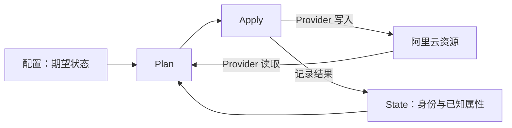

# 01_terraform_基础概念与第一个项目

## 为什么需要基础设施即代码

在控制台手工创建资源，结果或许能记住，过程却不容易重放：账号、地域、网络、权限和默认值散落在控制台和人的记忆里。基础设施即代码（Infrastructure as Code，IaC）把期望配置写进可 review、可复用、可追踪的文件。

Terraform 是 HashiCorp 开发的 IaC 工具。Terraform Core 读取配置并计算动作，Provider 负责连接平台 API。阿里云 Provider 将 Terraform 配置映射到阿里云资源；生产仓库通过它管理 OSS、ECS、CMS、RAM 等对象。

### 声明式配置

命令脚本通常按顺序描述要调用的操作。Terraform 配置描述期望的对象及其属性，再结合 State 和 Provider 读取到的实际值形成计划。

```hcl
resource "terraform_data" "policy_guard" {
  input = {
    effect  = "Allow"
    actions = ["oss:ListObjects"]
  }
}
```

这里先用 Terraform 内置的 `terraform_data` 描述本地实验值，不会调用阿里云 API，也不会创建云资源。完整实验随后会用 precondition 校验变量输入，对应生产代码中“先校验输入，再把合格数据传给后续配置”的结构。Terraform 不会持续在后台巡检；配置或真实资源变化后，需要再次运行工作流才会发现差异。

## 核心对象

| 对象 | 作用 | 阿里云场景例子 |
|---|---|---|
| Configuration | 描述期望状态的 `.tf` 文件 | OSS Bucket 或 CMS 告警配置 |
| Provider | 连接平台的插件 | `aliyun/alicloud` |
| Resource | Terraform 管理生命周期的对象 | `alicloud_oss_bucket` |
| Data Source | 查询已有数据供配置使用 | 查询已有云资源 |
| State | 保存配置地址与实际对象的绑定及属性 | `alicloud_oss_bucket.lab` 对应的 Bucket |
| Module | 一组可复用的 Terraform 配置 | 封装 ECS 或 CMS 资源的模块 |
| Backend | 决定 State 的保存和访问方式 | 本系列实验使用本地 State |

配置、State 与真实资源的关系：



State 保存管理映射，不是云资源备份。删除配置块时，Terraform 通常会计划删除仍由 State 管理的对象；删除本地 State 则会丢失映射，不会自动删除云端对象。

## 安装和版本

按操作系统参考 [Terraform 官方安装指南](https://developer.hashicorp.com/terraform/install)，安装后查看版本：

```bash
terraform version
terraform -help
```

本系列配置使用 `required_version = ">= 1.7, < 2.0"`。公司项目还应遵循项目和 CI 指定的 CLI 版本。Terraform CLI、Provider 和外部 Module 是三条独立的版本线。

## 第一个项目：离线校验一条 OSS 权限输入

生产仓库的临时授权流程会读取策略 JSON、检查语句结构，并在通过校验后构造后续数据。本练习保留“输入—派生结构—前置条件”的数据链，裁剪成离线教学版：只验证一条简化语句，不读取生产文件、不连接云端，也不创建权限。

生产代码依据：`permissions/temporary-access.tf` 中的 `terraform_data.temporary_access_source_policy_guard`、`_tmp_source_statements` 和 lifecycle precondition。以下内容是脱敏裁剪，不是可直接用于生产的策略。

### 1. 建立独立目录

```bash
mkdir -p ~/terraform-labs/01-policy-guard
cd ~/terraform-labs/01-policy-guard
```

创建完整的 `main.tf`：

```hcl
terraform {
  required_version = ">= 1.7, < 2.0"
}

variable "policy_statement" {
  description = "离线练习用的单条策略语句"
  type = object({
    effect    = string
    actions   = list(string)
    resources = list(string)
  })
  default = {
    effect    = "Allow"
    actions   = ["oss:ListObjects"]
    resources = ["acs:oss:*:*:<YOUR_LAB_BUCKET>"]
  }
}

resource "terraform_data" "policy_guard" {
  input = var.policy_statement

  lifecycle {
    precondition {
      condition = (
        var.policy_statement.effect == "Allow" &&
        length(var.policy_statement.actions) > 0 &&
        length(var.policy_statement.resources) > 0 &&
        alltrue([for action in var.policy_statement.actions : trimspace(action) != ""]) &&
        alltrue([for item in var.policy_statement.resources : trimspace(item) != ""])
      )
      error_message = "练习语句必须是 Allow，且至少有一个非空 Action 和 Resource。"
    }
  }
}

output "checked_statement" {
  description = "通过前置条件检查的输入"
  value       = terraform_data.policy_guard.output
}
```

`<YOUR_LAB_BUCKET>` 是提示性占位符，不是有效 Bucket 名称，也不会在本实验中被解析或访问。`terraform_data` 是内置资源，无需声明额外 Provider。

### 2. 初始化、计划和观察

```bash
terraform init
terraform plan -out=tfplan
terraform show tfplan
```

计划应显示 `terraform_data.policy_guard` 将创建，检查条件将在计划时可判断的情况下执行。这里只是预期观察，本文没有运行该实验。

```bash
terraform apply tfplan
terraform output checked_statement
terraform state list
```

apply 会在本地 State 中记录这项内置资源，不会创建 OSS Bucket 或 RAM 权限。重复运行 `terraform plan`，输入不变时应显示 `No changes`。

### 3. 触发输入校验

将默认值中的 `effect` 改成 `"Permit"`，再运行：

```bash
terraform plan
```

预期 precondition 报告 effect 不符合要求。恢复 `"Allow"` 后，再观察计划。

### 4. 清理

```bash
terraform plan -destroy -out=destroy.tfplan
terraform show destroy.tfplan
terraform apply destroy.tfplan
terraform state list
```

这里清理的是本地 State 中的 `terraform_data` 实例。目录中的源文件仍保留。

## 项目目录与常见误解

```text
01-policy-guard/
├── main.tf
├── terraform.tfstate
└── tfplan
```

该最小实验不需要下载云 Provider，通常不会生成 `.terraform.lock.hcl`。State 和保存的计划可能包含配置值，仍应按敏感材料管理；一般不要把它们提交到源码库。

- `init` 准备 Backend、Module 和 Provider；`plan` 计算动作；`apply` 执行动作。
- 同一目录的 `.tf` 文件共同组成模块，文件名不决定执行顺序。
- `plan` 对云资源仍可能发起读取请求；“预览”不等于离线。
- apply 失败不保证自动回滚已成功创建的对象。
- Provider 的资源参数及变更行为要查相应版本文档。

## 练习

1. 给对象增加 `description` 字段，并在 precondition 中要求它非空。
2. 把 `actions` 改为空列表，观察条件错误，再说明 `length` 检查的作用。
3. 用自己的话说明删除 Terraform 配置、删除 State 和删除云端资源分别意味着什么。

## 参考资料

- [Terraform 入门](https://developer.hashicorp.com/terraform/intro)
- [核心工作流](https://developer.hashicorp.com/terraform/intro/core-workflow)
- [terraform_data](https://developer.hashicorp.com/terraform/language/resources/terraform-data)
- [lifecycle precondition](https://developer.hashicorp.com/terraform/language/block/resource#precondition-and-postcondition)
- [State 的用途](https://developer.hashicorp.com/terraform/language/state/purpose)
- 生产依据：`permissions/temporary-access.tf`（脱敏裁剪、离线教学改编；仅保留输入校验数据链）

系列目录：[[IaC/terraform/README|学习路线]] · 下一篇：[[IaC/terraform/02_terraform_配置语法与文件结构|HCL 语法与配置文件]]。
