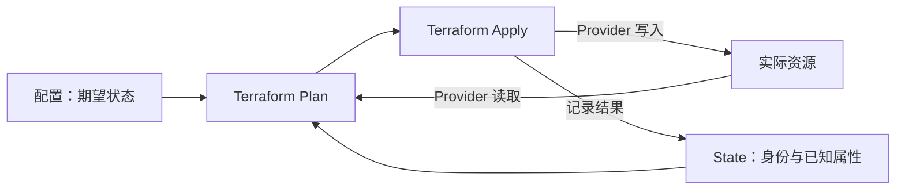

# 01_terraform_基础概念与第一个项目

## 为什么需要基础设施即代码

在控制台手工创建资源时，最终结果容易记住，创建过程却很难完整复现：资源选了哪个区域、网络用了哪个网段、哪些权限是后来补上的，往往分散在聊天记录和个人经验里。

基础设施即代码（Infrastructure as Code，IaC）把这些配置写成可版本管理的文件。修改前可以 review，执行前可以比较差异，创建新环境时可以复用同一套配置。

Terraform 是 HashiCorp 开发的 IaC 工具。它通过 Provider 调用不同平台的 API，管理资源的创建、更新和删除。常见对象包括云网络、虚拟机、数据库、DNS、Docker 容器和 Kubernetes 资源。

### 声明式是什么意思

Shell 脚本通常描述“先调用接口创建 A，再创建 B”；Terraform 配置主要描述“最终应该存在怎样的 A 和 B”。Terraform 根据配置、已记录的资源身份和实际资源，计算本次需要执行哪些动作。

```hcl
resource "local_file" "hello" {
  filename = "${path.module}/hello.txt"
  content  = "Hello, Terraform!\n"
}
```

这段配置的目标是让指定路径存在一个指定内容的文件，不是要求每次执行都额外创建一个新文件。

Terraform CLI 默认按命令触发运行，不会一直在后台巡检。手工改了资源后，要通过新的 plan/apply 或自动化运行才能发现和处理漂移。

### 与其他工具的关系

| 工具 | 主要用途 | 与 Terraform 的关系 |
|---|---|---|
| ARM Template / Bicep | Azure 原生资源声明与部署 | 同样可做 IaC，Terraform 通过 Provider 扩展到多个平台 |
| Ansible | 主机配置、软件安装和执行任务 | 可配合使用：Terraform 创建基础设施，Ansible 配置操作系统 |
| Packer | 构建机器镜像 | 先产出镜像，再由 Terraform 引用镜像创建实例 |
| Helm / Argo CD | Kubernetes 应用打包与持续交付 | Terraform 可提供集群和基础资源；应用交付应明确工具所有权 |

多云支持意味着使用统一的配置语言和工作流，不意味着 AWS、Azure 和阿里云可以直接复用同一种资源定义。资源类型、参数、认证和网络模型仍属于具体平台。

## Terraform 的几个核心对象

| 对象 | 作用 | 例子 |
|---|---|---|
| Configuration | 描述期望状态的 `.tf` 配置 | 文件应该存在、内容应该是什么 |
| Provider | 与平台交互的插件 | `hashicorp/local`、`hashicorp/azurerm` |
| Resource | Terraform 管理生命周期的对象 | `local_file.hello` |
| Data Source | 查询已有数据，供配置使用 | 查询已有资源组或读取文件 |
| State | 记录配置地址和实际对象的绑定、属性及元数据 | `local_file.hello` 对应哪个路径和内容 |
| Module | 同一目录内的一组 Terraform 配置 | 当前实验目录是 root module |
| Backend | 决定 State 放在哪里、怎样访问和锁定 | 本地文件、Azure Blob、S3 |

### 配置、State、真实资源的关系



- 配置说明“我想要什么”。
- State 说明“哪个实际对象归哪个配置地址管理，以及上次记录的信息”。
- Provider 读取当前实际对象，帮助 plan 判断变化；State 不能保证始终等于现实。

删除配置块后，只要对应对象仍由当前 State 管理，普通 plan 通常会提出删除它。删除 State 文件则丢失管理映射，不会自动删除真实资源。

## 安装和版本确认

按自己的操作系统使用 [官方安装指南](https://developer.hashicorp.com/terraform/tutorials/aws-get-started/install-cli) 安装 Terraform CLI。macOS 可使用官方 Homebrew tap：

```bash
brew tap hashicorp/tap
brew install hashicorp/tap/terraform
terraform version
terraform -help
```

Linux/Windows 可以从官方发布渠道下载匹配 CPU 架构的二进制，校验发布方提供的校验信息，再加入 `PATH`。公司项目还应使用团队规定的 Terraform 版本，避免本地和 CI 版本不一致。

## 第一个项目：管理本地文件

本实验只在自己的实验目录内写文件，不需要云账号。需要联网下载 Local Provider。

### 1. 创建独立目录

```bash
mkdir -p ~/terraform-labs/01-local-file
cd ~/terraform-labs/01-local-file
```

创建 `main.tf`，完整内容如下：

```hcl
terraform {
  required_version = ">= 1.7, < 2.0"

  required_providers {
    local = {
      source  = "hashicorp/local"
      version = "~> 2.5"
    }
  }
}

resource "local_file" "hello" {
  filename        = "${path.module}/hello.txt"
  content         = "Hello, Terraform!\n"
  file_permission = "0644"
}

output "file_path" {
  description = "实验文件的路径"
  value       = local_file.hello.filename
}
```

字段解释：

- `required_version`：约束 Terraform CLI 版本。
- `required_providers`：声明需要哪个 Provider，以及允许的版本范围。
- `local_file`：Local Provider 提供的资源类型。
- `hello`：Terraform 配置内的逻辑名称；不是磁盘上的文件名。
- `path.module`：当前模块所在目录，根模块中通常是 `.`。
- `output`：把感兴趣的结果暴露出来，便于 apply 后查看。

### 2. 初始化和检查

```bash
terraform init
terraform fmt
terraform validate
```

这些是读者在独立实验目录中的操作步骤。初始化通常会准备 Backend、下载模块和 Provider，并生成或使用 `.terraform.lock.hcl`；它不会因为配置里声明了资源就创建该资源。

`fmt` 统一 HCL 格式。`validate` 检查配置的语法和内部一致性，但不能证明账号权限、平台容量或所有 API 参数都符合实际环境。

### 3. 查看创建计划

```bash
terraform plan -out=tfplan
terraform show tfplan
```

首次执行，预期能看到 `local_file.hello` 将被创建，摘要类似：

```text
Plan: 1 to add, 0 to change, 0 to destroy.
```

这是预期观察结果，不是本仓库已经执行的终端记录。Plan 同时可能显示 output 的变化，output 变化不计入资源数量。

### 4. 执行已查看的计划

```bash
terraform apply tfplan
cat hello.txt
terraform output file_path
terraform state list
```

传入保存的计划文件表示执行该计划，不会再次询问 `yes`。因此查看计划的动作应发生在 apply 之前。

预期：目录出现 `hello.txt`，内容为 `Hello, Terraform!`；State 中有 `local_file.hello`。

### 5. 不改配置，再 plan 一次

```bash
terraform plan
```

没有其他变化时，预期为 `No changes`。这是声明式配置的一个重要观察：重复执行不会按次数创建更多对象。

### 6. 修改目标内容

把 `content` 改为：

```hcl
content = "Hello, Infrastructure as Code!\n"
```

这是一行替换片段，不是完整 `.tf` 文件。重新生成计划，查看 Local Provider 对内容变更给出的动作，再执行：

```bash
terraform plan -out=tfplan
terraform show tfplan
terraform apply tfplan
cat hello.txt
```

本例 Local Provider 的 `local_file` 对 `content` 变更采用替换，计划中预期出现 `-/+` 和 `forces replacement`，摘要为 `1 to add, 0 to change, 1 to destroy`。这描述的是 Terraform 资源的生命周期动作；不要由“只改了一行文本”推断一定是原地更新。其他资源的更新/替换行为也应查 Provider schema，详见 [[IaC/terraform/06_terraform_资源数据源与依赖|资源依赖与生命周期]]。

### 7. 清理实验

```bash
terraform plan -destroy -out=destroy.tfplan
terraform show destroy.tfplan
terraform apply destroy.tfplan
```

应确认删除计划只包含自己的实验文件。执行后，`terraform state list` 应不再列出 `local_file.hello`，`hello.txt` 应不存在。配置文件仍在，之后再执行普通 plan 会提出重新创建它。

## 目录里增加了哪些文件

```text
01-local-file/
├── main.tf
├── .terraform/              # 下载的 Provider、模块等工作数据
├── .terraform.lock.hcl      # Provider 版本与校验信息
├── terraform.tfstate        # 默认本地状态
├── terraform.tfstate.backup # 可能出现的前一份状态备份
├── tfplan                   # 保存的计划，包含潜在敏感信息
├── destroy.tfplan           # 后续生成的删除计划
└── hello.txt                # 由 local_file 管理的实验文件
```

`.terraform/`、State、计划文件不应进入普通源码仓库；`.terraform.lock.hcl` 通常需要提交，供团队和 CI 使用相同的 Provider 选择。State 和计划都可能包含敏感数据。

## 初学者容易混淆的地方

- `init` 准备运行环境，`plan` 计算动作，`apply` 执行动作。官方把核心工作流概括为 **Write → Plan → Apply**，初始化属于准备步骤。
- `main.tf` 没有特殊执行优先级，同目录的 `.tf` 文件会一起加载。
- Terraform 不会替每个 Provider 自动完成登录；认证方式由 Provider 决定。
- `plan` 会读取平台信息，可能需要网络和权限；“预览”不等于完全离线。
- `apply` 失败可能留下部分已创建资源，不是数据库事务的自动整体回滚。
- `destroy` 管理的是当前 State 绑定的资源，不是只清理终端所在目录的普通文件。

## 练习

1. 在已创建资源且尚未清理时，把 `main.tf` 改名为 `files.tf`，观察 plan 是否提出资源变化。
2. 在已创建 `hello.txt`、尚未清理的阶段，把资源逻辑名 `hello` 改成 `greeting`，同时更新 output 引用，观察计划中的地址变化。此时先不要执行，观察后恢复原逻辑名；后面用 `moved` 学习保留身份。清理之后 State 已没有旧绑定，不能再用它观察“删除旧地址、创建新地址”的差别。
3. 用自己的话说明删除 `hello.txt`、删除配置块和删除 State 文件分别意味着什么。

## 参考资料

- [Terraform 是什么](https://developer.hashicorp.com/terraform/intro)
- [核心工作流](https://developer.hashicorp.com/terraform/intro/core-workflow)
- [初始化命令](https://developer.hashicorp.com/terraform/cli/commands/init)
- [计划命令](https://developer.hashicorp.com/terraform/cli/commands/plan)
- [Local Provider：local_file](https://registry.terraform.io/providers/hashicorp/local/latest/docs/resources/file)
- [Local Provider 2.9.1：文件资源替换规则](https://github.com/hashicorp/terraform-provider-local/blob/v2.9.1/internal/provider/resource_local_file.go)
- [State 的用途](https://developer.hashicorp.com/terraform/language/state/purpose)

系列目录：[[IaC/terraform/README|学习路线]] · 下一篇：[[IaC/terraform/02_terraform_配置语法与文件结构|HCL 语法与配置文件]]。
